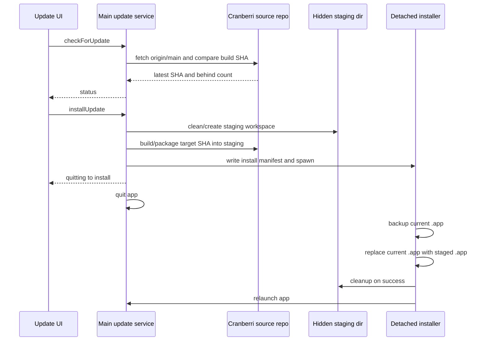
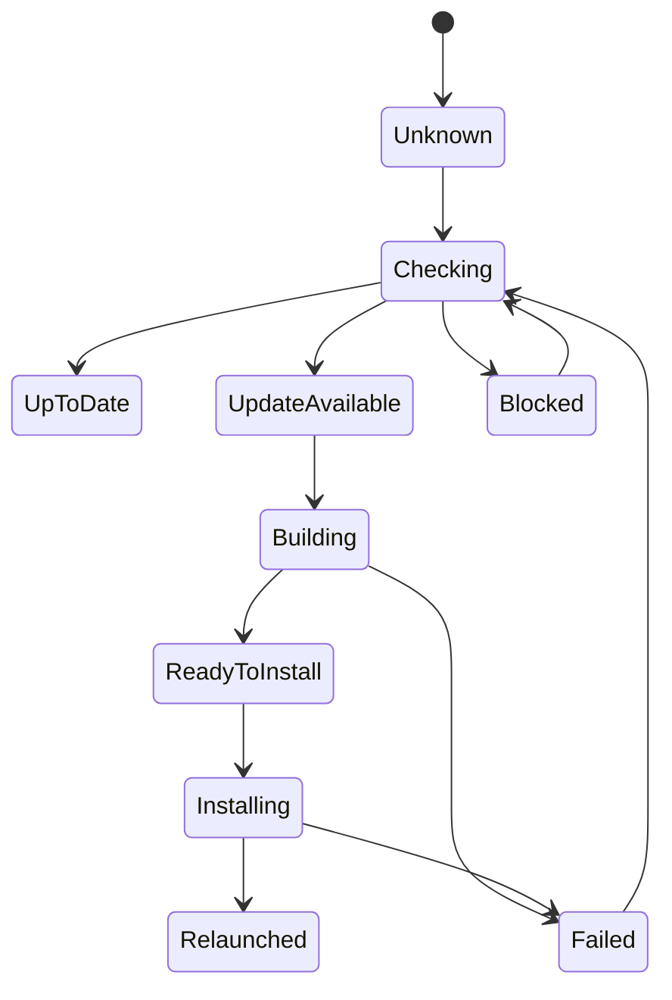

# Source-Built App Updater - Plan

## Goal Capsule

- **Objective:** Ship Cranberri as a macOS app that can update itself from the latest `origin/main` source build with a first-class one-click flow.
- **Product authority:** The updater installs from GitHub `origin/main`, not release DMGs, and must not leave duplicate user-visible app copies.
- **Execution profile:** Standard packaging and update-lifecycle work touching main/preload/shared types, settings, UI, build metadata, and macOS install behavior.
- **Stop conditions:** Stop if in-place app replacement cannot be made reliable on macOS without code signing/notarization choices, or if the source repo cannot be resolved without asking the user to choose it.
- **Tail ownership:** The plan is complete when packaged-app update status, source-built staging, in-place replacement, relaunch, cleanup, and failure recovery are verified on macOS.

---

## Product Contract

### Summary

Cranberri should feel like an installed desktop app even while dogfooding updates from source.
The user sees update status, clicks one update action, and the currently installed app is replaced in place after a local build from the newest `origin/main`.

### Problem Frame

The current app can run in development and has GitHub/repo awareness, but it has no durable packaged-app update path.
DMG-based release updates would be simpler, but the requested dogfood loop is more direct: the app should notice that the GitHub origin has newer commits, build them locally, and install that build without making the user manage duplicate files.

### Requirements

**Update detection**

- R1. Cranberri reports the currently installed build commit, the latest `origin/main` commit, and the number of commits behind when the configured update source is available.
- R2. Cranberri distinguishes development mode, packaged mode, missing source repo, missing GitHub origin, dirty source repo, dependency/build failure, install failure, and up-to-date states.
- R3. The update check is explicit and user-triggered for v1, with optional lightweight refresh when the update UI opens.

**Source-built install**

- R4. One-click update fetches `origin/main`, builds from that commit in a hidden staging area, and installs the result over the current app bundle.
- R5. The flow never leaves a duplicate Cranberri app visible in `/Applications`, Downloads, the repo root, or the desktop after a successful update.
- R6. The app preserves the user's existing Cranberri data under Electron `userData`; the source-built update replaces app code, not local sessions, settings, repos, or telemetry.
- R7. The user can see progress across fetch, dependency install, build, package, install, cleanup, and relaunch phases.

**Safety and recovery**

- R8. The updater builds from an isolated clean checkout of the target SHA, so uncommitted source repo changes are not included, overwritten, or required to be stashed.
- R9. Failed updates keep the currently running app usable until the final quit/install boundary, and failed replacement leaves either the old app or the new app in a launchable state.
- R10. The update helper cleans hidden staging artifacts after success and exposes cleanup guidance after failure.
- R11. The update helper writes a durable install result manifest, relaunches the previous app on replacement failure when possible, and lets Cranberri show the failed phase and log path on next launch.

**Packaging**

- R12. Cranberri has a reproducible macOS package target that produces a `.app` and DMG-compatible output through `electron-builder`.
- R13. Packaged builds embed enough build metadata for the app to compare itself with `origin/main`.

### Acceptance Examples

- AE1. Given a packaged app built at commit `A` and `origin/main` at commit `B`, when the user checks updates, then Cranberri shows it is behind by the compare count and enables Update.
- AE2. Given a successful source build, when the user clicks Update, then Cranberri stages the new app, quits, replaces the existing app path, relaunches Cranberri, and removes the hidden staging directory.
- AE3. Given the build fails before app replacement, when the user returns to Cranberri, then the current app is still running and the update UI shows the failed phase and log path.
- AE4. Given replacement fails after quit, when the helper exits, then there is no duplicate user-facing Cranberri app and the user receives a readable failure log in the staging metadata.

### Scope Boundaries

#### In Scope

- macOS packaged app build configuration.
- Source-built update detection against GitHub `origin/main`.
- Hidden staging, in-place app replacement, relaunch, and cleanup.
- A first-class update UI in existing settings/about or health surfaces.

#### Deferred to Follow-Up Work

- Fully silent background auto-updates.
- Release-DMG based update channel.
- Code signing, notarization, and Sparkle-style delta updates if source-built replacement proves insufficient.
- Windows and Linux packaging/update behavior.

#### Out of Scope

- Publishing this private repo publicly.
- Syncing user settings, Codex sessions, or repo state through GitHub.
- Updating arbitrary registered repos; v1 updates only Cranberri itself.

---

## Planning Contract

### Key Technical Decisions

- KTD1. **Use source build plus in-place app replacement for v1.** The requested dogfood loop is newest `origin/main`, so the plan avoids release assets as the primary source while preserving installed-app behavior.
- KTD2. **Stage in hidden app-owned storage, not user-visible locations.** Build artifacts live under an updater staging directory such as Electron `userData`, and successful cleanup is part of done.
- KTD3. **Install through a detached helper after app quit.** The running Electron process should not replace its own app bundle; main process writes an install manifest, spawns a helper, exits, and the helper performs backup/replace/relaunch.
- KTD4. **Embed build metadata at packaging time.** A small generated/shared build-info module records commit SHA, branch, build time, and packaged/development mode so update status does not depend on the source repo matching the running app.
- KTD5. **Keep updater IPC typed end to end.** New update status, progress, and command payloads belong in `src/shared/`, with preload and `src/renderer/vite-env.d.ts` updated alongside main handlers.
- KTD6. **Prefer local Git/CLI primitives over GitHub release APIs for v1 detection.** The repo already uses `simple-git` and `gh`; commit comparison can use `git fetch` plus `rev-list --count` from the configured Cranberri source repo, while GitHub REST compare remains a fallback or future improvement.

### High-Level Technical Design

### Assumptions

- The installed app can locate or ask for a local Cranberri source repo that has the private GitHub origin configured.
- The first implementation may require a local developer machine with Node/npm dependencies available, because source-built updates intentionally compile locally.
- Code signing/notarization is not required to prove the private dogfood loop, but the plan keeps the packaging surface compatible with signing later.

### Sources and Research

- `package.json` already includes `electron-builder` but has no packaging scripts or builder configuration.
- `src/main/git.ts` already parses GitHub remotes and status, including `origin`, branch, ahead, and behind metadata.
- `src/main/github.ts` already uses `gh` for GitHub panel data, including commits and releases.
- `src/preload/index.ts` and `src/renderer/vite-env.d.ts` show the typed IPC pattern that new update APIs should follow.
- Electron-builder publish docs say its `publish` key configures artifact publishing and update metadata; this plan intentionally defers release publishing while adding local package output.
- Electron-builder auto-update docs note macOS DMG is auto-updatable and macOS auto-update needs signing; this plan avoids claiming full native auto-update until signing/notarization is addressed.
- GitHub REST commit docs document compare/list commit APIs with read-only contents permission; this supports a future API fallback if local Git comparison is not enough.

---

## Implementation Units

### U1. Package Cranberri as a macOS app

- **Goal:** Add reproducible local macOS packaging that produces a usable `.app` and DMG-compatible artifact.
- **Requirements:** R12, R13.
- **Dependencies:** None.
- **Files:** `package.json`, `electron-builder.yml` or `package.json` build config, `scripts/`, `src/main/index.ts`.
- **Approach:** Add package scripts for macOS app packaging and configure product name, app id, output directory, included files, native dependency handling, and macOS targets. Keep publish disabled for local builds so packaging does not require GitHub tokens.
- **Execution note:** This is packaging/config-heavy; prefer smoke verification of the packaged app over unit tests.
- **Patterns to follow:** Existing `npm run build` script remains the pre-package correctness gate.
- **Test scenarios:** Test expectation: none -- this unit is packaging configuration, proven by package output and launch smoke.
- **Verification:** A packaged Cranberri app launches, loads the renderer from packaged files, and keeps existing Codex/terminal functionality available.

### U2. Embed build metadata

- **Goal:** Record the build commit and build context inside packaged Cranberri so update checks compare the running app to `origin/main`.
- **Requirements:** R1, R2, R13.
- **Dependencies:** U1.
- **Files:** `scripts/`, `src/shared/buildInfo.ts`, `src/main/index.ts`, `src/preload/index.ts`, `src/renderer/vite-env.d.ts`, `src/shared/update.ts`.
- **Approach:** Generate build metadata before packaging and expose a read-only app/build info IPC call. In development mode, report development status and local HEAD separately from packaged build metadata.
- **Patterns to follow:** Existing `app:get-version` in `src/main/index.ts` and typed preload declarations in `src/preload/index.ts` / `src/renderer/vite-env.d.ts`.
- **Test scenarios:** 
  - Given generated metadata with commit SHA `A`, when the renderer asks for build info, it receives `A`, build time, app version, and packaged/development mode.
  - Given no generated metadata in development, when build info is read, the app reports development mode without crashing.
  - Given malformed metadata, when build info is read, the app falls back to a safe unknown state.
- **Verification:** Typecheck passes and packaged app update UI can display the running build commit.

### U3. Add updater domain types and IPC

- **Goal:** Create typed update status, progress, install command, and failure payloads across main, preload, and renderer.
- **Requirements:** R1, R2, R3, R7, R10.
- **Dependencies:** U2.
- **Files:** `src/shared/update.ts`, `src/main/updater.ts`, `src/main/index.ts`, `src/preload/index.ts`, `src/renderer/vite-env.d.ts`.
- **Approach:** Add an updater service with `check`, `install`, `cancel/clear failure` if needed, and progress event surfaces. Validate persisted and IPC payloads with `zod` where data crosses process boundaries.
- **Patterns to follow:** Existing `src/shared/settings.ts`, `src/main/settings.ts`, and `src/preload/index.ts` typed IPC pattern.
- **Test scenarios:** 
  - Given no configured Cranberri source repo, when checking updates, status is `blocked` with an actionable reason.
  - Given development mode, when checking updates, status explains that packaged app replacement is unavailable but comparison can still be shown if a source repo exists.
  - Given an update operation emits phase progress, when the renderer subscribes, progress arrives in order with phase names and human-readable labels.
  - Given a main-process error, when the IPC call rejects or returns failure, the payload does not expose secrets or raw environment variables.
- **Verification:** Typecheck proves renderer/preload/main agreement, and unit tests cover status shape transitions without invoking real packaging.

### U4. Resolve and validate the Cranberri source repo

- **Goal:** Let the packaged app find the local Cranberri source repo used to fetch and stage source-built updates.
- **Requirements:** R1, R2, R4, R8.
- **Dependencies:** U3.
- **Files:** `src/shared/settings.ts`, `src/main/settings.ts`, `src/main/repos.ts`, `src/main/updater.ts`, `src/renderer/components/SettingsDialog.tsx`.
- **Approach:** Store an optional updater source repo path in settings or derive it from registered repos whose GitHub origin matches `fraction12/Cranberri`. Validate that it is a Git repo, has a GitHub origin, and can fetch `origin`; local working tree cleanliness is informational because update builds use an isolated checkout.
- **Patterns to follow:** Existing settings migration in `src/main/settings.ts` and repo validation in `src/main/repos.ts`.
- **Test scenarios:** 
  - Given a registered repo with matching origin, when no updater path is set, Cranberri selects it as the source candidate.
  - Given multiple matching candidates, when checking updates, Cranberri asks the user to choose rather than guessing.
  - Given a dirty source repo, when install is requested, Cranberri warns that local edits are not part of the update and proceeds only from the isolated target checkout.
  - Given a non-GitHub or missing origin, when checking updates, Cranberri returns a blocked status.
- **Verification:** Settings persist across restart and invalid repo paths are rejected before any build starts.

### U5. Implement commit comparison against origin/main

- **Goal:** Detect whether `origin/main` has newer commits than the running packaged build.
- **Requirements:** R1, R2, R3.
- **Dependencies:** U2, U4.
- **Files:** `src/main/updater.ts`, `src/shared/update.ts`, `src/main/updater.test.ts`.
- **Approach:** Run a fetch for `origin main`, resolve the latest remote SHA, and compare it with the embedded build SHA using Git commit ancestry/count. If the embedded SHA is unavailable or not reachable, report an unknown comparison state rather than claiming no update.
- **Patterns to follow:** Existing `simple-git` use in `src/main/git.ts`; keep Git operations in main.
- **Test scenarios:** 
  - Given local build SHA is ancestor of `origin/main`, when checking updates, status is update available with the correct behind count.
  - Given local build SHA equals `origin/main`, when checking updates, status is up to date.
  - Given local build SHA is not found in the source repo, when checking updates, status is comparison unknown with latest SHA still shown.
  - Given fetch fails, when checking updates, status is failed or blocked with a readable reason.
- **Verification:** Tests use a temporary Git repo fixture or a thin Git adapter mock that proves ancestry/count behavior without touching the real Cranberri repo.

### U6. Build latest main into hidden staging

- **Goal:** Build the latest source into a hidden staging area without modifying user-visible files or leaving duplicate apps.
- **Requirements:** R4, R5, R7, R8, R10.
- **Dependencies:** U1, U4, U5.
- **Files:** `src/main/updater.ts`, `src/main/processRegistry.ts`, `src/shared/update.ts`, `src/main/updater.test.ts`.
- **Approach:** Create a fresh hidden staging workspace under app-owned data, materialize the target SHA as a clean archive or worktree, install dependencies as needed, run the package build, and capture logs. Register the build as an app process so the existing process rail can display or terminate it if appropriate.
- **Execution note:** Treat this as an integration-heavy unit; isolate command execution behind a small adapter so tests can verify phase ordering and failure behavior.
- **Patterns to follow:** Existing process registry in `src/main/processRegistry.ts` and terminal/process lifecycle conventions.
- **Test scenarios:** 
  - Given a target SHA, when staging starts, the service emits phases for preparing, dependencies, build, package, and ready-to-install.
  - Given the build command fails, when staging stops, no install helper is spawned and the current app remains untouched.
  - Given stale staging files from an earlier failed update, when a new update starts, Cranberri cleans or replaces only its updater staging directory.
  - Given a successful package, when staging completes, the staged `.app` path is outside user-visible locations.
- **Verification:** Automated tests cover phase/failure behavior; a manual packaged-app smoke builds into hidden staging and confirms no visible duplicate app remains.

### U7. Replace the current app in place and relaunch

- **Goal:** Install the staged app over the currently running app bundle through a detached helper.
- **Requirements:** R4, R5, R6, R7, R9, R10, R11.
- **Dependencies:** U6.
- **Files:** `src/main/updater.ts`, `scripts/`, `src/shared/update.ts`, `src/main/updater.test.ts`.
- **Approach:** Write an install manifest containing current app path, staged app path, backup path, log path, result manifest path, and relaunch targets for both success and failure. Spawn a detached helper that waits for the app to quit, moves the current app to a hidden backup, moves the staged app into the original path, writes the durable result manifest, relaunches the new app on success or the previous app on replacement failure when possible, and removes backup/staging after success.
- **Execution note:** Keep the helper small and auditable; it is the riskiest part of the feature and should favor explicit failure states over clever rollback.
- **Patterns to follow:** Existing main-process lifecycle in `src/main/index.ts`; avoid renderer involvement after the quit boundary.
- **Test scenarios:** 
  - Given a valid staged app and writable current app path, when helper runs, it replaces the app at the same path and relaunches that path.
  - Given replacement fails before deleting the old app, when helper exits, the original app remains in place.
  - Given replacement fails after backup move, when helper exits, it restores the backup or leaves a single launchable app at the original path.
  - Given replacement fails after Cranberri quits, when the helper can restore or keep the previous app, it writes the failed result manifest and relaunches the previous app.
  - Given success, when cleanup runs, staging and backup directories are removed.
- **Verification:** Helper unit tests run against temporary directories; manual verification confirms `/Applications` or the current app location contains one Cranberri app after update or failed replacement.

### U8. Add first-class update UI

- **Goal:** Surface update status and actions as a polished app-level control.
- **Requirements:** R1, R2, R3, R7, R10, R11, AE1, AE2, AE3, AE4.
- **Dependencies:** U3, U4, U5, U6, U7.
- **Files:** `src/renderer/components/SettingsDialog.tsx`, `src/renderer/components/Header.tsx`, `src/renderer/components/RepoRail.tsx`, `src/renderer/state/settings.tsx`, `src/shared/update.ts`.
- **Approach:** Add an Update section in Settings/About and optionally a compact header badge when an update is available. The UI should show current SHA, latest SHA, behind count, source repo, progress phase, log location on failure, and a single primary Update action. On startup, read any pending helper result manifest and surface failed install status before allowing a retry.
- **Patterns to follow:** Existing settings sections in `src/renderer/components/SettingsDialog.tsx` and health card status styling in `src/renderer/components/RepoRail.tsx`.
- **Test scenarios:** 
  - Given up-to-date status, when the user opens About, the update control shows current build and disables Update.
  - Given update available, when the user opens About, the control shows behind count and enables one primary Update action.
  - Given update progress, when phases arrive, the UI shows the active phase and prevents duplicate update starts.
  - Given a failed update, when the UI renders, it shows the failed phase and log path without hiding the retry action.
  - Given a helper failure manifest from a previous launch, when Cranberri starts, the update UI shows the failed phase and log path.
- **Verification:** Renderer behavior is covered with component or state tests where practical, plus manual packaged-app UI verification.

### U9. Add verification docs and dogfood checklist

- **Goal:** Document the local packaged-app update loop so future Cranberri work can dogfood it safely.
- **Requirements:** R3, R5, R9, R10, R11, R12.
- **Dependencies:** U1-U8.
- **Files:** `README.md`, `docs/plans/2026-07-07-001-feat-source-built-app-updater-plan.md`.
- **Approach:** Replace the empty README with a short local run/package/update section and include a private dogfood checklist for verifying no duplicate app files remain after update.
- **Patterns to follow:** AGENTS.md preference for concise, source-of-truth repo docs.
- **Test scenarios:** Test expectation: none -- documentation only.
- **Verification:** README instructions match the implemented package scripts and update UI labels.

---

## Verification Contract

| Gate | Applies to | Done signal |
|---|---|---|
| Typecheck | U2-U8 | Shared update types compile across main, preload, and renderer. |
| Lint | U1-U9 | New updater service, UI, and scripts satisfy repo lint rules. |
| Unit tests | U3-U7 | Update state transitions, commit comparison, staging failures, and helper replacement behavior are covered. |
| Production build | All units | `npm run build` succeeds before packaging. |
| Package smoke | U1, U2, U8 | Packaged app launches and displays build/update info. |
| Update smoke | U4-U8 | A packaged app behind `origin/main` builds, replaces itself in place, relaunches, and leaves no duplicate user-visible app copy. |
| Failed-install smoke | U7, U8 | A forced helper replacement failure relaunches the previous app when possible and shows the persisted failed phase plus log path on next launch. |

---

## Risks & Dependencies

- **macOS self-replacement is the highest-risk path.** Mitigation: use a detached helper, hidden backup, explicit failure logs, and a temporary-dir test harness before trying `/Applications`.
- **Code signing may become mandatory for a polished install experience.** Mitigation: keep builder config signing-ready but do not block the private dogfood loop on signing until the first source-built flow works.
- **Local build dependencies may fail on the user machine.** Mitigation: surface build logs and keep the old app running until replacement begins.
- **Private GitHub access depends on local Git credentials.** Mitigation: rely on the configured local source repo and its existing auth instead of embedding GitHub tokens.

---

## Definition of Done

- Cranberri can be packaged as a macOS app and launched outside `npm run dev`.
- The packaged app shows its embedded build commit and compares it with `origin/main`.
- One click builds the latest `origin/main` in hidden staging, replaces the current app path, relaunches, and cleans staging.
- Failed build or install paths are readable, recoverable, and do not leave duplicate user-facing Cranberri apps.
- Helper failures after the quit boundary are persisted, visible after relaunch, and retryable from the update UI.
- Existing userData-backed settings, repos, sessions, and telemetry survive the update.
- `npm run build`, relevant tests, package smoke, and update smoke have been run and documented in the final implementation handoff.
