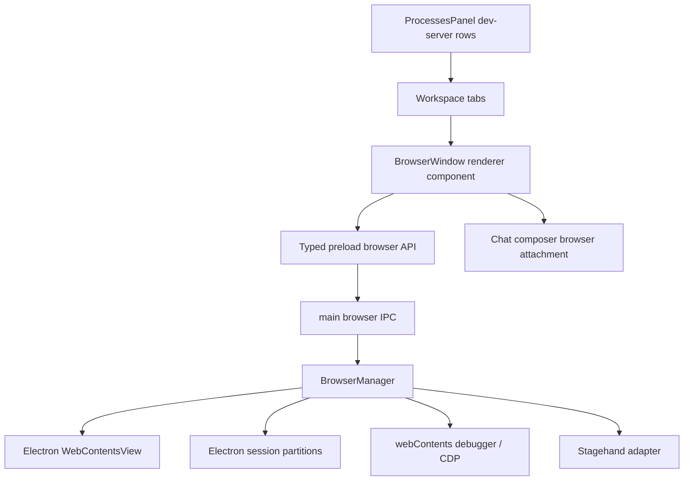

## Goal Capsule

| Field | Value |
|---|---|
| Objective | Add a first-class Browser workspace window to Cranberri that behaves like Terminal: openable as a top-level workspace tab, tied to repo/process context, persisted in app state, and suitable for agent-driven UI work. |
| Authority hierarchy | User request, `AGENTS.md`, existing Cranberri chat-first workspace model, Electron security constraints, current repo patterns. |
| Execution profile | Multi-unit implementation with main/preload/shared/renderer changes, a small dependency decision for browser automation, focused unit tests, Electron UAT, and `npm run build` before shipping. |
| Stop conditions | Stop if Electron cannot host a secure embedded `WebContentsView` in the current window architecture, if browser content would require Node integration, or if app-state migration would risk losing existing chat/terminal windows. |
| Tail ownership | Browser lifecycle, profile persistence, process-panel integration, Design Mode capture, and UAT evidence belong to this plan; broad IDE/editor features stay out. |

---

## Product Contract

### Summary

Plan a real embedded browser in Cranberri, modeled after the existing Terminal window and informed by Orca's per-worktree browser pattern: a repo-scoped browser pane with address controls, history, viewport support, automation affordances, and a future-proof Design Mode path.

### Problem Frame

Cranberri currently has first-class chat and terminal windows, but no native browser workspace. That leaves web-app development split across Cranberri and an external browser, and prevents the agent loop from sharing the same live page, session, and UI context that the user sees. Orca's model is useful here because its browser is not a passive preview; it is a real Chromium surface scoped to work, scriptable by agents, and connected to design feedback.

### Requirements

- R1. Browser is a first-class workspace window type alongside `chat` and `terminal`, with tab identity, title, active state, close behavior, and persistence per repo.
- R2. Browser uses Electron `WebContentsView` in the main process, not an iframe, `webview`, deprecated `BrowserView`, or an external system browser tab.
- R3. Browser has normal navigation controls: address bar, back, forward, reload/stop, current URL, loading state, page title, and page error display.
- R4. Browser can be opened from the workspace toolbar and from dev-server rows in the process panel, with a best-effort local URL inferred from the process when possible.
- R5. Browser state is repo-scoped: open tabs/windows, selected URL, page title, profile id, viewport mode, and dev-server association survive app reload without breaking existing app-state files.
- R6. Browser sessions use Electron session partitions so cookies, cache, user agent, and future profile controls are isolated by Cranberri browser profile rather than leaking through the app renderer.
- R7. Browser content is sandboxed from Cranberri UI: no Node integration, no renderer preload into arbitrary pages, URL validation in IPC, and bounded data returned from inspection APIs.
- R8. Design Mode lets the user click an element in the visible browser and send useful context to the active Codex chat: URL, viewport, element HTML, nearby DOM, computed styles, bounding box, and screenshot evidence.
- R9. Browser automation exposes deterministic primitives for agents: navigate, reload, back/forward, screenshot, inspect, click/fill when enabled, and snapshot current page state.
- R10. Stagehand is evaluated and introduced as the high-level browser-action adapter only if it can operate against Cranberri's browser session without creating a split-brain browser; low-level view lifecycle and CDP control stay in Cranberri-owned Electron code either way.
- R11. Closing a browser workspace window destroys or detaches its native view cleanly, and switching tabs/resizing panes does not leave blank views, stale overlays, or hidden webContents consuming resources.
- R12. Existing chat, terminal, process panel, settings, GitHub panel, and release/update behavior remain unchanged.

### Key Flows

- F1. Open browser from workspace toolbar
  - **Trigger:** User clicks the browser add button in the workspace tab bar.
  - **Steps:** Cranberri creates a browser workspace window, attaches a native browser view to the active pane, loads the default URL or blank start page, and persists the window state.
  - **Outcome:** The browser appears as a peer to Chat and Terminal, with no external window required.

- F2. Open browser from dev-server process
  - **Trigger:** User clicks Open Browser on a `dev-server` row in the process panel.
  - **Steps:** Cranberri infers the localhost URL from known process metadata/output where available, opens or focuses a browser window associated with that process, and navigates to the URL.
  - **Outcome:** A running dev server becomes inspectable from inside the workspace.

- F3. Use Design Mode for agent feedback
  - **Trigger:** User enables Design Mode and clicks a page element.
  - **Steps:** Cranberri captures bounded DOM/CSS/screenshot context from the live browser and inserts it into the active chat composer or active thread context as a browser attachment.
  - **Outcome:** Codex receives the same UI evidence the user is inspecting, without the user manually copying selectors or screenshots.

- F4. Agent operates the same browser
  - **Trigger:** Codex or a future tool invocation requests a browser action.
  - **Steps:** Cranberri routes the action through typed IPC and the BrowserManager, using Electron/CDP primitives directly or Stagehand through the adapter when natural-language action is enabled.
  - **Outcome:** User and agent share one browser session, avoiding the split-brain problem of separate browser instances.

### Acceptance Examples

- AE1. Given an existing app-state file containing only chat and terminal windows, when Cranberri starts after this feature, then the file parses successfully and existing windows remain intact.
- AE2. Given a Browser workspace tab is active, when the user switches to Terminal and back, then the web page remains loaded and visible without creating a duplicate native view.
- AE3. Given a dev server process is listed, when the user opens Browser from that row, then Cranberri opens a browser window pointed at the inferred local URL or prompts within the browser chrome to enter the URL if inference fails.
- AE4. Given Browser Design Mode is active, when the user clicks a visible element, then the active chat composer receives bounded context containing URL, viewport, element summary, styles, and screenshot evidence.
- AE5. Given the user closes a Browser tab, when process and memory state are inspected through app logs/UAT, then the associated view is removed and its webContents is destroyed or intentionally retained only when another workspace window references it.
- AE6. Given browser automation is disabled or missing model configuration, when an agent asks for high-level Stagehand action, then Cranberri returns a clear disabled-capability result while deterministic Electron actions still work.

### Scope Boundaries

In scope:

- First-class Browser workspace window.
- Native embedded Chromium view using Electron `WebContentsView`.
- Repo-scoped browser profile baseline through Electron sessions.
- Basic navigation, viewport presets, screenshots, page inspection, and Design Mode capture.
- Dev-server process-panel entry point.
- Stagehand adapter boundary and dependency wiring only after compatibility with Cranberri's Electron runtime is proven.
- Tests and UAT sufficient to prove no regression to chat/terminal/process behavior.

Deferred:

- Chrome/Edge cookie import.
- Full source-map file/line resolution for clicked elements.
- Multi-tab browser strip inside one Browser workspace window.
- Download shelf, find-in-page, devtools docking, and history fuzzy search.
- Cross-worktree isolation beyond Cranberri's current repo workspace model.
- Public CLI automation surface comparable to Orca CLI.

Outside this product identity:

- Replacing the user's default browser.
- Building a general-purpose browser product.
- Cloud-hosted browser service as the default path.
- Rebuilding Playwright, CDP, or Stagehand primitives in Cranberri.

### Sources

- Orca per-worktree browser: https://www.onorca.dev/docs/browser/overview
- Orca Design Mode: https://www.onorca.dev/docs/browser/design-mode
- Orca browser profiles: https://www.onorca.dev/docs/browser/profiles
- Electron `WebContentsView`: https://www.electronjs.org/docs/latest/api/web-contents-view
- Electron `session`: https://www.electronjs.org/docs/latest/api/session
- Electron `webContents`: https://www.electronjs.org/docs/latest/api/web-contents
- Chrome DevTools Protocol: https://chromedevtools.github.io/devtools-protocol/
- Chrome DevTools Protocol `DOMSnapshot`: https://chromedevtools.github.io/devtools-protocol/tot/DOMSnapshot/
- Stagehand Playwright integration: https://docs.stagehand.dev/v3/integrations/playwright

---

## Planning Contract

### Key Technical Decisions

- KTD1. Use `WebContentsView` as the native browser surface. Electron documents `WebContentsView` as the supported view that displays a `webContents`, while `BrowserView` is deprecated; this keeps the feature on the current Electron path and avoids iframe/webview limitations.
- KTD2. Put browser lifecycle in main process. The renderer owns browser chrome and layout intent, but only main creates views, manages sessions, attaches/detaches child views, drives navigation, and talks to CDP.
- KTD3. Extend workspace state rather than creating a separate browser rail. Browser should behave like Terminal, so `WorkspaceWindowType` grows to include `browser`, with browser-specific metadata held in a typed optional field or companion state keyed by workspace window id.
- KTD4. Use a renderer placeholder plus bounds reporting. `BrowserWindow.tsx` renders toolbar and a content placeholder; a `ResizeObserver` reports the placeholder bounds to main so BrowserManager can position the `WebContentsView` exactly over the pane.
- KTD5. Use persistent Electron session partitions for profiles. Default profile ids should be deterministic and repo-scoped, using `persist:cranberri-browser:<profile-id>` style partitions while keeping profile metadata in Cranberri app state.
- KTD6. Keep deterministic browser primitives separate from Stagehand. Navigation, screenshot, CDP snapshots, and element inspection are Cranberri-owned APIs; Stagehand is an adapter candidate for higher-level "act/observe/extract" behavior and can be disabled or deferred without blocking the visible browser.
- KTD7. Design Mode v1 uses injected page script plus CDP/screenshot support. The first useful version should capture element context and screenshot evidence reliably; full sourcemap-to-file mapping is deferred unless cheap during implementation.
- KTD8. Dev-server URL detection starts conservative. Use process kind, command, cwd, and recent output/known port patterns where available, then fall back to editable address bar rather than guessing dangerously.
- KTD9. Browser IPC is a first-class typed surface. Add shared request/result types and preload typings; every browser action crosses IPC through schemas rather than untyped `unknown` blobs.
- KTD10. Browser security defaults are stricter than app renderer defaults. Browser content gets no Node integration, no arbitrary preload, no direct access to `window.cranberri`, and all inspection payloads are bounded/redacted before reaching chat.

### High-Level Technical Design

Lifecycle shape:

1. Workspace state creates or focuses a browser window id.
2. Renderer mounts `BrowserWindow.tsx`, renders toolbar and browser viewport placeholder, and calls `browser.attach` with window id, repo id/profile id, initial URL, and placeholder bounds.
3. Main BrowserManager creates or reuses the matching `WebContentsView`, binds it to the main window content view, loads the URL, and emits page state updates.
4. Renderer reports resize/visibility changes; main updates view bounds or hides/detaches the view when inactive.
5. On close, Workspace calls browser teardown before removing state; BrowserManager removes the child view and destroys the webContents unless retained by an explicit profile/window reuse rule.

State shape:

- `WorkspaceWindowType` includes `browser`.
- Browser window metadata tracks current URL, title, profile id, optional dev-server process id, viewport preset, and loading/error state.
- App-state parsing accepts old version-1 files and migrates or defaults browser fields without dropping chat/terminal entries.
- Browser runtime state that should not persist, such as in-flight load, CDP attachment, and current bounds, stays in BrowserManager memory.

### Existing Patterns To Follow

- `src/renderer/components/TerminalWindow.tsx` for first-class workspace pane lifecycle, resize handling, and repo-path empty state.
- `src/renderer/components/Workspace.tsx` for window tab rendering, close behavior, lazy loading, and process event bridging.
- `src/renderer/state/workspace.ts` for repo-scoped window state mutation.
- `src/main/terminal.ts` and `src/preload/index.ts` for typed main/preload IPC shape.
- `src/main/appState.ts` and `src/shared/appState.ts` for persisted state schemas.
- `src/renderer/components/process-terminal-events.ts` and `src/renderer/components/process-terminal-events.test.ts` for event helpers connecting the process panel to workspace windows.

### Assumptions

- Cranberri stays Electron-first and local-first; no cloud browser provider is required for v1.
- Electron 42 supports `WebContentsView` in the packaged app target Cranberri already ships.
- `@playwright/test` remains a dev dependency for UAT; Stagehand may add a runtime dependency only if it can be isolated behind a main-process adapter.
- One browser workspace window owns one native view in the first implementation. A tab strip inside Browser can come later.
- Browser profile persistence can be modeled now even if the first UI exposes only a default profile and viewport presets.

### Dependencies And Constraints

- Electron `WebContentsView` and `session` APIs must be created after `app.whenReady`.
- `BrowserManager` needs access to the main `BrowserWindow`; current `getMainWindow` can be passed into browser IPC initialization like Codex IPC does.
- Native view bounds are in main-window coordinates, so renderer-to-main bounds reporting must account for device scale and current window content origin.
- Browser content can capture sensitive page data; screenshot and DOM payloads must be size-bounded and explicit-user-triggered for Design Mode.
- Stagehand integration may require model configuration and Playwright-compatible page control; first validate whether it can target Cranberri's existing browser session, and defer it if it would require a separate browser.

### Sequencing

1. Land shared state/types and migration first so app startup remains safe.
2. Land BrowserManager and typed IPC with a minimal attach/navigate/destroy smoke path.
3. Land BrowserWindow renderer UI and workspace tab integration.
4. Land dev-server process entry point once a browser can open directly.
5. Land Design Mode capture once screenshot and DOM primitives exist.
6. Land profile/viewport controls, then validate and land or explicitly defer the Stagehand adapter after the core browser is stable.
7. Run packaged UAT and release validation only after the native view lifecycle is proven in dev.

---

## Implementation Units

### U1. Extend Workspace State And App-State Schema

- **Goal:** Add `browser` as a persisted workspace window type without breaking existing app-state files.
- **Requirements:** R1, R5, R12, AE1.
- **Files:** `src/shared/appState.ts`, `src/main/appState.ts`, `src/renderer/state/workspace.ts`, `src/renderer/vite-env.d.ts`.
- **Approach:** Introduce browser window metadata in the shared state contract, update zod parsing in main, add `openBrowser` to workspace state, and preserve old state compatibility.
- **Test scenarios:** App-state parser accepts old chat/terminal-only state; app-state parser accepts browser windows with metadata; invalid browser metadata falls back safely without losing other windows; `openBrowser` creates or focuses a browser window for the active repo.
- **Verification:** Add or extend focused tests near app-state/workspace helpers if helpers are extractable; run `npm test` and `npm run build`.

### U2. Add Main-Process BrowserManager And Typed Browser IPC

- **Goal:** Create the native browser runtime that owns `WebContentsView`, sessions, navigation, bounds, lifecycle, and page state events.
- **Requirements:** R2, R3, R6, R7, R9, R11.
- **Files:** `src/main/browser.ts`, `src/main/index.ts`, `src/shared/browser.ts`, `src/preload/index.ts`, `src/renderer/vite-env.d.ts`.
- **Approach:** Add a BrowserManager initialized with `getMainWindow`, expose typed IPC handlers for attach, detach, destroy, navigate, reload, stop, back, forward, screenshot, page state, and bounds updates; emit browser events back to renderer for title/url/loading/error changes.
- **Test scenarios:** BrowserManager creates one view per window id; repeated attach reuses the view; detach hides/removes without destroying; destroy removes child view and destroys webContents; URL validation rejects unsupported schemes; profile id maps to expected Electron partition.
- **Verification:** Unit-test pure helpers for URL/profile/bounds normalization where possible; run dev-app smoke to ensure a visible nonblank view can load `https://example.com` or a local page; run `npm run build`.

### U3. Build BrowserWindow Renderer As A First-Class Workspace Pane

- **Goal:** Add the visible Browser window UI with controls and workspace tab behavior matching Terminal's level of polish.
- **Requirements:** R1, R3, R5, R11, R12, AE2.
- **Files:** `src/renderer/components/BrowserWindow.tsx`, `src/renderer/components/Workspace.tsx`, `src/renderer/state/workspace.ts`, `src/renderer/components/browser/BrowserToolbar.tsx`, `src/renderer/components/browser/BrowserViewport.tsx`.
- **Approach:** Add lazy-loaded browser component, workspace toolbar add button with browser icon, browser tab icon/title rendering, close teardown behavior, address bar, back/forward/reload controls, loading/error state, and a bounds-reporting viewport placeholder.
- **Test scenarios:** Workspace renders Browser tab with correct icon/title; BrowserWindow calls attach on mount and detach/destroy on close; navigation controls disable according to page state; switching between chat/terminal/browser does not unmount persistent state incorrectly; no text overflow in toolbar controls.
- **Verification:** Component tests for render/control behavior where feasible; manual UAT for tab switching/resizing; `npm run build`.

### U4. Connect Dev-Server Processes To Browser Windows

- **Goal:** Make running app previews reachable from the process panel with one action.
- **Requirements:** R4, R5, R8, AE3.
- **Files:** `src/renderer/components/right-rail/ProcessesPanel.tsx`, `src/renderer/components/process-browser-events.ts`, `src/renderer/components/process-browser-events.test.ts`, `src/shared/processes.ts`, `src/main/processRegistry.ts`.
- **Approach:** Add an Open Browser affordance for `dev-server` rows, helper events paralleling process-terminal events, conservative URL inference from process metadata/known local ports, and workspace focusing keyed by process id.
- **Test scenarios:** Dev-server row dispatches browser-open event; non-dev-server rows do not show browser action; process id maps to stable browser window id; known localhost command/output infers URL; unknown URL opens Browser with editable address fallback.
- **Verification:** Add event/helper tests; run `npm test`, start a known dev server, open it through the process panel, and verify the browser loads inside Cranberri.

### U5. Add Design Mode Capture And Chat Attachment Pipeline

- **Goal:** Turn the visible browser into a pointer-to-agent feedback loop.
- **Requirements:** R8, R9, R10, AE4.
- **Files:** `src/main/browser.ts`, `src/shared/browser.ts`, `src/renderer/components/BrowserWindow.tsx`, `src/renderer/components/browser/DesignModeToggle.tsx`, `src/renderer/components/ChatWindow.tsx`, `src/shared/codex.ts`, `src/renderer/components/chat/*`.
- **Approach:** Add Design Mode toggle, inject a bounded element picker into the page when enabled, capture clicked element context through main/CDP, take a screenshot or crop evidence, and insert a browser-context attachment into the active chat composer using the existing input model or a narrow extension of it.
- **Test scenarios:** Toggling Design Mode installs/removes the picker; clicking an element returns URL, viewport, selector-ish summary, HTML, computed styles, bounds, and screenshot metadata; capture payload is bounded; unsupported pages fail gracefully; chat composer displays the browser attachment and sends it to Codex.
- **Verification:** Unit-test payload bounding/formatting; UAT on a local Vite app page; confirm attachment is visible in chat and included in the outgoing Codex message.

### U6. Add Profiles And Viewport Controls

- **Goal:** Establish the profile/session model needed for serious web-app testing without overbuilding profile management.
- **Requirements:** R5, R6, R7.
- **Files:** `src/shared/browser.ts`, `src/main/browser.ts`, `src/renderer/components/browser/BrowserToolbar.tsx`, `src/renderer/components/browser/ViewportMenu.tsx`, `src/shared/appState.ts`, `src/main/appState.ts`.
- **Approach:** Add default repo profile, session partition derivation, user-agent placeholder fields, and viewport presets that can drive CDP device metrics or view sizing without resizing the whole Cranberri window.
- **Test scenarios:** Default profile id is stable for a repo; different profile ids map to different Electron partitions; viewport preset persists per browser window; resetting viewport returns page to pane-sized layout; invalid profile names are normalized safely.
- **Verification:** Unit-test profile/partition helpers; UAT cookie persistence across reload for a simple local page; `npm run build`.

### U7. Validate Stagehand Adapter For High-Level Browser Actions

- **Goal:** Make the built-in browser ready for agent-level browser operation without coupling Cranberri's core browser to one automation library.
- **Requirements:** R9, R10, AE6.
- **Files:** `package.json`, `package-lock.json`, `src/main/browserAutomation.ts`, `src/main/browser.ts`, `src/shared/browser.ts`, `src/preload/index.ts`.
- **Approach:** Spike `@browserbasehq/stagehand` against Cranberri's existing Electron browser session before committing the dependency; if compatible, isolate it behind a `BrowserAutomationAdapter`, and if not compatible, leave the adapter disabled with a documented follow-up rather than introducing a second browser runtime.
- **Test scenarios:** Adapter reports disabled when configuration/dependency requirements are missing; deterministic browser actions still work when Stagehand is disabled; compatibility spike proves whether Stagehand can observe or act on the current page without creating a separate browser session; errors return typed results.
- **Verification:** Add adapter unit tests around capability reporting and error mapping; run `npm test`; perform one manual high-level action only if local config is available.

### U8. Package, UAT, And Document The Browser Window Contract

- **Goal:** Prove the feature works in the real Electron app and leave enough durable context for later browser work.
- **Requirements:** R11, R12, all acceptance examples.
- **Files:** `docs/browser-window.md`, `docs/plans/2026-07-07-003-feat-first-class-browser-window-plan.md`, optional UAT notes under `docs/`.
- **Approach:** Document architecture, security boundaries, known deferrals, and UAT steps; run dev and packaged app checks; verify no regression to terminal close behavior and process-panel behavior.
- **Test scenarios:** Dev app opens Browser from toolbar; dev-server process opens Browser to local URL; browser survives resize/tab switching; Design Mode sends context to chat; closing Browser destroys view; Terminal still opens/closes/kills as before; packaged app launches and browser view is nonblank.
- **Verification:** Run `npm test`, `npm run build`, `npm run package:dir`, and manual Electron UAT before release.

---

## Verification Contract

| Gate | Command / action | Applies to | Done signal |
|---|---|---|---|
| Unit tests | `npm test` | U1, U4, U5, U6, U7 | Relevant tests pass, including app-state compatibility and process/browser helper behavior. |
| Production build | `npm run build` | All units | TypeScript, ESLint, metadata build, helper copy, and Electron Vite build pass. |
| Packaged smoke | `npm run package:dir` | U2, U3, U8 | Packaged Electron app launches and shows a nonblank embedded browser view. |
| Dev-app UAT | `npm run dev` plus local dev-server process | U3, U4, U5 | Browser opens from toolbar and process panel; local page loads; resize/tab switching remain stable. |
| Security review | Manual code review of browser IPC and webPreferences | U2, U5, U7 | Browser content has no Node integration or Cranberri preload exposure; URL/action payloads are validated and bounded. |
| Regression check | Manual chat/terminal/process-panel smoke | U3, U4, U8 | Existing chat sessions, terminal windows, terminal close behavior, and process termination still work. |

Release/UAT checklist:

- Open Cranberri with existing app-state containing chat and terminal windows.
- Add Browser from workspace toolbar.
- Navigate to a public safe page and a localhost dev server.
- Open Browser from a dev-server process row.
- Switch Chat -> Browser -> Terminal -> Browser.
- Resize the main split panes.
- Enable Design Mode and send a clicked element context into chat.
- Close Browser and confirm no native view remains visible.
- Package and launch the app from `dist/mac*` or equivalent package output.

---

## Definition of Done

- Browser appears as a workspace window peer to Chat and Terminal.
- Browser state persists per repo without corrupting old app-state files.
- Browser is powered by Electron `WebContentsView` and session partitions.
- Navigation, reload/stop, back/forward, URL/title/loading/error states work.
- Dev-server process rows can open a browser window to the app preview path.
- Design Mode captures bounded page context and hands it to Codex chat.
- Stagehand is either working behind the adapter or explicitly disabled with typed capability reporting; deterministic browser primitives work either way.
- Browser close/switch/resize lifecycle has no visible blank-pane, z-order, or stale-view regression.
- Chat, Terminal, GitHub panel, settings, updater, and process panel still pass smoke checks.
- `npm test`, `npm run build`, and packaged Electron UAT pass.
- Any dead-end browser experiments, debug logging, or temporary scripts are removed before shipping.
