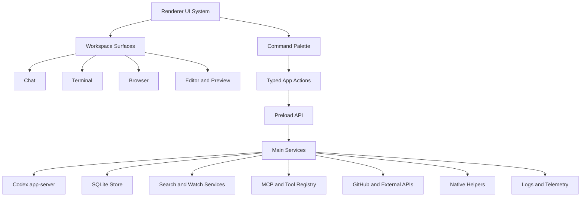
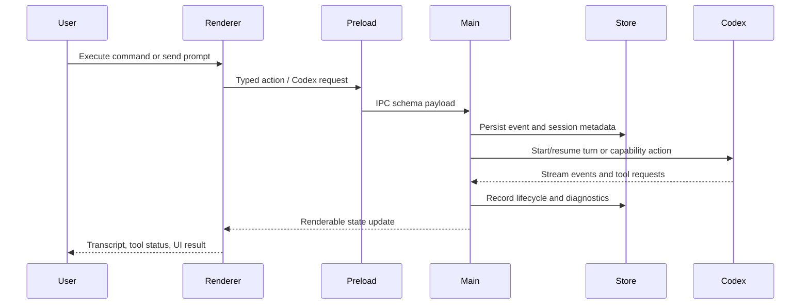

## Goal Capsule

| Field | Value |
|---|---|
| Objective | Upgrade Cranberri from a focused chat-first Electron app into a native-Codex-parity local agent cockpit with a beautiful commandable UI, durable local state, first-class browser/editor/terminal surfaces, MCP/tool readiness, and production-grade observability. |
| Authority hierarchy | User directive to be aggressive, `AGENTS.md`, current Cranberri stack and repo patterns, observed native Codex app bundle capabilities, existing browser/updater/plugin plans. |
| Execution profile | Deep, phased platform work. Land dependency and system foundations first, then wire visible capabilities in independently verifiable slices. |
| Stop conditions | Stop or re-plan if a dependency conflicts with Electron 42 packaging, if a native helper requires secrets/signing not available locally, if Codex app-server protocol compatibility breaks, or if a slice would require destructive state migration. |
| Tail ownership | Dependency hygiene, UI system, persistence, command palette, terminal polish, browser surface, editor surface, MCP/tool substrate, observability, packaging, and full build verification belong to this plan. |

---

## Product Contract

### Summary

Cranberri should feel like a serious native agent IDE: fast, dense, polished, keyboard-first, repo-aware, and capable of sharing live work surfaces with Codex.
This plan intentionally borrows the native Codex app's broad capability stack while adapting it to Cranberri's local-first, chat-dominant product identity.

### Problem Frame

Cranberri already has the beginning of the right shape: Electron, React, TypeScript, Codex app-server integration, PTY terminal, git diff context, plugin/skill surfacing, and a private local-first workflow.
It is not yet on par with native Codex because it lacks a richer component system, durable queryable state, first-class browser/editor surfaces, a command palette, MCP/tool protocol substrate, high-fidelity terminal features, broad native app affordances, and robust observability.
The upgrade should not become generic SaaS or a dashboard; it should become a powerful single-user coding cockpit where chat, files, terminal, browser, tool events, and repo context stay in one coherent app.

### Requirements

**Platform and dependency foundation**

- R1. Cranberri adopts a broad but purposeful dependency set for native-Codex-parity capabilities: Radix primitives, command palette, motion, TanStack UI/data helpers, CodeMirror, Shiki, xterm add-ons, SQLite, MCP/WebSocket protocol libraries, Octokit, Sentry/logging, file search/watch utilities, and packaging/native helper support.
- R2. Dependencies are grouped behind local adapters or focused components so the app can evolve without leaking library APIs through every feature.
- R3. The app continues to build through the existing `npm run build` contract after each major slice.

**Beautiful commandable UI**

- R4. Common shell interactions use polished primitives: dialogs, popovers, menus, tabs, tooltips, toasts, scroll areas, command palette, keyboard shortcuts, and responsive panels.
- R5. The app introduces a reusable UI utility layer for class composition, variants, overlays, and motion without turning Cranberri into a generic component showcase.
- R6. The workspace supports keyboard-first navigation and command execution across repos, chat windows, terminals, browser windows, files, and settings.

**Durable local state and search**

- R7. Cranberri moves high-value runtime data toward a local SQLite-backed store for transcripts, sessions, tool events, browser state, repo indexes, and usage records while preserving existing JSON app-state compatibility.
- R8. File search, fuzzy search, watched repo changes, and ignore-aware glob handling become shared services instead of one-off UI logic.

**Work surfaces**

- R9. Terminal gains native-app-grade polish: web links, clipboard support, search, stable process lifecycle, and better surfaced process metadata.
- R10. Browser becomes a first-class workspace surface, aligned with `docs/plans/2026-07-07-003-feat-first-class-browser-window-plan.md`, and remains user-and-agent shared rather than split into separate hidden browsers.
- R11. Editor/code surfaces use CodeMirror and Shiki where appropriate for rich prompt editing, file previews, patch review, snippets, and future inline tool results.

**Agent/tool substrate**

- R12. Cranberri gains first-class MCP/tool substrate dependencies and types so future connectors and local tools can be discovered, inspected, invoked, and rendered consistently.
- R13. GitHub and external code-host affordances use Octokit rather than ad hoc shell output when structured API access is useful.
- R14. Codex app-server remains the primary Codex integration boundary; native Codex private packages are not copied directly.

**Observability, packaging, and native capability**

- R15. Errors, app events, tool events, and agent lifecycle events are observable through local logs and optional Sentry instrumentation.
- R16. Native helper work is gated behind small explicit modules: permissions, AppleScript/JXA helpers, updater/package checks, and future Objective-C bridges where they pay for themselves.
- R17. Existing chat, terminal, git, settings, update, and plugin/skill behavior stays intact while new capabilities are introduced.

### Key Flows

- F1. Command palette action
  - **Trigger:** User presses the global command shortcut.
  - **Steps:** Palette opens, indexes available actions and recent objects, filters by fuzzy search, and executes the selected typed command.
  - **Outcome:** The user can drive Cranberri without hunting through rails or tabs.

- F2. Rich local state lookup
  - **Trigger:** User opens a prior session, searches files, or inspects a tool event.
  - **Steps:** Renderer asks typed state/search APIs; main process reads SQLite or search indexes; UI renders virtualized results.
  - **Outcome:** Cranberri feels persistent and fast across reloads and long histories.

- F3. Shared browser work
  - **Trigger:** User or Codex opens a local dev server.
  - **Steps:** Browser workspace opens against the same Electron browser surface; inspection, screenshot, and future automation use that surface.
  - **Outcome:** User and agent reason from the same live page.

- F4. Tool-capable agent loop
  - **Trigger:** A Codex thread needs a repo, browser, file, GitHub, or MCP-backed action.
  - **Steps:** Cranberri exposes typed capabilities, records tool lifecycle events, and renders status/results in the app.
  - **Outcome:** Tool use is visible, auditable, and ready for richer connectors.

### Acceptance Examples

- AE1. Given the current app, when the foundation dependency batch is installed, then `npm run build` still passes and no unused import churn is introduced.
- AE2. Given a long transcript or file result list, when the user scrolls, then virtualized rendering keeps interaction smooth without layout jumps.
- AE3. Given an existing chat/terminal app-state file, when Cranberri launches after state foundation changes, then existing windows remain intact.
- AE4. Given the command palette is opened, when the user types a repo/action/session name, then matching commands appear and execute through typed handlers.
- AE5. Given a terminal emits a URL, when the user clicks it, then Cranberri opens it through the appropriate app/browser path.
- AE6. Given a browser workspace is active, when Codex requests a deterministic browser action, then the action targets the same visible session or returns a clear disabled-capability result.
- AE7. Given a tool or app error occurs, when the user opens diagnostics, then Cranberri has enough local log context to explain what failed without exposing secrets.

### Scope Boundaries

In scope:

- Dependency installation and local wrappers for the aggressive parity stack.
- Visual/component polish needed for a beautiful app shell.
- Command palette and keyboard-first app actions.
- SQLite-backed storage foundation and migration path.
- Search/watch/fuzzy utility substrate.
- Terminal add-ons and process UX polish.
- Browser plan integration and sequencing.
- CodeMirror/Shiki editor and code rendering surfaces.
- MCP/WebSocket/tool substrate foundation.
- GitHub structured API foundation.
- Local logging plus optional Sentry wiring.
- Packaging/native-helper preparation.

Deferred to follow-up work:

- Full source-map-to-file mapping from browser clicks.
- Full marketplace/plugin installer parity.
- Full cross-device sync or cloud-hosted state.
- Private native Codex internal packages or unpublished workspace packages.
- Replacing Codex app-server with a different agent engine.
- Heavy native modules that require signing or entitlements before the app has a stable helper boundary.

Outside this product identity:

- Generic SaaS admin shell.
- General-purpose browser replacement.
- General-purpose VS Code replacement.
- Cloud-first multi-user collaboration platform.

---

## Planning Contract

### Key Technical Decisions

- KTD1. Install aggressively, wrap conservatively. The dependency list should be broad enough to unlock parity work, but Cranberri code should import most libraries through local utilities, hooks, or focused components.
- KTD2. Keep Codex app-server as the agent source of truth. Native Codex's private packages are evidence for capabilities, not reusable dependencies for Cranberri.
- KTD3. Put durable data behind main-process services. SQLite, filesystem watchers, native helpers, and structured integrations belong in main/preload/shared surfaces, not directly in React components.
- KTD4. Build a real UI system before adding more surfaces. Radix, command palette, variants, toasts, overlays, virtual lists, and motion should become the shared shell language used by browser/editor/tool surfaces.
- KTD5. Use dependency capability bands. Dependencies land in batches that correspond to capabilities: UI shell, state/search, terminal/editor/browser, agent/tool protocols, integrations, observability/native.
- KTD6. Treat browser as a dependent platform feature. The existing first-class browser plan remains valid, but it should consume the new UI, state, logging, and tool-substrate foundations where possible.
- KTD7. Prefer explicit native helper boundaries. macOS permission checks, AppleScript/JXA, Objective-C bridges, and updater helpers should live behind tiny main-process modules with typed IPC, not scattered shell calls.
- KTD8. Make verification incremental. Each unit should have either automated tests or a build/runtime smoke path; broad dependency installation is not done until the production build proves packaging compatibility.

### High-Level Technical Design

### Dependency Bands

- **UI shell:** `@radix-ui/react-popover`, `@radix-ui/react-select`, `@radix-ui/react-scroll-area`, `@radix-ui/react-separator`, `@radix-ui/react-switch`, `@radix-ui/react-checkbox`, `@radix-ui/react-slider`, `@radix-ui/react-toast`, `cmdk`, `@floating-ui/react`, `motion`, `sonner`, `class-variance-authority`.
- **Data and layout:** `@tanstack/react-table`, `@tanstack/react-form`, `@tanstack/react-store`, `@tanstack/store`, existing `@tanstack/react-query`, existing `@tanstack/react-virtual`.
- **Editor/rendering:** `codemirror`, `@codemirror/state`, `@codemirror/view`, `@codemirror/commands`, `@codemirror/autocomplete`, `@codemirror/search`, `@codemirror/lang-javascript`, `@codemirror/lang-css`, `@codemirror/lang-html`, `@codemirror/lang-markdown`, `@codemirror/language`, `shiki`, `mermaid`, `katex`, `react-katex`, `dompurify`, `@braintree/sanitize-url`.
- **Terminal:** `@xterm/addon-web-links`, `@xterm/addon-clipboard`, `@xterm/addon-search`.
- **Persistence/search:** `better-sqlite3`, `drizzle-orm`, `drizzle-kit`, `superjson`, `chokidar`, `ignore`, `minimatch`, `micromatch`, `istextorbinary`, `mime-types`, `@vscode/ripgrep` if bundled search is preferred over system `rg`.
- **Agent/tool protocols:** `@modelcontextprotocol/sdk`, `ws`, `bufferutil`, `utf-8-validate`, `eventsource`, `zod-to-json-schema`.
- **Integrations:** `@octokit/core`, `@octokit/graphql`, `@octokit/rest`.
- **Observability/native/package:** `@sentry/electron`, `@sentry/react`, `electron-log`, `debug`, `nanoid`, `date-fns`, `msw`, `node-addon-api`, `electron-context-menu`, `@electron/notarize`.

### Existing Patterns To Follow

- `src/main/codex/client.ts` and `src/main/codex/ipc.ts` for long-lived external process integration and typed event streaming.
- `src/main/terminal.ts`, `src/renderer/components/TerminalWindow.tsx`, and `src/renderer/components/process-terminal-events.ts` for process-backed workspace surfaces.
- `src/shared/appState.ts`, `src/main/appState.ts`, and `src/renderer/state/workspace.ts` for persisted workspace state.
- `src/preload/index.ts` and `src/renderer/vite-env.d.ts` for typed preload expansion.
- `src/renderer/components/chat/MarkdownContent.tsx` and `src/renderer/components/right-rail/DiffViewer.tsx` for lazy rich rendering.
- `docs/plans/2026-07-07-003-feat-first-class-browser-window-plan.md` for browser-specific architecture and acceptance examples.

### Assumptions

- Cranberri can tolerate a larger dependency footprint because the target is a private native power tool, not a tiny public package.
- Electron 42 and Vite 7 can bundle the selected browser/editor/UI libraries without changing the app's fundamental build system.
- Native modules such as `better-sqlite3`, `bufferutil`, and `utf-8-validate` may require packaging checks before they are considered fully landed.
- Sentry should be optional or environment-gated so local private work is not sent anywhere unexpectedly.
- The first implementation should use npm and the existing `package-lock.json`; package manager migration is not part of this plan.

### Sequencing

1. Install dependency bands and prove the build can still resolve.
2. Add local UI primitives and command/action registry.
3. Add SQLite/logging/search services behind typed main/preload APIs.
4. Upgrade terminal, transcript, and file-result rendering with virtual/editor/code primitives.
5. Execute the first-class browser plan on top of the new substrate.
6. Add MCP/tool registry foundations and structured integration points.
7. Add observability, packaging, and native-helper gates.
8. Run full build, targeted tests, and manual smoke passes across chat, terminal, git, browser, and settings.

---

## System-Wide Impact

This work changes Cranberri from a small Electron app into a platform app with more native modules and runtime surfaces.
The biggest impacts are package size, build complexity, IPC surface area, state migration responsibility, and the need to keep renderer components thin while main process services grow.
The plan should make Cranberri more capable without making every component responsible for every library.

---

## Risks And Mitigations

- **Native dependency packaging risk:** `better-sqlite3`, `bufferutil`, and `utf-8-validate` can fail in Electron packaging. Mitigate by installing early, running `npm run build`, and adding package-dir validation before relying on them.
- **UI library sprawl:** A broad dependency set can produce inconsistent UI. Mitigate with local wrappers and style conventions before feature teams import primitives ad hoc.
- **State migration risk:** Moving toward SQLite can accidentally strand existing JSON state. Mitigate with compatibility-first migrations and tests that load old app-state shapes.
- **Security risk from browser/tool surfaces:** Browser and MCP features can expose sensitive local data. Mitigate with typed, bounded IPC payloads, explicit enablement, sandboxed browser content, and logging redaction.
- **Performance risk from rich rendering:** Markdown, Shiki, Mermaid, CodeMirror, and large transcripts can be heavy. Mitigate with lazy imports, virtualization, and route-level loading.
- **Scope risk:** "Codex parity" can become endless. Mitigate by landing the foundation and the first visible capability slices, then treating further parity as follow-up plans.

---

## Implementation Units

### U1. Install And Categorize The Parity Dependency Set

- **Goal:** Add the aggressive dependency foundation in one traceable package-lock change, grouped by capability so later wiring has the libraries available.
- **Requirements:** R1, R2, R3, AE1.
- **Dependencies:** None.
- **Files:** `package.json`, `package-lock.json`.
- **Approach:** Install the UI, data, editor, terminal, persistence/search, protocol, integration, observability, and native-helper packages listed in Dependency Bands. Keep package versions npm-resolved unless a package has a known Electron compatibility constraint discovered during install.
- **Execution note:** This is mostly package/config work; prefer install/build smoke verification over unit coverage.
- **Test scenarios:** Dependency install completes with lockfile updates; TypeScript build resolves the existing app without adding imports; production build completes or surfaces native packaging blockers to address before later units.
- **Verification:** `npm run build` passes or any failure is narrowed to a specific dependency compatibility issue with a follow-up decision.

### U2. Create UI Foundation Wrappers

- **Goal:** Turn Radix, motion, toasts, class merging, and floating overlays into Cranberri-native UI primitives.
- **Requirements:** R4, R5, R17.
- **Dependencies:** U1.
- **Files:** `src/renderer/lib/ui.ts`, `src/renderer/components/ui/`, `src/renderer/index.css`, `src/renderer/components/SettingsDialog.tsx`, `src/renderer/components/Workspace.tsx`, `src/renderer/components/RepoRail.tsx`.
- **Approach:** Add small wrappers for class composition, button/icon-button variants, dialog/popover/menu/toast primitives, scroll area, and motion-safe transitions. Refactor only one or two existing components initially to prove the pattern without sweeping the whole app.
- **Patterns to follow:** Current semantic CSS token layer in `src/renderer/index.css`; current component thinness in `src/renderer/components/`.
- **Test scenarios:** Existing settings dialog still opens and closes with keyboard; toolbar/menu controls retain accessible labels; toast provider renders without affecting current layout; no text overflows in compact workspace tabs.
- **Verification:** Component-focused tests where logic is extracted, plus `npm run build` and a visual smoke pass.

### U3. Add Command Palette And Typed Action Registry

- **Goal:** Introduce a keyboard-first command surface that can operate across repos, workspace windows, sessions, settings, terminal, and browser.
- **Requirements:** R4, R6, AE4.
- **Dependencies:** U2.
- **Files:** `src/shared/actions.ts`, `src/renderer/state/actions.tsx`, `src/renderer/components/CommandPalette.tsx`, `src/renderer/App.tsx`, `src/renderer/state/workspace.ts`, `src/renderer/components/Header.tsx`.
- **Approach:** Create a typed action registry in renderer state for local UI actions first, then leave room for main-process actions. Use `cmdk` and fuzzy matching to list available commands and recent objects. Start with open chat, open terminal, open settings, switch window, focus repo, and health check actions.
- **Test scenarios:** Palette opens from keyboard shortcut; palette closes on Escape; selecting an action invokes the correct handler; disabled actions explain why they cannot run; fuzzy search returns expected window/repo/action matches.
- **Verification:** Add tests for action filtering and command execution helpers; run `npm run build`.

### U4. Add SQLite Store And Structured Local Event Log

- **Goal:** Establish durable local storage for sessions, tool events, logs, browser metadata, and future transcript search while preserving JSON app state.
- **Requirements:** R7, R15, AE3, AE7.
- **Dependencies:** U1.
- **Files:** `src/main/store.ts`, `src/main/store.schema.ts`, `src/main/telemetry.ts`, `src/main/appState.ts`, `src/shared/store.ts`, `src/preload/index.ts`, `src/renderer/vite-env.d.ts`, `src/main/store.test.ts`.
- **Approach:** Add a main-process SQLite service using `better-sqlite3` and a tiny schema/migration layer. Keep existing `appState.json` as the workspace layout source initially, but mirror structured events and diagnostics into SQLite. Use zod schemas at IPC boundaries.
- **Execution note:** Add characterization tests for old app-state parsing before changing persistence behavior.
- **Test scenarios:** Store initializes in a temp userData path; migrations are idempotent; app events can be inserted and queried; old app-state JSON still loads; malformed SQLite rows do not crash diagnostics rendering.
- **Verification:** `npm test` covers store initialization and migration; `npm run build` passes.

### U5. Add Search, Watch, And File Intelligence Services

- **Goal:** Create shared repo search utilities for fuzzy command results, file previews, ignore-aware scans, and future transcript/repo indexing.
- **Requirements:** R7, R8, AE2.
- **Dependencies:** U1, U4.
- **Files:** `src/main/search.ts`, `src/main/repos.ts`, `src/shared/search.ts`, `src/preload/index.ts`, `src/renderer/vite-env.d.ts`, `src/renderer/state/search.ts`.
- **Approach:** Wrap `rg` or `@vscode/ripgrep`, `chokidar`, `ignore`, glob helpers, MIME detection, and `fuse.js` behind typed search APIs. Start with bounded file search and repo watch events; defer full indexing until the API shape is proven.
- **Test scenarios:** Search respects ignored files; search refuses paths outside registered repos; binary files are not returned as text previews; watcher emits bounded updates for create/modify/delete; large result sets are truncated with metadata.
- **Verification:** Add main-process tests around path safety and search result normalization; run `npm test` and `npm run build`.

### U6. Upgrade Terminal Experience

- **Goal:** Bring terminal behavior closer to native Codex quality with links, clipboard support, search, and better process affordances.
- **Requirements:** R9, AE5.
- **Dependencies:** U1, U2.
- **Files:** `src/renderer/components/TerminalWindow.tsx`, `src/main/terminal.ts`, `src/shared/processes.ts`, `src/renderer/components/right-rail/ProcessesPanel.tsx`, `src/renderer/components/process-terminal-events.ts`, `src/renderer/components/process-terminal-events.test.ts`.
- **Approach:** Add xterm web-links, clipboard, and search add-ons. Surface terminal command/cwd/process metadata more clearly in ProcessesPanel. Keep terminal lifecycle owned by main process and existing window close semantics intact.
- **Test scenarios:** URL links open through Cranberri external/browser action; search finds text in terminal buffer; clipboard operations use browser-safe APIs; closing a terminal still kills the PTY only after confirmation; process panel can focus an existing terminal.
- **Verification:** Extend process terminal event tests; manually smoke terminal create/write/resize/close; run `npm run build`.

### U7. Add Editor And Rich Code Rendering Surfaces

- **Goal:** Use CodeMirror and Shiki for rich code input, file previews, snippets, patch review, and future inline tool results.
- **Requirements:** R11, AE2.
- **Dependencies:** U1, U2, U5.
- **Files:** `src/renderer/components/editor/CodeEditor.tsx`, `src/renderer/components/editor/CodePreview.tsx`, `src/renderer/components/chat/MarkdownContent.tsx`, `src/renderer/components/right-rail/DiffViewer.tsx`, `src/renderer/components/ChatWindow.tsx`.
- **Approach:** Add lazy-loaded CodeMirror editor/preview components and Shiki-backed highlighting where it materially improves current markdown/diff rendering. Start with read-only previews and prompt/editor affordances before replacing existing composer behavior.
- **Test scenarios:** Code preview renders large files without blocking the app; markdown code blocks still render when Shiki lazy import fails; editor preserves plain text input/output; language selection handles unknown extensions gracefully.
- **Verification:** Add rendering tests for fallback behavior; run `npm run build`.

### U8. Execute Browser Surface On The Shared Substrate

- **Goal:** Implement the first-class browser plan using the new UI, storage, logging, and action registry foundations.
- **Requirements:** R10, R16, AE6.
- **Dependencies:** U2, U3, U4, U5.
- **Files:** `src/shared/browser.ts`, `src/main/browser.ts`, `src/main/index.ts`, `src/preload/index.ts`, `src/renderer/vite-env.d.ts`, `src/renderer/state/workspace.ts`, `src/renderer/components/BrowserWindow.tsx`, `src/renderer/components/Workspace.tsx`, `src/renderer/components/right-rail/ProcessesPanel.tsx`.
- **Approach:** Follow `docs/plans/2026-07-07-003-feat-first-class-browser-window-plan.md`, but reuse command actions, store events, toasts, and diagnostics. Keep deterministic browser primitives separate from any future high-level automation adapter.
- **Test scenarios:** Existing chat/terminal windows migrate; browser opens from toolbar; browser navigates and reports loading/title/url; switching windows preserves browser view; close destroys or detaches the view; deterministic screenshot/inspect actions target the visible browser.
- **Verification:** Execute the browser plan's tests and manual Electron UAT; run `npm run build`.

### U9. Add MCP And Tool Registry Foundation

- **Goal:** Prepare Cranberri to discover, describe, and eventually invoke MCP/tools with typed visibility in the UI.
- **Requirements:** R12, R14, AE7.
- **Dependencies:** U1, U3, U4.
- **Files:** `src/shared/tools.ts`, `src/main/tools.ts`, `src/main/codex/ipc.ts`, `src/renderer/state/tools.tsx`, `src/renderer/components/right-rail/ToolsPanel.tsx`, `src/renderer/components/chat/Transcript.tsx`.
- **Approach:** Add protocol-facing types, tool metadata normalization, lifecycle event records, and UI surfaces for viewing tool calls/results. Do not replace Codex app-server; mirror and enrich what Cranberri can observe.
- **Test scenarios:** Tool metadata validates through zod; unknown tool payloads are displayed safely; tool events are persisted to the local event log; renderer handles pending/success/error states; disabled MCP capability produces a clear message.
- **Verification:** Add unit tests for schema normalization and event persistence; run `npm test` and `npm run build`.

### U10. Add Structured GitHub Integration Foundation

- **Goal:** Move GitHub affordances toward structured Octokit calls where useful while preserving existing shell-safe behavior.
- **Requirements:** R13, R17.
- **Dependencies:** U1, U4.
- **Files:** `src/main/github.ts`, `src/shared/git.ts`, `src/renderer/components/right-rail/GitHubPanel.tsx`, `src/main/settings.ts`, `src/shared/settings.ts`.
- **Approach:** Introduce Octokit behind the existing GitHub main-process module. Start with authenticated capability detection and repository metadata/pull request/issue lookups when credentials exist; keep shell/git fallbacks for local repo facts.
- **Test scenarios:** No token keeps current GitHub panel behavior; token present enables structured calls; API failure degrades to existing summary; private repo data is not logged verbatim.
- **Verification:** Mock API tests for success/failure; manual local smoke without exposing tokens; run `npm run build`.

### U11. Wire Observability, Diagnostics, And Packaging Gates

- **Goal:** Make Cranberri debuggable and package-safe as native modules and surfaces grow.
- **Requirements:** R15, R16, R17, AE7.
- **Dependencies:** U1, U4.
- **Files:** `src/main/telemetry.ts`, `src/main/health.ts`, `src/main/updater.ts`, `src/renderer/components/SettingsDialog.tsx`, `src/renderer/components/RepoRail.tsx`, `electron.vite.config.ts`, `package.json`.
- **Approach:** Add optional Sentry/electron-log/debug wiring with explicit enablement, redact sensitive payloads, expose diagnostics in settings/health, and add package-dir validation for native modules. Prepare native helper boundaries without implementing broad native control in this unit.
- **Test scenarios:** Telemetry disabled by default does not send remote events; local logs record app/codex/tool failures; health report includes native module/package checks; redaction removes token-like values; package-dir build smoke passes.
- **Verification:** Add tests for redaction helpers; run `npm run build` and `npm run package:dir` when native dependency compatibility needs proof.

### U12. Full App Parity QA Pass

- **Goal:** Verify the platform still behaves coherently after aggressive dependency and capability wiring.
- **Requirements:** R3, R17, AE1-AE7.
- **Dependencies:** U1-U11.
- **Files:** `src/**/*.test.ts`, `src/**/*.test.tsx`, `docs/updater-dogfood.md`, `docs/plans/2026-07-07-004-feat-codex-parity-platform-plan.md`.
- **Approach:** Add a focused regression pass for startup, repo selection, chat send, Codex streaming, terminal lifecycle, git diff rail, settings, command palette, search, browser, tool-event rendering, and diagnostics. Keep tests useful rather than blanket snapshots.
- **Test scenarios:** Fresh app state startup; old app state startup; chat thread creation/send; Codex event rendering; terminal create/resize/close; command palette open/execute; git status/diff display; browser open/navigate; diagnostics view with a synthetic error; production build completes.
- **Verification:** `npm test`, `npm run build`, and manual Electron smoke across the core flows.
- **Completion note:** Added packaged Electron smoke coverage for fresh startup, seeded repo startup, real git diff rendering, fake Codex streaming, persisted tool timeline rendering, command-palette file search, terminal creation, browser navigation, and browser text capture. Fixed two package-runtime issues found by the smoke: the right-rail diff viewer now avoids a fragile lazy chunk for the core diff surface, and packaging explicitly rebuilds native modules for Electron before Builder runs while restoring local Node ABI afterward. Verified with `npm run package:dir`, `npm run smoke:electron`, `npm test`, `npm run build`, and `git diff --check`.

---

## Verification Contract

| Gate | Applies To | Done Signal |
|---|---|---|
| Dependency install smoke | U1 | `package-lock.json` updates cleanly and existing app imports still compile. |
| Unit tests | U3-U6, U9-U11 | Focused tests cover action filtering, store migrations, search safety, terminal events, schema normalization, and redaction helpers. |
| Production build | All units | `npm run build` passes after each major batch. |
| Electron runtime smoke | U2, U3, U6, U8, U11 | App launches; settings, chat, terminal, browser, command palette, and diagnostics can be exercised without console-breaking errors. |
| Packaging smoke | U1, U4, U11 | `npm run package:dir` passes when native modules are relied on. |
| Security/privacy review | U8-U11 | Browser/tool/logging surfaces bound payloads, avoid secrets in logs, and degrade clearly when disabled. |

---

## Definition of Done

- Dependency bands are installed or explicitly deferred with a compatibility reason.
- New libraries are accessed through local wrappers/services where they would otherwise spread through unrelated code.
- Existing chat, terminal, git rail, settings, update, and plugin/skill paths still build and smoke successfully.
- Command palette, UI foundation, local store/event log, search/watch service, terminal add-ons, editor surface, browser foundation, tool registry, GitHub foundation, and diagnostics have each landed to the level defined by their unit.
- Tests cover the risky behavior changes and state migrations rather than only rendering snapshots.
- `npm run build` passes.
- Native-module packaging blockers are resolved or documented with a specific follow-up.
- Experimental or abandoned code from failed approaches is removed before the work is called complete.

---

## Post-U12 Continuation Notes

- **Browser context to chat:** Browser page snapshots and element inspections can now be sent into a targeted chat composer as bounded, structured context. This makes the visible browser surface usable as Codex prompt context without adding hidden browser automation. Verified with focused formatting/event tests plus the packaged smoke path that captures `cranberri-browser-smoke-ready`, sends it to chat, and confirms the composer receives the page context.
- **Browser screenshots to Codex visual input:** Browser screenshots can now be persisted under app `userData/browser-captures`, inserted into the active chat as a visible composer chip, and sent to Codex as a `localImage` input with high detail. This closes the first visual-context parity gap with the native Codex app. Verified with shared/browser formatting tests and the packaged Electron smoke path that sends a screenshot to fake Codex and waits for `local-images:1`.
- **Terminal context to chat:** Terminal panes can now send their current xterm buffer into the active chat as bounded structured context. This makes shell output part of the same prompt-context loop as browser and repo surfaces. Verified with formatter tests and the packaged Electron smoke path that writes `cranberri-terminal-context-ready`, sends terminal context to chat, and submits it through fake Codex.
- **Latest terminal context reuse:** After sending or copying active terminal context once, the command palette can now resend the saved terminal context into the active chat or copy the formatted terminal context to the clipboard without focusing the terminal. This gives shell output the same reusable-context treatment as browser page, screenshot, and element captures. Verified with command action tests and packaged Electron smoke coverage that resubmits and copies `cranberri-terminal-context-ready` from the latest terminal buffer.
- **Right-rail repo context to chat:** Selected right-rail files can now send bounded repo context into the active chat, including diff hunks and working/HEAD content where appropriate. This connects the file/diff rail to the same Codex prompt-context loop as browser and terminal surfaces. Verified with formatter/event tests and the packaged Electron smoke path that selects `README.md`, sends the modified file context to chat, and submits it through fake Codex.
- **Latest repo file context reuse:** After a repo file context is sent from the right rail or palette search, the command palette can now resend the saved file context into the active chat or copy the formatted context to the clipboard. Right-rail sends publish a typed captured-context event, so the palette reuse actions stay decoupled from the rail implementation. Verified with command action tests, event tests, and packaged Electron smoke coverage that resubmits and copies the selected `README.md` context containing `cranberri-electron-smoke-search`.
- **Tool timeline context to chat:** Tool timeline rows can now send bounded tool-event context into the active chat, including status, metadata, arguments, results, and errors. This turns observed tool activity into reusable Codex prompt context instead of a passive audit trail. Verified with formatter tests and the packaged Electron smoke path that sends the fake tool completion to chat and submits it through fake Codex.
- **Latest tool event context reuse:** After a tool-event context is sent from the tool timeline or command palette, the command palette can now resend the saved tool-event context into the active chat or copy the formatted context to the clipboard. Tool timeline sends publish a typed captured-context event, matching the reusable file and process context bridges. Verified with command action tests, event tests, and packaged Electron smoke coverage that resubmits and copies the saved fake tool event containing `cranberri-fake-tool-complete`.
- **Latest session context reuse:** After a session search result or transcript match is sent to chat, the command palette can now resend the saved session context or copy it to the clipboard. The command palette records the fully loaded thread as a typed latest-session context, so users can reuse the same historical transcript without repeating the search. Verification covers command action states, typed event helpers, and packaged Electron smoke that resubmits/copies the fake Codex session context containing `cranberri fake codex smoke`.
- **Latest Codex resource context reuse:** Skill, app, MCP server, MCP tool, and tool-registry contexts now record a typed latest-resource context when sent from settings, the tool rail, or the command palette. The command palette can resend or copy the most recent resource context, preserving skill `inputParts` when the latest resource is a skill. Verification covers action states, typed event helpers, and packaged Electron smoke that resubmits/copies the fake MCP tool context for `inspect_fixture`.
- **Latest GitHub context reuse:** GitHub repo/panel/item contexts now publish a typed latest-GitHub context from both the command palette and right rail. The command palette can resend or copy the most recent GitHub context without re-querying the panel, matching the broader latest-context reuse pattern. Verification covers command action states, typed event helpers, and packaged Electron smoke that resubmits/copies the fake `smoke/context` branch item.
- **Latest app context reuse:** Diagnostics, Codex usage, active-chat context, and workspace brief sends now publish a typed latest-app context. The command palette can resend or copy the most recent app/system/workspace context, so generated health, usage, and workspace snapshots are reusable without recomputing them. Verification covers action states, typed event helpers, and packaged Electron smoke that resubmits/copies the saved workspace brief.
- **Settings resources to chat:** The Apps and tools settings view can now send skill, connected app, MCP server, and individual MCP tool context into the active chat. Skills are sent as structured `skill` input attachments; app and MCP rows send concise capability context. Verified with Codex resource helper tests and the active-chat input-part parser test.
- **Command-palette session history search:** The command palette now searches active-repo Codex sessions across recent and archived history, switches to server-side session search when the user types a query, and labels open/archived sessions clearly. This makes prior Codex work reachable from the keyboard instead of only through the small recent-session rail. Verified with action metadata tests plus TypeScript.
- **Process rail context to chat:** Running repo process rows can now send structured process context into the active chat, including pid/ppid, kind, status, cwd, repo path, source, terminal window id, and lifecycle metadata. This closes another prompt-context gap so Codex can reason about live dev servers and terminal children without manual copying. Verified with process context formatter tests plus the packaged Electron smoke path that opens the Processes panel, sends a live terminal process context to chat, and submits it through fake Codex.
- **Latest process context reuse:** After process context is sent from the process rail or command palette, the command palette can now resend the saved process context into the active chat or copy the formatted process context to the clipboard. Process rail sends publish a typed captured-context event, matching the latest file-context bridge. Verified with command action tests, event tests, and packaged Electron smoke coverage that resubmits and copies a running process context containing `Status: running`.
- **Browser navigation submit hardening:** Browser address submission now reads the submitted input value directly instead of relying on a possibly stale React state snapshot. This fixed a packaged-smoke race where fast address fill+Enter could keep the embedded browser on `about:blank` before page-text capture. Verified with `npm run build`, `npm run package:dir`, `npm run smoke:electron`, `npm test`, and `git diff --check`.
- **Command-palette process actions:** Running repo processes now appear in the command palette with actions to focus their terminal, open dev-server processes in the browser, and send process context to chat. This makes live runtime state keyboard-reachable instead of rail-only. Verified with command action tests plus the packaged Electron smoke path that searches `process context`, sends the live terminal process context to chat, and submits it through fake Codex.
- **Command-palette right-rail actions:** Right-rail views are now command-palette addressable: changed files, all files, diff, issue, repo processes, GitHub, tool timeline, and bottom-panel close all go through a typed right-rail command event. This moves the repo/context rail closer to native Codex keyboard control instead of icon-only navigation. Verified with right-rail command event tests, command action tests, and the packaged Electron smoke path that opens `Show all repo files` and `Show tool timeline` from the palette.
- **Command-palette active window context:** The active terminal or browser can now send its current buffer, page text snapshot, or screenshot to the active chat directly from the command palette. This closes the keyboard-first context capture gap for the two live workspace surfaces that already had toolbar-only context buttons. Verified with command action tests plus the packaged Electron smoke path that sends active terminal context, active browser page context, and active browser screenshot context through fake Codex.
- **Command-palette active browser controls:** The active browser can now be reloaded, stopped, and navigated backward/forward from the command palette through the same BrowserView IPC surface as the toolbar buttons. This gives local preview iteration a keyboard-first control path. Verified with command action tests plus the packaged Electron smoke path that reloads the active browser before capturing page context.
- **Active browser page clipboard handoff:** The active browser can now copy its bounded page context from the command palette, using the same snapshot formatter as the send-to-chat path. This makes browser-visible state reusable in external tools or follow-up prompts without forcing an immediate Codex message. Verified with command action tests plus the packaged Electron smoke path that copies the active browser page context and checks the clipboard for `cranberri-browser-smoke-ready`.
- **Command-palette searched file context:** Repo path/content search results now include companion actions that send the matched file's working-tree content into the active chat as bounded repo file context. This turns keyboard search into a direct prompt-context capture path instead of requiring a detour through the right rail. Verified with command action tests plus the packaged Electron smoke path that searches `README`, sends `README.md` context from the palette, and submits it through fake Codex.
- **Command-palette transcript search context:** Session search now hydrates candidate Codex threads, searches transcript turns locally, surfaces transcript-match actions, and can send a bounded prior-session context block into the active chat. This makes old Codex work reusable from the keyboard instead of only reopenable as a historical thread. Verified with transcript formatter tests, command action tests, and the packaged Electron smoke path that searches fake transcript text, sends session context, and submits it through fake Codex.
- **Command-palette repo changes context:** The command palette now has direct actions for sending git status or full repo diff context into the active chat, using existing typed git IPC and bounded prompt formatting. This makes the repo's current change set agent-readable from the keyboard without selecting files one by one. Verified with repo context formatter tests, command action tests, and the packaged Electron smoke path that sends both status and diff context from a dirty fixture repo through fake Codex.
- **Latest repo changes context reuse:** After sending git status or repo diff context once, the command palette can now resend the saved repo changes context into the active chat or copy the formatted context to the clipboard. This gives the repo surface the same reusable-context loop as terminal buffers and browser captures, without re-querying or reselecting the diff. Verified with command action tests and packaged Electron smoke coverage that resubmits and copies the saved `cranberri-diff-smoke-ready` diff context.
- **Command-palette active Codex controls:** The active chat can now be compacted from the command palette, and an active Codex run exposes an interrupt command through the same typed action registry. This moves run-control affordances out of the chat chrome and into the keyboard-first command surface. Verified with command action tests plus the packaged Electron smoke path that compacts a fake Codex thread from the palette and observes the transcript compaction marker.
- **GitHub context to chat:** GitHub repo, panel, and item data can now be sent into the active chat as bounded structured context from the GitHub rail, and the command palette has keyboard actions for repo, PR, issue, and CI context. Repo-level GitHub context uses local remote metadata and does not require network credentials, while richer panels reuse the existing structured GitHub panel loader. Verified with formatter tests, command action tests, and the packaged Electron smoke path that seeds a GitHub remote, sends repo context from the palette, and submits it through fake Codex.
- **Command-palette workspace brief:** The command palette now has a one-shot workspace brief action that sends Codex a bounded summary of the active repo, open workspace windows, active chat/window, git status, GitHub remote metadata, and running repo processes. This gives Cranberri a native-app-style "tell the agent what I am looking at" command without requiring manual context assembly across rails. Verified with formatter tests, command action tests, and the packaged Electron smoke path that sends the brief through fake Codex from a dirty GitHub-backed fixture repo.
- **Command-palette diagnostics context:** App diagnostics can now be sent into chat from the command palette as bounded, redacted context covering health checks, runtime/build info, important app paths, native helper availability, and recent telemetry events. This makes Cranberri's own state inspectable by Codex without manual copying from Settings. Verified with formatter tests, command action tests, and the packaged Electron smoke path that reads diagnostics through IPC and submits the context through fake Codex.
- **Command-palette approval controls:** Active pending Codex approvals now appear as keyboard actions to approve or deny the requested tool/action from the command palette. The commands reuse the same renderer Codex approval path as the chat approval card, making permission resolution reachable without leaving the keyboard. Verified with command action tests and the packaged Electron smoke path that asks fake Codex for synthetic approvals, approves one from the palette, denies another, and observes each approval card clear.
- **Command-palette usage context:** Codex usage and rate-limit state can now be sent into chat from the command palette as bounded context covering the current limit, primary and secondary usage windows, reset times, credit balance, reset credits, and alternate limits. This makes usage pressure part of the same agent-readable workspace state as diagnostics and repo context. Verified with formatter tests, command action tests, and the packaged Electron smoke path that reads fake Codex rate limits through IPC and submits the usage context through fake Codex.
- **Account usage history:** Cranberri now exposes Codex `account/usage/read` through typed main/preload IPC, renders recent daily token usage in the Usage popover, and folds account history into the command-palette usage context sent to chat. This moves usage parity beyond current rate-limit pressure into longitudinal account behavior. Verified with formatter tests, action search tests, and the packaged Electron smoke path that reads fake account usage through IPC and submits the combined usage context through fake Codex.
- **Command-palette active chat context:** The active chat thread can now send a bounded self-description into chat from the command palette, including thread identity, run/activity state, context-window usage, pending approvals, and recent messages. This closes the gap between passive chat chrome indicators and agent-readable conversation state. Verified with active-chat formatter tests, command action tests, and the packaged Electron smoke path that sends the active fake thread context after a run and confirms context usage reaches fake Codex.
- **Command-palette session lifecycle:** Recent and archived Codex sessions now expose keyboard lifecycle actions in the command palette: archive active chat, archive recent/searched sessions, and unarchive archived sessions. These actions reuse the existing renderer Codex session state methods, keeping repo rail and command palette behavior aligned while avoiding one-keystroke destructive deletion. Verified with command action tests and the packaged Electron smoke path that archives the active fake thread and observes it in archived session results.
- **Early thread-title preservation:** New-thread IPC now returns the app-server-provided title, and renderer Codex state also buffers `thread_name_updated` events that arrive before a newly created local thread exists. This fixes a native-app parity race where live chats could stay labeled `New thread` even though the app-server had already named the session. Verified by tightening the packaged Electron smoke path so active-chat context must include the fake app-server title `Smoke Codex Thread`.
- **Command-palette session rename/delete:** Active, recent, searched, and archived Codex sessions now expose rename and delete actions from the command palette, reusing the same renderer Codex state methods as the repo rail. Rename uses the existing session-name update IPC, while delete is confirmation-gated in the palette so destructive history management is keyboard-reachable but not accidental. Verified with command action tests and the packaged Electron smoke path that renames the active fake session through the command palette before archiving it.
- **Command-palette plugin management:** Codex plugin marketplace refresh and available-plugin installs are now command-palette actions, backed by the same plugin IPC used by Settings. Installs are confirmation-gated because they mutate the user's local Codex environment, and successful commands invalidate plugin, skill, and tool registry queries so Settings and the palette stay aligned. Verified with command action tests that installed plugins are not offered as install targets.
- **Command-palette capability context:** Codex skills, connected apps, MCP servers, and individual MCP tools are now searchable command-palette actions that send bounded capability context into the active chat. This brings the Settings app/tool context buttons into the same keyboard-first command surface as repo, browser, terminal, usage, diagnostics, and session context. Verified with command action tests for skill/app/server/tool context dispatch.
- **Packaged capability-context smoke:** The fake Codex app-server now returns deterministic connected-app and MCP-tool registry data, and the packaged Electron smoke drives `Send app context: Fake Smoke App` plus `Send MCP tool context: Inspect fake smoke fixture` through the real command palette and chat composer. This proves the keyboard capability-context path works in packaged runtime, not only in unit tests. Verified with `npm run build && npm run package:dir && npm run smoke:electron && npm test && git diff --check`.
- **Pinned Codex sessions:** Codex sessions can now be pinned per repo from the repo rail context menu or the command palette, and pinned sessions render above recent/archived history without mutating Codex server state. Active, recent, searched, and archived sessions all expose Pin/Unpin commands so important threads can stay keyboard-reachable as the history surface grows. Missing pinned sessions are hydrated with `thread/read`, so they do not disappear just because they fall outside the current recent/archived page. Pinned state now stores lightweight session records alongside the legacy ID list, preserving archived/thread-title hints for old pins while keeping old app-state files compatible; failed hydration prunes stale local pins. Verified with app-state migration tests, pinned-session helper tests, command action tests, session-summary tests, and the packaged Electron smoke path that pins and unpins the active fake thread through persisted app state.
- **Command-palette terminal controls:** The active terminal now exposes keyboard-first command actions to open terminal search, copy the main-process terminal buffer, and clear terminal scrollback. Search and clear dispatch typed terminal-window command events into the visible xterm surface, and clear also clears the main terminal snapshot buffer so later context capture does not resurrect old output. Verified with terminal command event tests, command action tests, and the packaged Electron smoke path that opens active terminal search from the command palette.
- **CodeMirror tracked-file reader:** Tracked files opened from the all-files rail or command-palette file/content search now render through the bundled CodeMirror surface instead of a static code block. The reader is read-only, dark-theme aligned, line-numbered, wrap-aware, and scrolls/highlights the searched line when opened from a content match. The selected-file header also exposes a search action that opens CodeMirror's native search panel for the current file. Changed files still use the diff renderer, preserving patch review behavior. Verified with focused type/tests and the packaged Electron smoke path that opens `README.md:3` from content search, observes the focused CodeMirror reader, and opens the selected-file search panel.
- **Command-palette selected-file controls:** The right rail now publishes its selected file into the command surface, and the command palette exposes selected-file actions to search the current tracked-file reader, send selected file context to chat, and copy the selected file path. The actions disable clearly when no file is selected, and the search action requires a tracked-file CodeMirror reader. Verified with selected-file event/action tests plus the packaged Electron smoke path that searches and sends the active `README.md` file from the command palette.
- **Workspace brief selected-file awareness:** The one-shot workspace brief now includes the selected right-rail file path and status, so Codex receives the currently inspected file alongside the active chat, windows, GitHub summary, changed files, and running processes. Verified with workspace brief formatter tests and the packaged Electron smoke path that asserts `README.md` appears as the selected right-rail file in the submitted brief.
- **Selected-file clipboard handoff:** The right rail and command palette can now copy the selected file's current content to the system clipboard, using working-tree content for live files and HEAD content for deleted files. This keeps path, context-send, search, and content-copy controls together for the active file. Verified with selected-file command/action tests plus the packaged Electron smoke path that copies active `README.md` content through the command palette and observes the confirmation.
- **Mermaid diagram rendering:** Assistant markdown now renders fenced `mermaid` blocks through a dedicated Mermaid surface, using a dark app-aligned theme and falling back to a normal code preview if diagram rendering fails. This brings native Codex-style diagram answers into the transcript instead of showing raw Mermaid source. Verified with transcript rendering tests and the packaged Electron smoke path that sends a Mermaid block through fake Codex and waits for the generated SVG.
- **Code-block copy affordance:** Shared code previews now include a direct copy-code button with a short copied confirmation, covering assistant markdown code blocks, file previews, and Mermaid fallback previews. This matches the native Codex expectation that generated snippets can be lifted without selecting text manually. Verified with code preview rendering tests and the packaged Electron smoke path that copies a fake assistant TypeScript block.
- **Markdown media previews:** Assistant markdown now renders image syntax and direct media links through a polished media preview surface, including absolute local image paths converted to file URLs and video links rendered with native controls. Unsafe/non-media URLs fall back to text instead of becoming rendered media. Verified with transcript rendering tests plus the packaged Electron smoke path that loads a local PNG referenced from a fake Codex answer.
- **Markdown image visual handoff:** Local images rendered from assistant markdown can now be sent back into the active chat as high-detail `localImage` input parts, using the same visual-input path as browser screenshots. This lets screenshots, diagrams, and generated local assets shown in the transcript become reusable Codex visual context without manual attachment. Verified with transcript formatter tests plus the packaged Electron smoke path that clicks the media preview action and observes fake Codex receive `local-images:1`.
- **Selected-file native handoff:** The selected right-rail file can now be opened in the system default app or revealed in Finder from the command palette, using typed app IPC over Electron shell helpers and repo-relative path resolution in the renderer. This closes the gap between Cranberri's file reader and ordinary macOS file workflows. Verified with main-process IPC tests, selected-file command action tests, and packaged Electron smoke assertions that the actions are available for an active `README.md` selection.
- **Selected-file absolute-path handoff:** The selected right-rail file can now copy its absolute filesystem path from the command palette, complementing the existing repo-relative path copy, content copy, attach, open, and reveal controls. This makes selected repo files usable in native tools and external prompts without manually joining the repo root. Verified with selected-file command action tests and packaged Electron smoke coverage that copies the active `README.md` absolute path to the clipboard.
- **Visible selected-file native handoff:** The right-rail selected-file header now exposes direct controls to copy the selected file's absolute path, open it in the default app, or reveal it in Finder. This brings native file handoff into the visible file-review surface instead of leaving it only in the command palette. Verified with packaged Electron smoke coverage that opens `README.md`, copies the header absolute path, and confirms open/reveal controls are enabled.
- **Active transcript message reuse:** The command palette can now search recent active-chat user/assistant messages and expose per-message actions to send that historical turn back into the composer as prompt/response context or copy the raw message. This makes the current transcript keyboard-reusable, complementing prior-session transcript search. Verified with active transcript action tests and a packaged Electron smoke path that searches `cranberri fake codex smoke`, sends a matched transcript message to chat, and submits it through fake Codex.
- **Active chat transcript export and copy:** Active chats can now be exported as readable Markdown through a native save dialog, and copied as Markdown from the command palette without opening a dialog. The exporter includes thread metadata, repo path, context usage, timestamped turns, and strips Cranberri app directives from assistant messages. Verified with typed app IPC tests, transcript export formatter tests, command action tests, and packaged Electron smoke coverage for export-command availability plus clipboard-copy execution.
- **Browser screenshot native handoff:** After an active browser screenshot is captured for chat, the command palette now exposes native follow-up actions to open the saved PNG, reveal it in Finder, or copy its absolute path. This makes visual context artifacts reusable outside the chat composer while sharing the same typed app IPC as selected-file handoff. Verified with command action tests and packaged Electron smoke coverage that captures a browser screenshot, confirms open/reveal actions are enabled, and copies the saved screenshot path.
- **Latest browser page snapshot reuse:** After sending or copying active browser page context once, the command palette can now resend the saved page snapshot into the active chat or copy it again without focusing the browser. This keeps bounded visible page text reusable across follow-up prompts and external tools even after the active window changes. Verified with command action tests and packaged Electron smoke coverage that resubmits and copies the saved page context containing `cranberri-browser-smoke-ready`.
- **Browser capture tray context reuse:** Browser capture-tray page copies now copy the same bounded `Browser page context` payload that Codex receives, and tray captures publish into the command palette's latest browser context state. Browser screenshot sends from the tray also publish saved screenshot metadata for later native handoff. Verified with browser context event tests and packaged Electron smoke that copies a toolbar-captured page context through the latest-browser-page command without recapturing from the palette.
- **Browser capture tray screenshot handoff:** Screenshot captures in the browser tray now have direct native handoff controls to copy the saved PNG path, open it in the default app, or reveal it in Finder. These actions save the screenshot artifact on demand and publish the same latest-screenshot metadata used by command-palette resend/copy/open/reveal actions. Verified with packaged Electron smoke that copies a toolbar-captured screenshot path and then copies it again through the latest-browser-screenshot command.
- **Browser toolbar URL handoff:** The visible browser toolbar now has direct native handoff controls for copying the current URL and opening it in the system browser, complementing the command-palette active-browser controls. Verified with packaged Electron smoke coverage that navigates to the smoke fixture and copies the toolbar URL to the system clipboard.
- **Browser inspection tray handoff:** Inspected browser elements now expose direct tray controls for copying the element selector or raw element text, alongside the existing send/copy full-context controls. This makes design/debug handoffs usable outside Codex without forcing the user to trim the structured prompt context manually. Verified with packaged Electron smoke coverage that inspects the smoke fixture and copies both selector and element text from the visible tray.
- **Latest browser screenshot chat reuse:** After capturing a browser screenshot once, the command palette can now send that saved PNG back into the active chat as high-detail `localImage` context without re-capturing the browser. Cranberri keeps the screenshot path together with the page title and URL, so reused visual context remains agent-readable and points at the page that produced it. Verified with command action tests and packaged Electron smoke coverage that sends the saved screenshot through fake Codex as a second `local-images:1` browser screenshot message.
- **Latest browser element inspection reuse:** After inspecting a browser element once, the command palette can now send the saved inspection back into the active chat or copy it to the clipboard without re-entering inspection mode. The command reuses the same bounded element formatter as the live browser action, preserving selector, text, geometry, styles, and page URL for follow-up prompts. Verified with command action tests and packaged Electron smoke coverage that resubmits the saved element context and copies it from the palette.
- **Command-palette diagnostics path handoff:** Diagnostics paths now have stable command keys, and the command palette exposes copy/open/reveal actions for the app bundle, user data, resources, SQLite database, telemetry JSONL, and Electron log paths. Copying the user-data path is covered by packaged fresh-start smoke, while open/reveal commands reuse the same typed native app IPC as visible diagnostics controls.
- **Click-through notification polish:** Cranberri toasts are now short-lived, read-only, and click-through, so success/error feedback cannot block browser trays, toolbar buttons, or other dense native-app controls. The packaged Electron smoke harness also uses DOM-dispatch helpers for browser toolbar copy actions, keeping smoke focused on behavior rather than overlay timing.
- **Native helper settings handoff:** Native helper diagnostics now include bounded macOS settings targets for Accessibility and Apple Events automation, exposed through typed IPC, visible Diagnostics buttons, and command-palette actions. The main process only opens known System Settings URLs and rejects non-macOS targets. Verified with native-helper/action tests plus packaged fresh-start smoke asserting visible and command-searchable actions without opening System Settings.
- **Command-palette diagnostics telemetry maintenance:** Local diagnostics telemetry can now be cleared from the command palette through the same confirmation-gated flow as destructive session actions. This makes diagnostics maintenance keyboard-reachable while keeping local debug-history deletion deliberate. Verified with action tests, TypeScript, full test/build/package checks, and packaged Electron smoke discoverability coverage.
- **Command-palette commit dialog handoff:** The right-rail commit dialog is now reachable from the command palette through a typed rail command instead of only the visible Changes rail button. The palette reads live git status while open, disables the command when there are no changes, and opens the existing dialog without stealing the current rail view. Verified with command-event/action tests and packaged Electron smoke that opens and cancels the dialog before continuing selected-file workflows.

---

## Appendix

### Native Codex Capability Evidence Used For Planning

The locally installed native Codex app bundle is an Electron app with a bundled Codex binary, bundled ripgrep, a CUA Node runtime, native helper modules, SQLite, `node-pty`, WebSocket/protocol libraries, Sentry, CodeMirror, Radix, TanStack, xterm, Shiki, Mermaid, MCP SDK, Octokit, and native update/permission helpers.
Cranberri should borrow the capability shape, not private internal packages.
