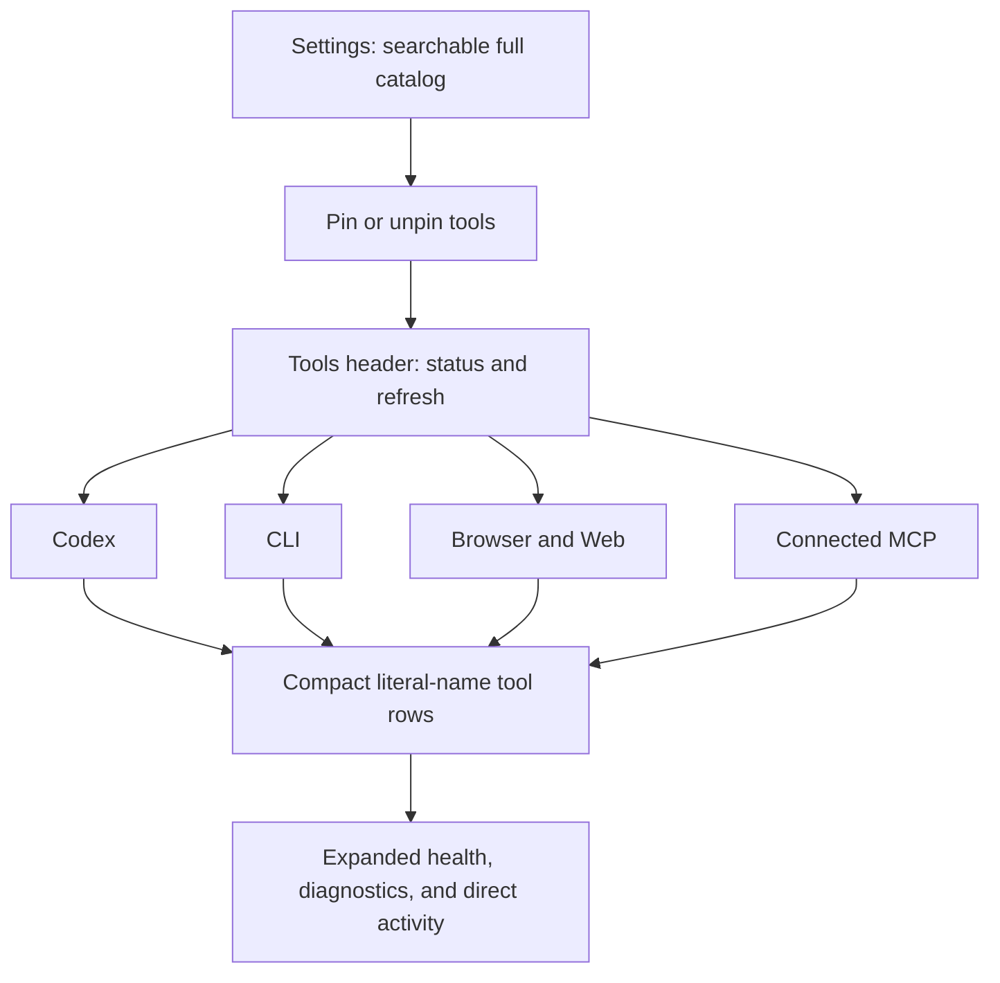
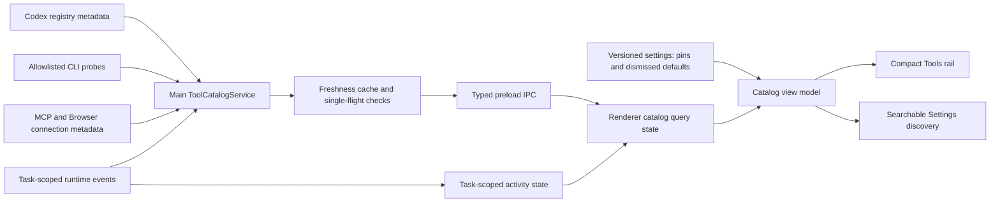

# Curated Tools Rail - Plan

## Goal Capsule

- **Objective:** Replace the registry-heavy Tools rail with a curated, trustworthy view of the literal tools available to Codex on this machine and in the active task.
- **Product authority:** The active Codex runtime, connected MCP state, and local machine checks are the source of truth; the UI must not imply availability it cannot verify.
- **Execution profile:** Focused product and UI redesign spanning the Tools rail and tool discovery in Settings.
- **Open blockers:** None at product scope. Implementation must verify which active-task capability states the runtime can report directly and preserve an honest unknown state where it cannot.

---

## Product Contract

### Summary

The Tools rail will show a curated catalog of literal tool names grouped by source. Each tool will expose machine availability and active-task status, with safe health checks and directly observed activity only when available, without exposing registry noise or inspecting shell commands.

**Product Contract preservation:** changed R8, R12, and R13 to clarify the confirmed safety and shell-privacy boundaries; all other product decisions and IDs are unchanged.

### Problem Frame

The current Tools rail gives equal prominence to aggregate counts, connected app names, MCP server metadata, authentication implementation labels, and raw tool events. A user cannot quickly tell which concrete tools Codex can use, whether those tools work in the current task, or what to do when one is unavailable.

Large registry totals and unfamiliar app names make the surface feel comprehensive while reducing its operational value. The result is a developer-facing registry viewer in a space that should function as a compact toolbelt.

### Key Decisions

| Decision | Rationale |
|---|---|
| Literal names | Rows lead with names such as `rg`, `git`, `exec_command`, and `apply_patch`, not generalized capability labels. |
| Curated rail | Cranberri provides strong defaults, while Settings owns full discovery and persistent pin or unpin choices. |
| Source grouping | Tools are grouped as Codex, CLI, Browser/Web, and Connected MCP so users understand where availability comes from. |
| Dual availability | Machine installation and active-task usability are separate states because an installed tool may still be blocked, unauthenticated, or unavailable to the task. |
| Safe cached checks | Health checks run when the panel opens, reuse recent results, and can be refreshed manually without continuous polling. |
| Direct activity only | Usage is attached only to directly observed Codex and MCP tool events; Cranberri does not inspect shell command text to infer CLI usage. |

### Surface Structure

### Actors

- A1. **Cranberri user:** Inspects tool readiness, runs safe tests, and chooses which discovered tools belong in the rail.
- A2. **Active Codex task:** Determines task-specific capability and supplies direct tool activity when the runtime exposes it.
- A3. **Local and connected tool sources:** Supply CLI installation data, runtime tool metadata, browser/web capabilities, and MCP connectivity state.

### Requirements

**Catalog and discovery**

- R1. The Tools rail displays literal tool names in a curated catalog rather than presenting aggregate registry inventory.
- R2. The catalog groups tools by source: Codex, CLI, Browser/Web, and Connected MCP.
- R3. Cranberri ships with strong defaults for commonly useful tools, including directly exposed Codex tools and CLI names such as `rg`, `grep`, `find`, `git`, `gh`, `node`, `npm`, `npx`, `python3`, `pip`, `jq`, and `curl` when present.
- R4. Settings provides the searchable full catalog and persistent pin or unpin controls; defaults seed the initial rail, after which the user's pin choices determine rail membership.

**Availability and health**

- R5. Every tool distinguishes machine or connection availability from usability in the active Codex task.
- R6. Availability states communicate installed or connected, missing, addressable, usable, authentication or approval required, unavailable, no active task, and unknown without exposing implementation-specific auth labels.
- R7. Opening the Tools rail presents cached health immediately and refreshes stale checks without starting periodic background polling.
- R8. A manual refresh retests the catalog, while tools with an allowlisted, non-side-effecting probe offer an individual test and tools that cannot be tested safely show that limitation plus a setup or authentication route when relevant.
- R9. Health checks must not mutate the repository, invoke a side-effecting remote operation, or expose secrets in their visible output.

**Rows and activity**

- R10. A compact row shows the literal name, source, availability, active-task status, version when meaningful, and last check time. Probe-capable entries show a test control; other entries show an explicit testing limitation and setup route when relevant.
- R11. Expanding a row reveals a technical description, executable or provider identity, bounded diagnostic output, and directly observed recent activity when available.
- R12. Direct Codex and MCP activity is summarized per tool with status, duration, and bounded safe previews, with failures offering a path to send diagnostic context to chat.
- R13. Cranberri does not inspect, display, parse, or infer executable usage from `exec_command` command text; CLI tools used through the shell remain unattributed and shell activity belongs to `exec_command`.

**Noise removal**

- R14. The default rail omits aggregate app, MCP, and tool totals; random app chips; raw server dumps; `observe-only`; whole-registry copy or send actions; and the standalone global event timeline.

### Key Flows

- F1. Inspect the current toolbelt
  - **Trigger:** A1 opens the Tools rail.
  - **Actors:** A1, A2, A3
  - **Steps:** Cranberri displays cached grouped rows, refreshes stale health checks, and distinguishes machine state from active-task state.
  - **Outcome:** A1 can identify ready tools and tools needing attention without reading registry internals.
  - **Covered by:** R1, R2, R5, R6, R7, R10, R14
- F2. Test a tool
  - **Trigger:** A1 selects the test control for a curated tool.
  - **Actors:** A1, A3
  - **Steps:** Cranberri runs a harmless tool-specific check and displays bounded success, failure, version, and remediation information.
  - **Outcome:** A1 knows whether the tool is healthy and what to do when it is not.
  - **Covered by:** R8, R9, R10, R11
- F3. Curate the rail
  - **Trigger:** A1 opens tool discovery in Settings.
  - **Actors:** A1, A3
  - **Steps:** A1 searches the full catalog, inspects source and status, then pins or unpins a tool.
  - **Outcome:** The Tools rail reflects the persisted curated selection, including removed defaults, without exposing the full inventory in the rail.
  - **Covered by:** R3, R4
- F4. Inspect direct activity
  - **Trigger:** A1 expands a directly observed Codex or MCP tool row.
  - **Actors:** A1, A2
  - **Steps:** Cranberri shows recent direct calls and bounded diagnostics attached to that tool.
  - **Outcome:** A1 can understand or reuse relevant tool context without navigating a separate raw timeline.
  - **Covered by:** R11, R12, R13

### Acceptance Examples

- AE1. `rg` is installed and usable
  - **Covers:** R3, R5, R8, R10, R13
  - **Given:** `rg` exists on the machine and the active task authoritatively advertises exact `rg` usability.
  - **When:** A1 opens Tools or tests `rg`.
  - **Then:** The row shows `rg`, its CLI source, installed state, task usability derived from that same-task evidence, version, and a successful safe test without claiming usage from shell command history. A local probe alone would leave task status `unknown`.
- AE2. `gh` needs authentication
  - **Covers:** R5, R6, R8, R9
  - **Given:** `gh` is installed but not authenticated.
  - **When:** Health is checked.
  - **Then:** The row distinguishes installation from authentication readiness and offers a setup route without displaying tokens or auth implementation details.
- AE3. No Codex task is active
  - **Covers:** R5, R6, R7
  - **Given:** The machine catalog is available but no task is active.
  - **When:** A1 opens Tools.
  - **Then:** Machine health remains visible and task status is labeled `no-active-task`, rather than being guessed.
- AE4. A direct tool completes
  - **Covers:** R11, R12
  - **Given:** Codex emits a completed `apply_patch` event.
  - **When:** A1 expands `apply_patch`.
  - **Then:** The row shows the recent success, duration, and bounded result context under `apply_patch`.
- AE5. A CLI runs inside the shell
  - **Covers:** R12, R13
  - **Given:** Codex invokes `rg` inside an `exec_command` call.
  - **When:** activity updates.
  - **Then:** The event belongs to `exec_command`; Cranberri does not attribute a usage count or command arguments to `rg`.
- AE6. An MCP tool is not pinned
  - **Covers:** R2, R4
  - **Given:** A connected MCP server exposes a healthy tool that is neither a default nor pinned.
  - **When:** A1 opens the Tools rail.
  - **Then:** The tool is absent from the rail but remains searchable and pinnable in Settings.

### Success Criteria

- A user can identify whether a curated tool exists, whether the active task can use it, and the next remediation action without interpreting registry internals.
- The Tools rail remains limited to defaults and pinned tools at normal right-rail sizes.
- Opening Tools causes no continuous polling, repository mutation, or side-effecting remote operation.
- Shell command text and sensitive authentication material are not captured to provide CLI activity attribution.

### Scope Boundaries

- The Tools rail does not manually invoke arbitrary tools or become a second command palette or terminal.
- Cranberri does not scan and display every executable available on `PATH`.
- Cranberri does not inspect shell command strings to derive per-CLI activity.
- The redesign does not change which tools Codex can use; it reports and tests available capability.
- Tool installation and authentication execution are not automatic; the surface routes users to an appropriate setup path.
- Full registry inspection and advanced diagnostics remain Settings concerns rather than default rail content.

### Dependencies and Assumptions

- Direct runtime and MCP tools have stable literal names that can be associated with their emitted activity.
- Cranberri can probe curated local executables and connected services without mutating user work.
- Active-task usability may not be knowable for every tool; unknown is an acceptable truthful state.
- Existing persisted settings can own the user's pin selections.

### Sources

- `docs/plans/2026-07-07-004-feat-codex-parity-platform-plan.md` establishes the existing tool registry, capability context, Settings discovery, and observability direction that this Product Contract narrows into a user-facing toolbelt.

---

## Planning Contract

### Context and Research

The existing implementation has three useful seams, but they currently collapse different concepts into one surface:

- `src/shared/tools.ts` and `src/main/tools.ts` model registry inventory and normalized runtime events. Registry inventory remains useful for full discovery, but it is not a user-facing readiness model.
- `src/main/codex/ipc.ts` already fetches task-scoped registry data and falls back to global inventory when a thread has gone stale. That fallback must remain visibly weaker evidence than same-task runtime evidence.
- `src/renderer/state/tools.ts` currently polls events every 1.5 seconds and registry data every 15 seconds. The new rail replaces that behavior with cached-on-open health, explicit refresh, and event-driven activity updates.

Existing settings persistence in `src/shared/settings.ts`, `src/main/settings.ts`, and the renderer settings write queue is the correct home for durable pin choices. Existing app, skill, plugin, and MCP resource management remains available in Settings; this work adds a focused tool catalog rather than deleting those capabilities.

### Key Technical Decisions

- **KTD1 - Separate readiness from inventory.** Introduce a typed `ToolCatalogSnapshot` and catalog entry model alongside `ToolRegistrySnapshot`. The registry remains the discovery input; the catalog is the curated, provenance-aware presentation model.
- **KTD2 - Use stable source-qualified IDs.** Catalog IDs use encoded components: `codex:<literal-name>`, `cli:<literal-name>`, `browser:<stable-provider-id>:<literal-name>`, and `mcp:<stable-provider-id>:<literal-name>`. Prefer runtime-issued opaque provider IDs, percent-encode delimiter-bearing components, and preserve alias mappings when a verified provider identity is renamed. Labels remain literal tool names while IDs prevent same-name collisions across providers.
- **KTD3 - Preserve evidence provenance.** Machine status is derived from local probes or connection metadata. Active-task inventory proves only `addressable`; authoritative task capability metadata or a successful same-task call in the current capability epoch proves `usable`. A failed, denied, authentication-gated, or approval-gated call records its specific task status without promoting usability. Global registry fallback, successful local tests, and installed binaries cannot promote task status beyond `unknown`; no active task maps to `no-active-task`.
- **KTD4 - Probe through an allowlist.** A main-process catalog service owns fixed, non-shell `execFile` probes with timeout, output bounds, capture-time redaction, cancellation, rate limits, single-flight refresh, and a short freshness window. Each probe policy fixes an absolute executable resolved from the same trusted GUI tool-path builder used for Codex, fixed argv, a neutral working directory, a minimal environment allowlist, expected network behavior, and whether automatic execution is permitted. Project-relative and otherwise untrusted resolutions are rejected. Credential-aware checks are manual-only. Codex, Browser/Web, and MCP entries use runtime metadata or connection state and never invoke an arbitrary tool as a health check.
- **KTD5 - Make `exec_command` own shell activity.** Runtime events carry a canonical catalog ID. Shell execution is always attributed to `codex:exec_command`; raw command text is not retained, rendered, parsed, or used to credit nested CLI names. Direct Codex and MCP calls may be correlated by thread ID and tool-call ID. Activity summaries are metadata-only by default, sanitized before logging/cache/IPC, stored in a task-scoped in-memory ring buffer of 20 entries for at most 30 minutes, and purged on task switch or closure; raw arguments, results, source content, and provider-authored instructions are never retained.
- **KTD6 - Persist intent, not a copied catalog.** Settings store `pinnedToolIds` and `dismissedDefaultToolIds`. Rail membership is `defaults union pins minus dismissed defaults`. Unknown pinned IDs survive transient discovery loss so reconnecting a provider restores the user's choice.
- **KTD7 - Replace polling with lifecycle-driven refresh.** Machine probe results are cached globally; task overlays are keyed by active thread ID plus capability epoch and are atomically replaced on a task change. Opening the panel returns only cache data valid for that key and triggers at most one stale refresh. Manual refresh bypasses freshness. Monotonic refresh generations and per-entry observation times prevent older full refreshes from overwriting newer individual tests. Runtime events update activity directly and invalidate only affected task evidence; there is no periodic catalog or activity polling.
- **KTD8 - Keep discovery in Settings.** The rail supports inspection, expansion, refresh, safe test, and navigation to setup. Search, complete discovery, and pin management live in Settings. Settings uses the same fixed source order as the rail, stable alphabetical order within each group, and `All`, `Available`, `Needs attention`, and `Pinned` filters; pinning never reorders the current result set.
- **KTD9 - Remove aggregate actions narrowly.** Whole-registry copy/send actions and the global timeline are removed from the rail and command actions. Existing per-app, per-skill, per-plugin, and per-MCP-resource context actions remain intact.

### Status and Provenance Model

| Evidence | Machine or connection status | Active-task status |
|---|---|---|
| Allowlisted CLI probe succeeds | `installed` | `unknown` unless same-task runtime evidence exists |
| Allowlisted CLI probe reports missing | `missing` | `unavailable` |
| Safe auth-status probe reports signed out | `authentication-required` | `unavailable` |
| Codex global registry lists a tool | `available` | `unknown` |
| Active task registry lists a tool | `available` | `addressable` unless capability metadata proves more |
| Active task successfully completes a direct tool event | Preserve source status | `usable` for the current capability epoch |
| Active task emits a failed direct tool event | Preserve source status | `unavailable`, `approval-required`, or `authentication-required` from the observed outcome |
| MCP server connected globally | `connected` | `unknown` |
| Active task directly emits an MCP tool event | `connected` | `usable` |
| No active task | Preserve machine status | `no-active-task` |
| Check fails without conclusive evidence | Preserve last good status as stale | `unknown` with diagnostics |

### Interaction State Matrix

| Operation | Visible state | Control behavior | Completion and failure |
|---|---|---|---|
| First catalog load with no cache | Skeleton rows in stable group slots | Refresh disabled; Settings link remains available | Replace in place; show a compact retry state if no data can be loaded |
| Stale cached catalog refresh | Existing rows remain visible with a stale label and live status text | One refresh request; individual tests remain enabled unless they target an entry in flight | Merge only newer per-entry observations; preserve last good data on failure |
| Forced catalog refresh | Existing rows remain visible with header progress | Refresh disabled until the current generation settles | New generation supersedes older work; partial failures remain per-entry |
| Individual safe test | Only that row shows progress | Its test control is disabled; full refresh may supersede it with a newer generation | Result expires with catalog freshness; failures show bounded remediation metadata |
| Direct activity | Row status transitions from running to terminal | Expansion and other rows remain interactive | Out-of-order events update only when thread, capability epoch, and call ID match |
| Pin write | Pin indicator updates optimistically without reordering | Repeated writes serialize through the settings queue | Persist success silently; rollback the indicator and announce a concise error on failure |

All status changes use text plus iconography rather than color alone. Interactive rows and controls are semantic buttons with predictable tab order, Enter/Space activation, `aria-expanded` and controlled detail regions, preserved focus across refreshes, and polite live announcements for refresh, test, and pin-write outcomes.

### Remediation Routing

- Missing CLI and authentication states open the Tools section in Settings focused on that tool, where Cranberri shows a non-secret terminal-ready instruction or trusted documentation link; Cranberri never installs or authenticates automatically.
- Disconnected provider states open the existing provider or MCP management surface in Settings and return to the same tool result when closed.
- Failure context is inserted into the active task composer as an unsent, explicitly labeled diagnostic draft after a confirmation preview. The payload contains only catalog ID, source, normalized status/error code, check time, and allowlisted remediation fields; raw stdout, stderr, arguments, results, and provider-authored instructions are excluded and redaction runs again immediately before insertion.
- Orphaned pins remain visible in both rail and Settings using the decoded literal name and source from their stable ID, with `Provider unavailable`, Settings, and Unpin actions. They transition in place when discovery returns.

### High-Level Technical Design

### System-Wide Impact

- **Main process:** gains catalog assembly, safe probes, cache ownership, per-entry tests, and canonical event attribution. Process spawning stays in main and never crosses the context bridge directly.
- **Shared contracts:** gain zod-backed catalog, status, source, provenance, refresh, and settings schemas. Existing registry contracts remain backward compatible while Settings and renderer migrate to the catalog.
- **Preload and IPC:** expose list/refresh/test operations with explicit Promise return types and validated inputs. Test requests accept only catalog IDs, never caller-supplied commands.
- **Renderer state:** owns panel-open lifecycle, active-task scoping, cached snapshots, and optimistic pin changes through the existing settings write queue.
- **UI:** replaces the registry dashboard with compact source groups and expandable rows, and adds the full searchable catalog to Settings.
- **Persistence:** migrates older settings by adding an optional/defaulted tools section. No destructive rewrite occurs, and unknown pin IDs are preserved.
- **Privacy and security:** shell command text, secrets, auth tokens, and unbounded process output do not enter catalog state or visible diagnostics.

### Risks and Mitigations

- **Runtime capability ambiguity:** app-server methods may expose global inventory without authoritative task visibility. Mitigation: encode provenance and render `unknown` instead of upgrading weak evidence.
- **Probe side effects or hangs:** even version/status commands can behave unexpectedly. Mitigation: fixed argv allowlist, direct process execution, short timeout, bounded output, cancellation, and no repository cwd dependency.
- **Stale UI after removing polling:** event or lifecycle gaps could leave data old. Mitigation: panel-open refresh, explicit refresh, direct event updates, and visible checked-at/stale state.
- **Settings race conditions:** pin changes can collide with unrelated settings edits. Mitigation: use the existing section write queue and merge only the tools section.
- **Dense right-rail layout:** grouped rows can still overflow the half-height panel. Mitigation: stable compact row dimensions, collapsed details by default, one scroll container, and desktop viewport smoke coverage.
- **Discovery churn:** disconnected MCP servers can temporarily remove entries. Mitigation: preserve orphan pin IDs and display reconnect/setup state when the provider returns.

### Alternatives Considered

- **Continue rendering registry aggregates:** rejected because it preserves the current comprehension problem and conflates inventory with readiness.
- **Scan all executables on PATH:** rejected because it creates noise, performance cost, and a false promise that Codex can use every binary.
- **Infer nested CLI calls from shell text:** rejected because it violates the explicit privacy boundary and produces incorrect attribution for scripts, aliases, pipelines, and quoted content.
- **Probe every direct/MCP tool:** rejected because arbitrary invocation is not a health check and may mutate external or local state.
- **Keep interval polling at a slower cadence:** rejected because panel lifecycle and direct runtime events cover the user need without permanent work.

### Open Questions Deferred to Implementation

- Confirm the exact app-server response that can prove direct tool availability for a specific active task. Until proven in code or fixtures, map registry-only evidence to `unknown` and same-thread observed calls to `usable`.
- Browser/Web entries may be built-in runtime capabilities or connected providers depending on app-server output. Preserve source-qualified IDs and use the strongest truthful provider metadata available without changing the four product groups.

---

## Implementation Units

### U0 - Validate App-Server Capability Evidence

**Files:** existing generated app-server protocol definitions and fixtures under `src/main/codex/`, `src/main/codex/fakeClient.ts`, and a focused protocol characterization test

**Work:**

- Capture authoritative protocol shapes for global inventory, active-task inventory, stale-thread fallback, capability changes, and successful, failed, denied, authentication-gated, and approval-gated direct events.
- Record which fields prove only addressability and which can prove same-task usability; default every unproven path to `unknown`.
- Establish the capability-epoch signal used to invalidate task overlays. If no explicit epoch exists, derive a local epoch from task start/resume and registry-change notifications without claiming stronger runtime semantics.

**Tests:**

- Characterizes current global and task-scoped registry responses without inventing unavailable fields.
- Proves stale-thread fallback cannot promote task usability.
- Maps successful and non-successful direct event outcomes to the provenance table.

**Traceability:** R5-R7, R11-R13; AE1, AE3-AE5; F1, F4.

**Depends on:** none.

### U1 - Typed Catalog Contract and Pure Assembly

**Files:** `src/shared/tools.ts`, new `src/main/tool-catalog.ts`, new `src/main/tool-catalog.test.ts`

**Work:**

- Add zod-backed source, machine status, task status, provenance, probe capability, activity summary, catalog entry, and snapshot contracts.
- Define stable source-qualified IDs and the default curated CLI/Codex/Browser tool descriptors.
- Implement pure catalog assembly from registry metadata, safe probe results, active thread ID, direct event evidence, and persisted preferences.
- Preserve last-good entries as stale when a refresh fails and preserve orphan pins independently of transient inventory.

**Tests:**

- Distinguishes machine status from task status for installed CLI tools.
- Treats global registry evidence as task `unknown` and same-thread evidence as `usable`.
- Emits `no-active-task` without hiding machine health.
- Computes membership from defaults, pins, and dismissed defaults while preserving unknown pin IDs.
- Generates collision-free IDs for same-named tools from different sources.

**Traceability:** R1-R7, R10; AE1, AE3, AE6; F1, F3.

**Depends on:** U0.

### U2 - Safe Checks, Cache, and Typed IPC

**Files:** `src/main/tool-catalog.ts`, `src/main/tool-catalog.test.ts`, `src/main/codex/ipc.ts`, `src/preload/index.ts`, `src/renderer/vite-env.d.ts`

**Work:**

- Add a fixed non-shell probe table for the curated CLI entries and safe authentication checks where available.
- Resolve probes through the same GUI tool-path builder used for Codex, reject project-relative resolution, and execute fixed absolute paths with a neutral working directory, minimal per-probe environment, timeout, output limits, capture-time redaction, rate limits, cancellation, and per-catalog single-flight behavior.
- Keep credential-aware and network-capable checks manual-only and identify local installation evidence as Cranberri-host evidence whenever Codex environment parity cannot be proven.
- Add IPC handlers and preload methods for cached list, forced refresh, and allowlisted single-entry test.
- Reject unknown IDs and never accept executable or argv values from renderer input.
- Authorize catalog IPC to the trusted Cranberri main frame and app origin, denying Browser contents, child frames, secondary windows, and navigated renderers.
- Use registry and connection metadata for direct, Browser/Web, and MCP readiness without invoking those tools.

**Tests:**

- Returns cached health immediately within the freshness window and coalesces concurrent refreshes.
- Forced refresh bypasses freshness and a per-tool test changes only the requested entry.
- Times out a hung probe, bounds output, redacts secret-shaped values, and preserves last-good status on failure.
- Rejects arbitrary test IDs and proves no shell or caller-supplied command path exists.
- Rejects project-relative/PATH-shadowed binaries, does not inherit secret environment values, and denies untrusted IPC senders.
- Reports an installed but signed-out `gh` as authentication-required without exposing credentials.

**Traceability:** R5-R9, R11; AE1, AE2; F1, F2.

**Depends on:** U1.

### U3 - Canonical, Task-Scoped Activity Without Polling

**Files:** `src/shared/tools.ts`, `src/main/tools.ts`, `src/main/tools.test.ts`, `src/renderer/state/tools.ts`, `src/renderer/state/tools.test.ts`, and the existing Codex event bridge where necessary

**Work:**

- Attach canonical catalog IDs to directly observed tool events and correlate lifecycle updates by thread ID plus tool-call ID.
- Normalize all shell execution to `codex:exec_command`, suppress raw command text and command-derived names, and leave unmatched events unattributed.
- Reduce direct activity to normalized metadata before logging, cache, or IPC; use the bounded task-scoped in-memory ring buffer and purge it on task switch or closure.
- Scope activity queries and subscriptions to the active task.
- Replace 1.5-second event and 15-second registry polling with cached-on-open catalog refresh, direct event updates, and explicit invalidation.

**Tests:**

- Attributes a completed direct `apply_patch` event to `codex:apply_patch` with bounded status/duration details.
- Attributes an `rg` shell command only to `codex:exec_command` and does not persist or expose the command text.
- Keeps events from another task out of the active task's rows.
- Does not schedule interval polling and refreshes once when stale panel data is opened.
- Handles progress/completion arriving out of order or without a matching start without inventing attribution.
- Never retains secret-shaped values, source content, raw arguments/results, or activity from a prior task or expired ring-buffer entry.

**Traceability:** R7, R11-R13; AE4, AE5; F1, F4.

**Depends on:** U1, U2.

### U4 - Versioned Tool Curation Settings

**Files:** `src/shared/settings.ts`, `src/main/settings.ts`, `src/main/settings.test.ts`, `src/renderer/state/settings-write-queue.test.ts`

**Work:**

- Add a versioned/defaulted `tools` settings section with `pinnedToolIds` and `dismissedDefaultToolIds`.
- Migrate existing settings without disturbing unrelated preferences.
- Route pin and unpin writes through the existing renderer section write queue.
- Keep orphan pin IDs during normalization and round trips.

**Tests:**

- Migrates pre-tools settings to empty user intent while retaining all prior sections.
- Persists default dismissal separately from explicit pins.
- Serializes concurrent tools and unrelated section writes without lost updates.
- Round-trips unknown source-qualified IDs unchanged.

**Traceability:** R3, R4; AE6; F3.

**Depends on:** U1.

### U5 - Full Catalog Discovery in Settings

**Files:** `src/renderer/components/SettingsDialog.tsx`, new `src/renderer/components/settings/ToolCatalogSettings.tsx`, new `src/renderer/components/settings/tool-catalog-settings-model.ts`, `src/renderer/state/tools.ts`, new colocated model tests, and `src/renderer/components/CodexResourcesSection.tsx` only where integration requires it

**Work:**

- Add a searchable full-catalog view in the fixed source order with stable alphabetical rows and `All`, `Available`, `Needs attention`, and `Pinned` filters; omit empty discovered groups but retain groups containing orphaned pins.
- Show literal names, concise status, source, pin state, safe-test availability, and setup route.
- Persist pin/unpin decisions through the settings state layer while retaining existing plugin, skill, app, and MCP resource management.
- Put shared source ordering, status, membership, orphan-pin, and pin-state selectors in renderer tool state. Keep only Settings search/filter transforms local to the Settings model and only expansion/layout state local to the rail model.
- Represent temporarily unavailable pinned tools with decoded literal/source labels, a provider-unavailable status, and Settings/Unpin actions without silently dropping user intent.

**Tests:**

- Search matches literal names and source without exposing raw registry payloads.
- Pinning a non-default adds it to computed rail membership.
- Unpinning a default records a dismissal; repinning clears that dismissal.
- Existing Apps/Skills/Plugins/MCP settings flows remain reachable.
- Loading, empty, stale, disconnected-provider, and refresh-error states keep prior catalog data usable.
- Keyboard navigation, focus retention, text status, and optimistic pin rollback behave as defined in the interaction matrix.

**Traceability:** R2-R4, R6, R8; AE6; F2, F3.

**Depends on:** U1, U2, U4.

### U6 - Compact Curated Tools Rail

**Files:** `src/renderer/components/right-rail/ToolsPanel.tsx`, new `src/renderer/components/right-rail/ToolGroup.tsx`, new `src/renderer/components/right-rail/ToolRow.tsx`, new `src/renderer/components/right-rail/tool-catalog-model.ts`, and colocated model/component tests

**Work:**

- Replace aggregate counters, app chips, server dumps, observe-only labels, global timeline, and whole-registry actions with four source groups.
- Render stable compact rows with literal name, source, machine/connection status, task status, version, checked time, and either a safe test control or an explicit testing limitation/setup route.
- Add expandable technical details, bounded diagnostics, directly observed recent activity, and a path to send failure context to chat.
- Trigger cached-on-open refresh, expose manual refresh, and keep one predictable scroll container with stable bottom-rail opacity and sizing.
- Implement semantic row/control behavior, focus retention, non-color labels, live announcements, and the confirmed metadata-only diagnostic draft flow.

**Tests:**

- Renders only defaults plus pins and keeps unpinned discovered tools out of the rail.
- Separately labels installed/connected and active-task status, including `unknown` and `no-active-task`.
- Expands one row without resizing sibling rows and shows only bounded direct activity.
- Manual refresh and per-entry test expose progress and failure without closing or shifting the panel.
- Empty and refresh-failure states preserve useful cached rows and route discovery to Settings.
- Switching tasks never renders the previous task's status or activity, and older refresh generations cannot overwrite newer per-entry evidence.
- Normal, narrow, and minimum supported rail widths preserve controls, text containment, keyboard access, and the bottom icon rail.

**Traceability:** R1-R14; AE1-AE6; F1-F4.

**Depends on:** U1-U5.

### U7 - Remove Registry Noise and Update End-to-End Fixtures

**Files:** `src/renderer/state/actions.ts`, `src/renderer/state/actions.test.ts`, `src/renderer/components/CommandPalette.tsx`, `src/main/codex/fakeClient.ts`, `scripts/smoke-electron.mjs`, and obsolete registry-view-model tests replaced by catalog tests

**Work:**

- Remove whole-registry copy/send commands and old rail-only registry presentation helpers.
- Retain individual app, MCP resource, plugin, and skill context actions.
- Update fake runtime data to exercise direct Codex activity, MCP activity, unavailable tools, no active task, and truthful unknown states.
- Replace smoke assertions for aggregate counts/timeline with curated rows, pin persistence, refresh/test behavior, expansion, and shell-privacy attribution.

**Tests:**

- Command palette has no whole-registry action but retains individual resource context actions.
- Electron smoke opens Tools without polling-dependent waits, expands and safely tests a row, and verifies Settings pin persistence.
- Smoke verifies an `rg` command event appears only under `exec_command` and never reveals command text.
- Existing startup/session loading, chat, diff, terminal, browser, Settings, and update smoke checkpoints remain green.

**Traceability:** R4, R7-R14; AE4-AE6; F1-F4.

**Depends on:** U1-U6.

---

## Verification Contract

Run checks in this order, fixing failures before proceeding:

1. Focused Vitest suites for app-server protocol characterization, catalog assembly, probes/cache, event normalization, settings migration/write queue, view models, accessibility state, and actions.
2. `npm test` for the complete unit suite.
3. `npm run build` for TypeScript, ESLint, and the production Electron/Vite build required by repository policy.
4. `npm run package:dir` to catch packaged-main/preload and native dependency issues.
5. `npm run smoke:electron` against the packaged app, covering Tools rail, Settings discovery/pinning, safe checks, task scoping, shell privacy, and unchanged core workflows.
6. Desktop screenshot, keyboard, and screen-reader-semantics review at the normal `1400x900` Cranberri window, the minimum `900x600` window, and the minimum `320px` right rail, checking scroll ownership, focus retention, live status, row stability, text containment, bottom icon opacity, and no popover/rail overlap.
7. `git diff --check` and a final diff review for unrelated churn, secrets, generated release artifacts, and accidental command-text capture.

The implementation is not complete when only the unit model is green. The packaged Electron flow must prove the IPC, preload, settings persistence, and rendered rail together.

---

## Definition of Done

- [ ] The default Tools rail contains only curated literal tool rows grouped as Codex, CLI, Browser/Web, and Connected MCP.
- [ ] Every row truthfully separates machine/connection health from active-task usability and retains evidence provenance.
- [ ] Cached-on-open and manual refresh behavior works without interval polling.
- [ ] Only fixed, allowlisted, non-side-effecting probes can be tested; arbitrary Codex/MCP tool invocation and renderer-supplied commands are impossible.
- [ ] Direct activity is task-scoped, `exec_command` owns shell activity, and no shell command text is captured or displayed.
- [ ] Activity and diagnostic handoff are metadata-only, bounded, redacted before cache/IPC, and purged at the documented task/TTL boundaries.
- [ ] Settings provides searchable full discovery and durable default dismissal/pin behavior, including orphan pins.
- [ ] Tool controls are keyboard operable, preserve focus, expose semantic expansion/status state, and remain legible at `900x600` with a `320px` rail.
- [ ] Registry aggregates, random app chips, observe-only labels, global timeline, and whole-registry copy/send actions are absent from the rail.
- [ ] Existing per-resource context actions and Settings management capabilities remain intact.
- [ ] Focused tests, full unit tests, production build, packaged app, Electron smoke, and visual interaction QA pass.
- [ ] The final diff contains no secrets, unrelated changes, or release artifacts and is ready for a single focused PR.
