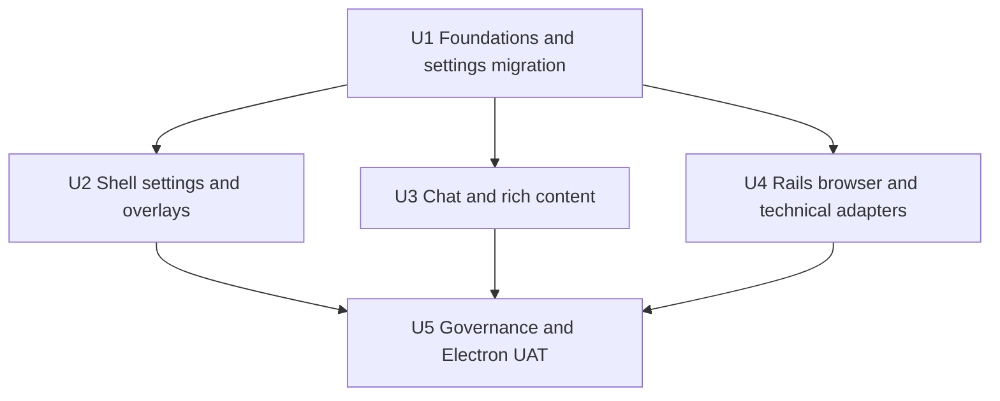

# Semantic Typography System - Plan

## Goal Capsule

- Replace component-selected font sizes, weights, line heights, and text colors with a small semantic role system that produces the same hierarchy everywhere.
- Make Standard use 13px operational chrome and 15px conversation prose, with Compact and Large as fully tested presets.
- Keep code and terminal sizing independently configurable while making every renderer consume the shared font families and accessible color pairings.
- Stop when production surfaces no longer depend on arbitrary typography utilities, semantic foreground/background pairs pass their contrast contract, dependency-owned text follows the app contract where controllable, and Electron UAT passes across themes and presets.

---

## Product Contract

### Summary

Cranberri should feel dense and calm in operational chrome, comfortable in conversation, and exact in technical content. Standardization means that equivalent intentions receive the same typography, not that every surface receives the same size.

### Requirements

**Semantic hierarchy**

- R1. Cranberri exposes named roles for page title, overlay title, panel title, body, prose, control, label, metadata, micro, status, code, and terminal text.
- R2. Standard renders operational body text at 13px and conversation prose at 15px.
- R3. Meaningful status, description, and decision text never renders below 12px; the 11px micro role is limited to optional timestamps, counts, versions, and similar metadata.
- R4. User and assistant messages share the same prose role, while reasoning and system content use a distinct supporting role.
- R5. Equivalent headings, menus, fields, empty states, errors, and statuses use the same role across shell, settings, right rail, overlays, and transient surfaces.

**Appearance and accessibility**

- R6. Interface typography is selectable through Compact, Standard, and Large presets rather than an arbitrary numeric slider.
- R7. Density is represented independently from type size; the first release preserves current spacing as the Standard density and does not silently couple spacing to the type preset.
- R8. Primary, secondary, tertiary, disabled, success, warning, info, danger, mention, on-accent, and on-danger pairings have explicit theme values and automated contrast checks.
- R9. Disabled text can use reduced opacity; visible enabled text must satisfy WCAG AA for normal text on every supported app surface.

**Content and technical surfaces**

- R10. Markdown headings, paragraphs, lists, quotes, tables, links, inline code, tagged code, and untagged fenced code have deliberate roles.
- R11. CodeMirror, code preview, and changed-file diff content use the shared mono family and Code size setting; dependency controls do not shrink below usable sizes.
- R12. Xterm uses the shared mono stack, a readable line-height, an AA-oriented ANSI palette, and minimum contrast enforcement.
- R13. Mermaid labels use the shared UI family and an interface-relative size.
- R14. Toasts and app tooltips use app-controlled typography and semantic colors instead of dependency/native defaults where a controlled primitive exists.

**Durability**

- R15. A repository audit rejects unauthorized raw typography utilities and contrast regressions while allowing explicit exceptions for content renderers and dependency integration code.
- R16. Electron UAT captures representative chat, rails, settings, dialogs, code, terminal, browser chrome, and toasts in light and dark at Compact, Standard, and Large.

### Acceptance Examples

- AE1. Given Standard and either theme, user and assistant prose compute to 15px with the same line-height and readable measure.
- AE2. Given a failed action in dark mode, danger copy remains visually semantic and measures at least 4.5:1 against its actual surface.
- AE3. Given Large at a 900px-wide window, rail headings, actions, paths, and statuses wrap or truncate without overlap.
- AE4. Given a Markdown response containing every heading, untagged code, tagged code, a table, quote, link, and mention, each element has visible hierarchy and code follows the Code setting.
- AE5. Given ANSI black, white, and bright colors in both terminal themes, necessary text reaches the configured minimum contrast rather than disappearing into the terminal background.
- AE6. Given a new component using a raw font-size or line-height utility outside an approved boundary, `npm run typography:audit` fails with its file and token.

### Scope Boundaries

- Embedded webpage typography remains controlled by the page and Chromium; Cranberri standardizes browser chrome and captured inspection text only.
- Physical fallback font selection remains OS-controlled because Cranberri does not bundle fonts.
- This work does not redesign information architecture, row spacing, or panel layout beyond changes required to prevent typography overflow.
- This work does not add a public design-system or Storybook dependency.

---

## Planning Contract

### Key Technical Decisions

- KTD1. Define semantic role classes in `src/renderer/lib/typography.ts` with CVA and CSS variables rather than adding a generic wrapping component; this preserves existing DOM and lets every element choose the correct semantic tag.
- KTD2. Replace the numeric `appearance.uiFontSize` setting with `appearance.typePreset` while migrating old values to Compact, Standard, or Large. Keep Code and Terminal numeric settings.
- KTD3. Use role-specific size and line variables for each preset rather than arithmetic clamps. Every preset therefore has an intentional, testable scale with no duplicate settings.
- KTD4. Separate text tone from type role. Typography helpers select family, size, line-height, and weight; semantic tone helpers select foreground and state pairing.
- KTD5. Treat third-party integrations as adapters. Override or configure CodeMirror, diff viewer, Xterm, Mermaid, and Sonner at their integration boundary instead of spreading exceptions across feature components.
- KTD6. Add a zero-dependency Node audit script and focused Vitest coverage. Wire the audit into `npm run build` after the migration reaches zero unauthorized declarations.
- KTD7. Use the existing Electron smoke harness as the visual specimen and UAT surface rather than shipping a production typography laboratory.

### Sequencing

### Risks and Mitigations

- Preset migration can reset a user's preference. Preserve old numeric values through deterministic nearest-preset migration and test every boundary.
- A global color change can affect icons as well as text. Introduce text-specific semantic tokens and migrate enabled text deliberately instead of changing every existing RGB channel in place.
- Tailwind Merge does not understand every custom size token. Configure or avoid conflicting class composition so semantic role output remains deterministic.
- Dependency CSS can outrank app classes. Verify computed output in packaged Electron, not only source class names.
- A broad migration can hide overflow regressions. Run narrow-window Large UAT after each surface group, then the full matrix at the end.

---

## Implementation Units

### U1. Semantic foundations, presets, and contrast contract

- **Goal:** Establish the role/tone API, explicit three-preset metrics, accessible color pairings, and persisted-setting migration.
- **Requirements:** R1, R2, R3, R6, R7, R8, R9.
- **Files:** `src/renderer/index.css`, `tailwind.config.js`, `src/renderer/lib/typography.ts`, `src/renderer/lib/typography.test.ts`, `src/shared/settings.ts`, `src/main/settings.ts`, `src/main/settings.test.ts`, `src/renderer/state/appearance.ts`, `src/renderer/state/appearance.test.ts`, `src/renderer/components/settings/AppearanceSettings.tsx`.
- **Approach:** Define fixed role variables per preset, semantic role/tone helpers, text-safe foreground tokens, and v4 settings migration. Replace the Interface slider with a three-item segmented control while leaving density spacing unchanged.
- **Test scenarios:** Default Standard values; Compact and Large metrics; migration from every old 11-16 numeric value; invalid preset fallback; light/dark contrast for enabled text; accent and danger button pairings.
- **Verification:** Focused settings/appearance/typography tests, `npm run typecheck`, and Appearance screenshots in both themes.

### U2. Shell, settings, shared controls, and overlays

- **Goal:** Migrate app chrome, repo/session surfaces, settings pages, dialogs, command palette, menus, fields, toasts, and controlled tooltips to semantic roles.
- **Requirements:** R3, R5, R9, R14.
- **Files:** `src/renderer/lib/ui.ts`, `src/renderer/components/Header.tsx`, `src/renderer/components/Workspace.tsx`, `src/renderer/components/RepoRail.tsx`, `src/renderer/components/UsageMeter.tsx`, `src/renderer/components/SettingsDialog.tsx`, `src/renderer/components/settings/*`, `src/renderer/components/GeneralSettings.tsx`, `src/renderer/components/CodexResourcesSection.tsx`, `src/renderer/components/DiagnosticsSection.tsx`, `src/renderer/components/ConfirmDialog.tsx`, `src/renderer/components/CommandPalette.tsx`, `src/renderer/components/AppToaster.tsx`, `src/renderer/components/UpdateResultToast.tsx`.
- **Approach:** Replace utility combinations by intent, normalize overlay and panel hierarchy, prevent inherited field weight, and add one app tooltip primitive for visible app-owned hover labels where practical.
- **Test scenarios:** Active/inactive navigation, loading/empty/error states, destructive dialogs, long paths, long session titles, settings hierarchy, stacked success/error toasts, Large at minimum rail width.
- **Verification:** Existing component tests, targeted new role assertions, `npm run typecheck`, and shell/settings/overlay Electron captures.

### U3. Conversation and rich-content hierarchy

- **Goal:** Standardize user/assistant prose, supporting transcript roles, composer, transient chat controls, and every Markdown content type.
- **Requirements:** R2, R3, R4, R5, R10, R13.
- **Files:** `src/renderer/components/ChatWindow.tsx`, `src/renderer/components/chat/Transcript.tsx`, `src/renderer/components/chat/TranscriptList.tsx`, `src/renderer/components/chat/MarkdownContent.tsx`, `src/renderer/components/chat/mention-pill.tsx`, `src/renderer/components/chat/MarkdownMedia.tsx`, `src/renderer/components/chat/MermaidDiagram.tsx`, `src/renderer/components/chat/AddMenu.tsx`, `src/renderer/components/chat/ApprovalSelector.tsx`, `src/renderer/components/chat/ModelSelector.tsx`, `src/renderer/components/chat/AttachmentChips.tsx`, `src/renderer/components/chat/ContextWindowIndicator.tsx`, `src/renderer/components/chat/GoalModePill.tsx`, `src/renderer/components/chat/PlanModePill.tsx`, `src/renderer/components/editor/CodePreview.tsx`.
- **Approach:** Remove fixed line-height overrides, define a complete Markdown renderer, route untagged fences through the code role, distinguish tool/system/error content, and use consistent menu/metadata roles.
- **Test scenarios:** Equal user/assistant metrics; streaming and completed content; all Markdown headings; tagged/untagged code; lists, quotes, tables, links, mentions; expanded reasoning; approval and compaction errors; model menu hierarchy; Mermaid theme/preset updates.
- **Verification:** Transcript/Markdown/CodePreview tests, `npm run typecheck`, and a complete chat specimen captured in both themes and all presets.

### U4. Right rail, browser chrome, editor, diff, and terminal adapters

- **Goal:** Migrate operational rails and make technical dependencies follow the shared type and color contract.
- **Requirements:** R3, R5, R9, R11, R12, R13.
- **Files:** `src/renderer/components/RightRail.tsx`, `src/renderer/components/right-rail/*`, `src/renderer/components/BrowserWindow.tsx`, `src/renderer/components/TerminalWindow.tsx`, `src/renderer/components/terminal-theme.ts`, `src/renderer/components/editor/CodeEditor.tsx`, `src/renderer/components/editor/CodePreview.tsx`.
- **Approach:** Normalize panel/row/status roles, add emergency wrapping where diagnostics can contain unbroken values, override diff metrics, install an explicit CodeMirror dark-aware theme including search controls, and configure Xterm family, line-height, and contrast.
- **Test scenarios:** Every file status; long paths/errors; agent/tool/process/GitHub states; browser address/search labels; Code 8/12/24; diff parity; terminal 8/13/24; every ANSI base/bright color in light/dark.
- **Verification:** Existing rail/editor/terminal tests plus contrast tests, `npm run typecheck`, and packaged Electron captures at 900px and wide desktop.

### U5. Typography governance and complete Electron UAT

- **Goal:** Prevent regression and prove the whole system in the real app.
- **Requirements:** R15, R16 and all acceptance examples.
- **Files:** `scripts/typography-audit.mjs`, `scripts/smoke-electron.mjs`, `package.json`, targeted tests and documentation under `docs/audits/`.
- **Approach:** Audit unauthorized raw type utilities and fixed line-height declarations, allow only documented adapter/content exceptions, add contrast assertions, and extend smoke captures for preset/theme/width/content matrices.
- **Test scenarios:** Audit passes current production code; injected forbidden token fails with file/token; Compact/Standard/Large in light/dark; narrow Large shell; Markdown specimen; dependency surfaces; stacked toasts; disabled states remain exempt.
- **Verification:** `npm run typography:audit`, `npm test`, `npm run build`, packaged Electron smoke in fresh and repo modes, screenshot inspection, and `git diff --check`.

---

## Verification Contract

| Gate | Units | Done signal |
|---|---|---|
| Focused Vitest files | U1-U4 | New and existing role, migration, content, rail, and terminal scenarios pass |
| `npm run typography:audit` | U5 | No unauthorized production typography or contrast violations |
| `npm test` | U1-U5 | Full unit suite passes |
| `npm run build` | U1-U5 | Metadata, typecheck, lint, updater helper, and production renderer build pass |
| Packaged Electron smoke `fresh` | U2-U5 | First-run/settings/overlay typography and interaction checks pass |
| Packaged Electron smoke `repo` | U2-U5 | Chat/rails/browser/editor/terminal typography and interaction checks pass |
| Screenshot review | U1-U5 | No overlap, clipping, illegible text, hierarchy drift, or blank dependency surfaces across required matrix |

---

## Definition of Done

- The semantic roles and three presets are the only normal production path for app-owned typography.
- Standard computes to 13px operational body and 15px user/assistant prose.
- Enabled meaningful text is at least 12px and passes the contrast contract on its supported surfaces.
- Markdown, CodeMirror, diff, Xterm, Mermaid, Sonner, and controlled tooltips follow their documented adapters.
- Old numeric Interface settings migrate without data loss or startup failure.
- Compact, Standard, and Large pass light/dark packaged Electron UAT at wide and narrow widths.
- The audit, full tests, build, both smoke modes, and diff checks pass.
- Dead utility combinations and abandoned adapter attempts are removed rather than left as compatibility clutter.
