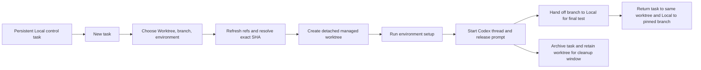
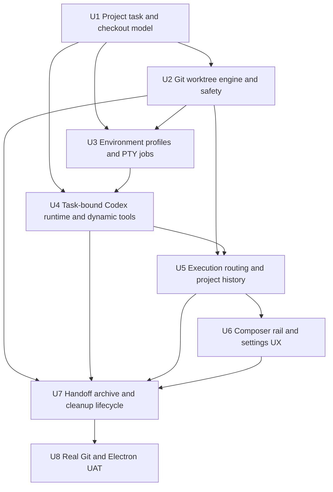

# First-Class Worktree Environments - Plan

## Goal Capsule

- Turn each registered repository into one stable project with a user-selected Local checkout and pinned home branch.
- Give every non-Local root task and its workers one Cranberri-managed Git worktree, created detached at the exact commit of the selected branch and bound durably to its Codex thread.
- Let app-level, project-associated environment profiles run repository-specific setup and actions without Cranberri knowing about Docker, Honcho, AWS, npm, or any other stack.
- Let a persistent Local control task manage environment profiles through typed Cranberri tools, while ordinary new tasks default to Worktree.
- Support safe Worktree-to-Local and Local-to-Worktree handoff so the same task can move into the foreground for final testing and return Local to its pinned branch afterward.
- Keep the interface compact: location, branch, and environment selections instead of a Git data dump.
- Stop when migration, provisioning, setup, concurrent task isolation, handoff, archive retention, cap cleanup, restart recovery, and real Electron UAT all pass without risking Local or external worktrees.

---

## Product Contract

### Summary

Cranberri treats a repository as a project, Local as its foreground checkout, and a managed worktree as the private execution checkout for one root task and its workers. The app owns orchestration, identity, safety, and lifecycle. Repository-specific setup remains user-defined in an environment profile.

The normal flow is:

### Requirements

**Project and checkout identity**

- R1. Existing `repos.json` entries migrate losslessly into versioned project records while preserving IDs, names, paths, expanded state, workspace state, and session pins.
- R2. A project owns one explicit Local checkout, a canonical Git common-directory identity, a user-selected pinned local branch, an optional default environment, and a persistent Local control task. Remote-tracking refs can base a task but cannot be pinned until a local branch exists.
- R3. The pinned branch is the default base for new worktrees and the branch Local returns to after handoff. Pinning does not continuously switch or reset the Local checkout.
- R4. Cranberri recognizes Local, Cranberri-managed, and external Git worktrees as different checkout kinds. User-created permanent worktrees are external in this slice; external worktrees remain user-owned and are never counted, adopted, moved, or deleted implicitly.
- R5. A task record durably binds project ID, nullable Codex thread ID until thread creation succeeds, checkout ID, managed-worktree ID when present, base ref, base SHA, environment ID and revision, lifecycle state, timestamps, and a pending-first-turn payload with delivery state. Pre-thread drafts live in the same authoritative task store.
- R6. Workers and nested workers inherit their parent task's checkout. They never receive independent managed worktrees and never appear as top-level project sessions.

**Task defaults and branch selection**

- R7. Every project opens to exactly one persistent Local control task. It appears as a fixed `Local` row, reopens instead of duplicating, cannot be archived or deleted, and replaces a missing Codex thread in place. Closing its tab closes only the view. Additional root-task tabs default to Worktree, while the user can explicitly choose Local subject to the Local execution lease.
- R8. Opening the branch picker enumerates configured remotes and runs fetch/prune for each without pulling, merging, or changing Local. Any failed or partial refresh continues with refreshed and local refs and shows `Couldn’t refresh branches. Using local refs.` with a `Retry` action for failed remotes; sanitized detail goes to Diagnostics.
- R9. The branch picker groups local and remote refs, marks the pinned and current branches, and resolves the selected ref to an exact commit before creation.
- R10. Worktree creation uses `git worktree add --detach {path} {sha}`. Cranberri records both the human-readable base ref and immutable SHA and does not create a feature branch automatically.
- R11. `Include local changes` is off by default and lives inside the branch popover. It is enabled only when the selected base resolves to Local `HEAD`; it copies tracked, staged, and untracked changes without mutating Local, and a failed apply rolls provisioning back safely.

**Managed worktree location and lifecycle**

- R12. The default root is `${CRANBERRI_HOME}/worktrees` when `CRANBERRI_HOME` is set and `~/.cranberri/worktrees` otherwise. Settings can choose a different root for future worktrees.
- R13. Paths use `{root}/{project-slug}-{project-id8}/{task-slug}-{worktree-id8}`. Branch names never become directory paths, and renaming a task never moves its checkout.
- R14. Worktree ownership is recorded in main-process state and in a matching sidecar manifest under the managed root, never as an untracked file inside the checkout.
- R15. Provisioning is serialized per project and globally capacity-checked so simultaneous requests cannot exceed the cap or allocate the same path.
- R16. If Git succeeds but persistence or setup fails, Cranberri records an interrupted operation and reconciles it on startup instead of silently orphaning or deleting the checkout.

**App-level environments**

- R17. Environment profiles are app-level, associated with a project, and stored under Electron user data rather than requiring a repository file.
- R18. A profile has a stable ID, name, version, default setup script, optional macOS/Windows/Linux overrides, declared environment-variable names, common terminal actions, and a deterministic revision hash. Every normalized TOML revision is stored immutably while a task or archive references it.
- R19. The canonical profile file uses a Codex-compatible `environment.toml` core (`version`, `name`, and `setup.script`) with Cranberri-owned typed extensions for platform scripts and actions. Parsing and writing use a TOML library rather than string manipulation.
- R20. One profile can be the project default. A Worktree task can select another profile or `No environment`; setup, retry, actions, and recreation resolve immutable content by environment ID plus revision, so later edits or profile deletion cannot change existing tasks.
- R21. Setup runs inside the new worktree before the Codex thread starts. Cranberri atomically stores the first prompt and inputs before provisioning, keeps them queued until setup exits successfully, and clears them only after app-server acknowledges the first turn. Failure leaves a retryable task draft with its prompt intact.
- R22. Automated setup receives a minimal OS/shell environment, `CRANBERRI_SOURCE_TREE_PATH`, `CRANBERRI_WORKTREE_PATH`, project/base metadata, and Codex-compatible `CODEX_SOURCE_TREE_PATH` and `CODEX_WORKTREE_PATH` aliases. A trusted profile may declare additional variable names to inherit; profiles never store secret values, and Cranberri-only credentials are never passed by default.
- R23. Setup and actions run in a real PTY so interactive flows such as AWS login work. Output is bounded, cancelable, process-registered, and available through `View logs`; actions open in the integrated terminal at the task checkout. Raw logs use owner-only permissions, never enter telemetry, survive restart only while their failed/test/needs-attention state is retained, and expose only sanitized summaries in Diagnostics.
- R24. The persistent Local control task receives typed `cranberri_environments` dynamic tools to list, read, create, update, validate, test, set default, and safely delete profiles. List/read/validate and non-executing edits may run automatically, but edits create an untrusted revision, delete requires confirmation, and test/setup/action execution requires a compact in-app approval that shows the exact project and revision diff. Any edit revokes trust. Worktree cleanup, root changes, secret values, and arbitrary filesystem deletion are not exposed as agent tools.
- R25. Environment `test` creates a temporary managed worktree from the pinned branch, runs setup there, streams logs, and cleans only a verified safe test checkout. A failed test counts toward the cap, remains inspectable, and reuses the same checkout on retry when its ownership and Git state still match.

**Task-bound execution**

- R26. Paths are resolved from trusted project/task/checkout IDs in the main process. New IPC contracts do not accept an arbitrary renderer-supplied execution path, and every checkout-scoped filesystem target is realpath-authorized immediately before read, write, watch, copy, or open.
- R27. Codex create, resume, send, steer, approval, interrupt, compaction, worker control, and history operations use the task's checkout instead of the currently active project path.
- R28. `CodexClient` does not use mutable process-global `cwd` to route concurrent calls. Every thread-affecting call receives an explicit execution context.
- R29. Git status, files, diff, commit, GitHub, search, file watching, terminal, process discovery, browser/dev-server context, command actions, header path, and the right rail follow the active window's checkout.
- R30. Workspace windows persist project ID, task ID, and checkout identity. A restored chat opens against its recorded checkout even when another project or task is active.
- R31. Project session history aggregates the Local path and every owned managed-worktree path in one app-server query, then decorates sessions from task records. Switching or expanding another project does not change the active task.

**Handoff**

- R32. At most one root task can hold a project-scoped Local execution lease. Mutating Codex turns, Git actions, terminals, setup/actions, and handoff against Local require that lease; Handoff acquires it before preflight and retains it through binding commit or rollback. Handoff also requires an idle root task, no active workers, and no running task-bound process, with a concise stop-and-continue action when processes are the only blocker.
- R33. Worktree-to-Local handoff requires a named branch. If the task remains detached, Cranberri offers `Create branch here` and waits for an explicit branch name rather than inventing one.
- R34. Handoff preflights branch ownership, conflicts, Local cleanliness, source status, and target availability before changing either checkout, then revalidates HEAD and status at each mutation boundary so external IDE or shell changes fail into recovery instead of being overwritten.
- R35. Dirty tracked and untracked task changes move through a reversible handoff bundle stored with owner-only permissions. The source is not cleaned until the destination checkout and bundle apply are verified; success deletes the bundle after the binding commit, while a partial failure preserves both copies and the bundle in `Needs attention` until explicit recovery resolution.
- R36. Worktree-to-Local detaches the managed worktree to release the feature branch, checks that branch out in Local, transfers pending changes, resumes the same Codex thread at Local, and atomically updates the task binding.
- R37. Local-to-Worktree returns Local to its pinned branch, checks the task branch out in the task's original managed worktree, transfers pending changes, resumes the same thread there, and preserves the existing worktree association.
- R38. Handoff refreshes the active chat, files, diff, agents, terminal defaults, and browser/process context. Existing PTYs are never silently retargeted to a different directory.

**Archive, retention, and cleanup**

- R39. Archiving a managed task archives the Codex thread and marks its worktree archived. The directory remains restorable for the configured retention period, which defaults to 7 days.
- R40. Retention is configurable from 1 to 90 days. The managed-worktree cap defaults to 15 and is configurable from 1 to 15; it counts every Cranberri-managed checkout, including failed environment tests, while Local and external worktrees are excluded.
- R41. Before creating a worktree above the configured cap, Cranberri attempts the oldest eligible archived worktree even if its retention window has not elapsed. If every candidate is protected, creation is blocked with a concise explanation.
- R42. Automatic cleanup protects active, pinned, handed-off-to-Local, external, locked, dirty, staged, conflicted, process-owning, unpushed-branch, and detached-unreferenced-commit worktrees.
- R43. Cleanup verifies registry ownership, sidecar identity, canonical root containment, Git common-directory identity, and current Git state immediately before acting.
- R44. Cleanup uses normal `git worktree remove` without force. Only a residual path left after successful Git unregister may go through Electron Trash. Cranberri never uses recursive deletion, broad `git worktree prune`, or a renderer-provided path for automatic cleanup.
- R45. Startup reconciliation handles interrupted creates, missing paths, stale records, changed roots, retained archives, and unknown directories under a managed root. Unknown or mismatched paths fail closed and appear in Diagnostics.
- R46. Unarchiving within retention returns to the same checkout. Before removing a recreatable clean worktree, Cranberri anchors its verified archive-time HEAD at `refs/cranberri/tasks/{taskId}` and retains that private ref plus the immutable environment revision until final task deletion. A removed worktree recreates from that ref and reruns the recorded revision; unique or unpushed work is never auto-recreated or discarded.

**Interface and feedback**

- R47. A new Worktree composer shows compact selections equivalent to `[Worktree] [main] [Default environment]`. The environment control hides when there is only one usable default, while `No environment` remains reachable through the location menu. Compact controls and icon actions have accessible names, keyboard-reachable tooltips, and deterministic focus return.
- R48. The only primary in-progress states are `Creating worktree...` and `Setting up environment...`; recovery states are `Worktree creation failed` and `Environment setup failed`, preserve the draft and selections, and offer `Retry` plus `View diagnostics` or `View logs`. Startup-reconciled interruptions map to the same recovery surface. Branch SHAs, paths, ahead/behind counts, and command output stay out of the main flow, while state changes use polite live-region announcements.
- R49. Task headers show `Local · branch` or `Worktree · branch/detached` with compact Handoff, Open, and Actions menus. Handoff explicitly covers eligibility, stop-and-continue, branch creation, preflight failure, transfer progress, success, `Needs attention`, and return-to-worktree states. Details and raw errors live in Diagnostics or logs.
- R50. The left rail keeps projects as the top-level objects. Sessions beneath them show a subtle Local/Worktree icon and branch, newest first, without turning each worktree into another repository.
- R51. Settings add focused Environments and Worktrees pages. Environments opens on the active project, includes a project switcher, places the default profile control above that project's profile list, and provides clear empty/trust states. Project-specific pinned branch and default environment live with the project; root, retention, and cap remain global.

### Acceptance Examples

- AE1. Given an existing Cranberri install, first launch after upgrade preserves every registered repository ID, expanded project, workspace tab, and pinned session while assigning Local checkout records.
- AE2. Given a pinned `main` branch and a successful fetch, a new Worktree task is detached at the exact current `main` SHA even if Local is checked out elsewhere.
- AE3. Given a failed fetch, the branch picker remains usable with local refs, shows the agreed toast and Retry action, and does not advance or modify Local.
- AE4. Given dirty Local and `Include local changes` off, the new worktree is clean. With it on for Local `HEAD`, the worktree receives the changes while Local remains byte-for-byte and index-for-index unchanged.
- AE5. Given a setup script that creates a marker and prompts for input, `View logs` exposes the PTY, the first Codex turn starts only after exit 0, and the agent can read the marker.
- AE6. Given two simultaneous tasks for one project, each chat, diff, terminal, process list, file watcher, and Codex turn stays bound to its own checkout.
- AE7. Given the Local control task, asking Codex to create and test an environment writes an untrusted app-level TOML revision, shows one exact-revision trust approval before execution, and then runs a real temporary-worktree test instead of a repo-specific hardcoded workflow.
- AE8. Given a feature branch and pending changes in a worktree, Handoff moves the branch and changes to clean Local, keeps the same thread, and can later return the task to the same worktree while restoring Local to its pinned branch.
- AE9. Given 15 managed worktrees, creation removes only the oldest safe archived candidate. If all 15 are protected, the sixteenth is blocked and no path is deleted.
- AE10. Given an owned archived worktree with an unpushed commit, cleanup leaves it untouched and Diagnostics says why. Given a matching safe clean worktree, Git unregisters it and no unmanaged checkout changes.
- AE11. Given app termination during create, setup, handoff, or archive, relaunch reconciles to a retryable or needs-attention state without losing the prompt, Local changes, or worktree ownership.
- AE12. Given the compact new-task and task-header UI at minimum app width, controls do not overlap, long branch names truncate with a tooltip, and no Git metadata dump enters the conversation surface.

### Scope Boundaries

- Cranberri does not implement Docker, Honcho, AWS, package-manager, migration, port, database, or secret-copying logic. Environment scripts own repository-specific setup.
- Cranberri does not auto-create a feature branch, auto-commit, auto-push, or auto-open a pull request as part of worktree creation or handoff.
- This slice treats user-created permanent worktrees as external and does not adopt, relocate, or automatically delete external worktrees.
- Automatic `.worktreeinclude` copying is deferred; app-level setup scripts and explicit `Include local changes` cover the agreed workflow.
- Unsafe archived worktrees are retained rather than snapshotted and deleted. Snapshotting unique dirty or unpushed work is a separate feature.
- Scheduled/background tasks are outside this plan.

---

## Planning Contract

### Current-State Findings

- `src/main/repos.ts` conflates one checkout with one project, accepts only a `.git` directory, and silently falls back to an empty registry on parse failure.
- `src/renderer/state/codex.tsx` routes several thread operations through `activeRepo.path`; `src/main/codex/client.ts` also carries mutable global `cwd`. Both can route concurrent tasks to the wrong checkout.
- `src/main/repoSecurity.ts` authorizes only exact registered paths and uses lexical resolution, so managed worktrees fail current Git/search/process checks and symlink escapes are not addressed.
- `src/renderer/components/RepoRail.tsx` asks app-server for one checkout path, while the current app-server supports a `cwd` array for project-wide history.
- `src/main/codex/client.ts::handleMessage` treats every message with an `id` as a client response. It cannot answer app-server's server-initiated `item/tool/call` request until bidirectional JSON-RPC dispatch is added.
- `src/main/terminal.ts` already has a PTY and bounded buffer, but terminal identity is path-derived and cannot yet represent setup/action jobs or survive checkout handoff safely.
- `src/shared/appState.ts` is renderer layout state. It is not authoritative enough for destructive lifecycle ownership or crash reconciliation.

### External Grounding

- OpenAI's current [Local environments](https://learn.chatgpt.com/docs/environments/local-environment) contract runs setup scripts automatically for new worktrees and exposes common actions in the integrated terminal.
- OpenAI's current [Worktrees](https://learn.chatgpt.com/docs/environments/git-worktrees) contract uses detached worktrees, Local/Worktree Handoff, a configurable managed root, and a default recent-worktree limit of 15.
- The locally generated current app-server protocol exposes `dynamicTools` on `thread/start`, server requests at `item/tool/call`, explicit `cwd` overrides on `turn/start`, and multiple cwd filters on `thread/list`. The implementation should pin tests to these capabilities and degrade clearly when an older CLI lacks them.

### Durable Data Model

| Entity | Authority | Key fields |
|---|---|---|
| Project | Main process project registry | `id`, `name`, `gitCommonDir`, `localCheckoutId`, `pinnedLocalBranch`, `defaultEnvironmentId`, `controlTaskId`, `localLeaseTaskId` |
| Checkout | Main process project registry | `id`, `projectId`, `kind`, `canonicalPath`, `gitCommonDir`, `ownership` |
| Task | Main process task store | `id`, `projectId`, nullable `threadId`, `checkoutId`, `worktreeId`, `role`, `state`, pending-first-turn payload/delivery state, base and environment revisions, timestamps |
| Managed worktree | Main process task store | `id`, `projectId`, `checkoutId`, `path`, `recordedRoot`, `baseRef`, `baseSha`, archive HEAD/private ref, branch/head state, lifecycle and cleanup fields |
| Environment | App-level TOML plus manifest | `id`, `projectId`, `name`, scripts, inherited variable names, actions, current/trusted revision, immutable revision paths, created/updated timestamps |
| Workspace window | Renderer app state | `id`, `type`, `projectId`, `taskId`, `checkoutId`, presentation state only |

### Key Technical Decisions

- KTD1. Replace path-as-project identity with versioned `Project`, `Checkout`, `Task`, and `ManagedWorktree` schemas in `src/shared/`. Preserve existing repository IDs during migration so renderer layout state does not churn.
- KTD2. Keep authoritative lifecycle state in an atomic main-process task store. Keep `CranberriAppState` limited to tabs, active selection, expansion, and other presentation state.
- KTD3. Corrupt project/task/environment state fails closed: preserve the original bytes, report Diagnostics, and do not persist an empty fallback over recoverable data.
- KTD4. Resolve checkout paths in main from typed IDs. Existing raw-path IPC remains only as a migration bridge and must authorize canonical Local or owned checkout paths; file-level operations also realpath-check their final target against the checkout.
- KTD5. Implement Git operations with `execFile('git', args, { cwd })` and structured parsers for `for-each-ref` and `worktree list --porcelain -z`. Do not interpolate paths or refs into shell commands.
- KTD6. Store the selected branch ref for display and the resolved commit SHA for behavior. Detached SHA creation is the only normal managed-worktree start state.
- KTD7. Add a serialized worktree lifecycle manager with explicit `draft`, `provisioning`, `setup`, `active`, `handingOff`, `local`, `archived`, `cleanupBlocked`, `needsAttention`, `removed`, and `failed` transitions.
- KTD8. Store the mutable profile head at `{userData}/environments/{projectId}/{environmentId}/environment.toml` and immutable normalized revisions at `revisions/{revision}.toml`, backed by a small typed TOML parser dependency and a Zod manifest. Reference-count task/archive revisions and remove only unreferenced history.
- KTD9. Extract a reusable PTY job primitive from `src/main/terminal.ts`; setup and actions share terminal streaming and process registration but use a separate minimal environment builder, owner-only raw logs, and explicit inherited-variable names.
- KTD10. Make Codex transport stateless with respect to cwd. Task IPC resolves the current checkout and passes it explicitly on create, resume, turn, control, and history calls.
- KTD11. Implement the environment agent surface with app-server dynamic tools, not a hidden prompt convention. Fix bidirectional JSON-RPC first, register only the `cranberri_environments` namespace on the Local control thread, Zod-validate every request/result, and route revision trust or deletion through explicit in-app approval.
- KTD12. Use one project-wide history query with the Local and owned checkout path array, then join against task records. Do not perform one history query per worktree.
- KTD13. Treat handoff as a journaled transaction guarded by the project Local execution lease, with repeated HEAD/status validation, a reversible owner-only transfer bundle, branch release, destination apply, Codex resume, binding commit, and rollback/needs-attention outcomes.
- KTD14. Record the managed root used by each worktree. A later Settings root change affects future creates but does not orphan or silently relocate existing records.
- KTD15. Cleanup must prove eligibility at execution time and remain intentionally incomplete on uncertainty. Before removing a recreatable checkout, anchor the archive HEAD in a private Cranberri ref. A blocked cleanup is a valid outcome; data loss is not.
- KTD16. Use progressive disclosure in the UI. Primary surfaces show location, branch, environment, state, and one recovery action; logs and Git details stay in secondary surfaces.

### Interaction State Contract

| Surface | Required states and behavior |
|---|---|
| Local control | Fixed `Local` project row; reopen existing thread; close view only; archive/delete unavailable; missing thread replaced in place; composer disabled with the Local lease holder named when another task owns Local |
| Provisioning | Draft; creating; setting up; interactive input; creation failed; setup failed; canceled; restart-reconciled failure; active. Failures preserve prompt/selections and expose one Retry plus Diagnostics or logs action |
| Environment trust | Untrusted revision; diff review; trusted revision; trust revoked by edit; deletion confirmation. No setup, test, or action executes an untrusted revision |
| Handoff | Eligibility check; process blocker with stop-and-continue; create branch; confirmation; preflight failure; transfer progress; success; needs attention; return to same worktree |
| Environments settings | Active-project context; project switcher; no profiles; profile list; default selection; editor; validation; test/trust state; failed-test recovery |
| Accessibility | Polite announcements for fetch/setup/handoff state, accessible selector/icon names, keyboard-operable popovers and tooltips, and focus return after every popover/dialog closes |

### Sequencing

### Risks and Mitigations

- **Wrong-checkout execution:** Remove mutable cwd routing, enforce one Local-bound root task through a project lease, and key React Query, terminals, processes, and Codex calls by checkout/task identity. Add simultaneous-task tests that deliberately interleave calls.
- **State migration loss:** Preserve IDs, test old files, write atomically, and fail closed on corrupt bytes rather than replacing them with defaults.
- **Path or symlink escape:** Realpath-check every checkout-scoped file target before use and compare canonical roots, common-directory identity, and sidecar ownership again before cleanup.
- **Capacity races:** Serialize lifecycle mutations and re-count after entering the lock.
- **Git success with state failure:** Journal intent before Git, commit state after Git, and reconcile both directions at startup.
- **Interactive setup hangs or leaks:** Run through a visible/cancelable PTY with a minimal environment, explicit inherited-variable names, owner-only bounded logs, and an explicit setup state; do not start Codex early.
- **Handoff data loss:** Hold the Local lease, revalidate external changes at mutation boundaries, keep source changes until target verification, retain the transfer bundle through commit, and prefer duplicate preserved data plus `Needs attention` over cleanup after uncertainty.
- **Replay drift:** Persist pending first-turn input before provisioning, immutable environment revisions, and private Git refs for removed-but-restorable tasks.
- **Prompt-injected setup:** Treat edited scripts as untrusted and require one exact-revision review before any test/setup/action execution.
- **Older Codex CLI:** Capability-check dynamic tools, cwd arrays, and explicit turn cwd. Show a targeted update-required state rather than silently dropping environment tools or cross-checkout routing.
- **UI overload:** Keep selectors compact and hide defaults; put branch and environment detail in their popovers and Diagnostics.

---

## Implementation Units

### U1. Project, checkout, task, and settings foundations

- **Goal:** Establish authoritative identity and persistence before any worktree can be created.
- **Requirements:** R1-R7, R12-R16, R26, R30, R40, R45.
- **Files:** `src/shared/projects.ts`, `src/shared/tasks.ts`, `src/shared/worktrees.ts`, `src/shared/settings.ts`, `src/shared/appState.ts`, `src/main/repos.ts`, `src/main/task-store.ts`, `src/main/settings.ts`, `src/main/appState.ts`, `src/main/index.ts`, `src/preload/index.ts`, `src/renderer/vite-env.d.ts`, `src/renderer/state/repos.tsx`, `src/renderer/state/appState.tsx`, `src/renderer/state/workspace.ts`, `src/main/repos.test.ts`, `src/main/settings.test.ts`, `src/main/appState.test.ts`, `src/renderer/state/workspace.test.ts`, `src/renderer/state/pinned-sessions.test.ts`.
- **Approach:** Introduce Zod-backed versioned schemas, migrate `repos.json` once while preserving IDs, add canonical Git/common-directory inspection, migrate path-keyed pins, extend windows with task/checkout identity, model nullable pre-thread tasks and durable pending-first-turn delivery, and add global worktree defaults (`root`, `7`, `15`). Use atomic temp-file replacement and a serialized write queue for authoritative stores.
- **Test scenarios:** Clean legacy migration; linked-worktree recognition; missing Local path; corrupt JSON preservation; duplicate common directory; local-only pinned branch; nullable draft thread; durable pending turn; old app-state migration; settings range bounds; root changes with existing records; two concurrent writes.
- **Verification:** Focused store/migration tests, `npm run typecheck`, and `git diff --check`.

### U2. Exact-SHA Git worktree engine and cleanup safety

- **Goal:** Provide structured Git discovery, branch refresh, detached creation, Local-change inclusion, inspection, and fail-closed removal.
- **Requirements:** R4, R8-R16, R41-R45.
- **Files:** `src/main/git-worktrees.ts`, `src/main/worktree-lifecycle.ts`, `src/main/repoSecurity.ts`, `src/main/processRegistry.ts`, `src/shared/processes.ts`, `src/main/git-worktrees.test.ts`, `src/main/worktree-lifecycle.test.ts`, `src/main/repoSecurity.test.ts`.
- **Approach:** Parse refs and porcelain output structurally, fetch every configured remote independently, canonicalize roots and common directories, resolve refs to commits, generate stable safe paths, serialize create/cleanup mutations, create detached worktrees, copy opt-in Local changes through a non-mutating binary patch and bounded regular-file copy, realpath-authorize targets, and implement ownership/protection checks. Use normal Git unregister plus Trash only for verified post-unregister residue, and create/remove private task refs for restorable archive HEADs.
- **Test scenarios:** Spaces and Unicode in paths; local/remote/pinned refs; multiple remotes with partial fetch failure; exact-SHA creation; same-HEAD change inclusion; binary/staged/untracked files; escaping symlink refusal; apply rollback; private-ref preservation; cap races; seven-day boundary; dirty, staged, conflicted, locked, process-owning, unpushed, detached-unique, external, and ownership-mismatch protections.
- **Verification:** Real temporary-repository Vitest suite on macOS, focused security tests, and manual inspection of every generated path and Git worktree record.

### U3. App-level environment profiles and PTY jobs

- **Goal:** Make setup and common actions repository-agnostic, interactive, revisioned, and inspectable.
- **Requirements:** R17-R25.
- **Files:** `package.json`, `package-lock.json`, `src/shared/environments.ts`, `src/shared/terminal.ts`, `src/main/environments/store.ts`, `src/main/environments/parser.ts`, `src/main/environments/runner.ts`, `src/main/environments/ipc.ts`, `src/main/terminal.ts`, `src/main/processRegistry.ts`, `src/main/index.ts`, `src/preload/index.ts`, `src/renderer/vite-env.d.ts`, `src/main/environments/parser.test.ts`, `src/main/environments/runner.test.ts`.
- **Approach:** Build on U2's managed create/inspect/cleanup API, add one lightweight TOML dependency, canonicalize the Codex-compatible core plus typed extensions, persist immutable normalized revisions and trust state, extract a reusable PTY job session with a minimal environment builder, inject Cranberri/Codex path variables, retain owner-only bounded logs, register processes, and implement temporary-worktree validation and retry flows.
- **Test scenarios:** Parse/write round trip; multiline quoting; platform fallback/override; invalid action; immutable revision lookup after edit/delete; trust revocation; imported minimal Codex profile; explicit variable inheritance; sentinel-secret non-inheritance; interactive input; cancellation; nonzero exit; missing shell; failed test restart/reuse/retention; safe successful cleanup.
- **Verification:** Environment/parser/runner tests, `npm run typecheck`, and a real temporary setup script exercised through the PTY.

### U4. Task-bound Codex runtime and environment dynamic tools

- **Goal:** Bind every Codex operation to a task execution target and let the Local control task manage environments through real tools.
- **Requirements:** R5-R7, R21, R24-R28, R31.
- **Files:** `src/shared/codex.ts`, `src/shared/tasks.ts`, `src/main/tasks.ts`, `src/main/codex/client.ts`, `src/main/codex/ipc.ts`, `src/main/codex/fakeClient.ts`, `src/main/environments/tools.ts`, `src/main/index.ts`, `src/preload/index.ts`, `src/renderer/vite-env.d.ts`, `src/main/codex/client.test.ts`, `src/main/codex/task-runtime.test.ts`, `src/main/environments/tools.test.ts`.
- **Approach:** Add task-aware start/send/resume/archive APIs, remove transport reliance on `setCwd`, pass explicit cwd and runtime roots, enforce the Local execution lease, durably acknowledge pending-first-turn delivery, support cwd arrays for project history, and fix JSON-RPC dispatch so server requests with IDs reach a bounded dynamic-tool router and receive success/error responses. Register environment tools only on lazily created Local control threads and bridge exact-revision trust/deletion requests to in-app approval. Update the fake client to filter by cwd and simulate task identity.
- **Test scenarios:** Two interleaved thread calls; competing Local tasks; lease acquisition/release/rollback; create/setup/send acknowledgement boundary; crash before/after first-turn acknowledgement; cwd-array history; control-thread persistence and replacement; dynamic-tool create/update/validate/test/default/delete; canceled trust/deletion approval; prompt injection attempt; malformed arguments; unknown namespace/tool; tool failure response; older-CLI capability failure; worker inheritance.
- **Verification:** Codex client/runtime/tool tests, local generated-protocol comparison, `npm run typecheck`, and fake-client Electron smoke for Local control tools.

### U5. Active execution routing and project-scoped history

- **Goal:** Make every workspace primitive follow the active task checkout rather than the active project's Local path.
- **Requirements:** R26-R31, R38, R50.
- **Files:** `src/renderer/state/tasks.tsx`, `src/renderer/state/codex.tsx`, `src/renderer/state/git.ts`, `src/renderer/state/search.ts`, `src/renderer/state/actions.ts`, `src/renderer/state/workspace.ts`, `src/renderer/components/Workspace.tsx`, `src/renderer/components/RightRail.tsx`, `src/renderer/components/Header.tsx`, `src/renderer/components/CommandPalette.tsx`, `src/renderer/components/TerminalWindow.tsx`, `src/renderer/components/workspace-chat-context.ts`, `src/renderer/components/RepoRail.tsx`, `src/renderer/components/repo-sessions-state.ts`, `src/renderer/state/actions.test.ts`, `src/renderer/state/workspace.test.ts`, `src/renderer/components/repo-sessions-state.test.ts`.
- **Approach:** Add one `TaskExecutionContext`, persist task/checkout IDs on windows, key queries and watchers by checkout, resolve Git/file/process/terminal/browser actions through execution IDs, realpath-authorize final file targets, aggregate project history across authorized paths, and migrate pins to task/project identity. Preserve current worker nesting and newest-first session order.
- **Test scenarios:** Active task changes while project stays fixed; non-active project expansion; restart restoration; Local lease holder changes; terminal cwd immutability; right-rail diff isolation; escaping symlink reads/previews/watchers; search watcher replacement; process/browser context; archived sessions across Local/worktrees; missing checkout recovery; worker exclusion.
- **Verification:** Focused renderer/model tests, React Query key assertions, `npm run typecheck`, and a two-task fake-client smoke pass.

### U6. Compact Worktree, Environments, and project UX

- **Goal:** Expose the complete workflow with the minimum visible Git machinery.
- **Requirements:** R3, R7-R11, R17-R25, R47-R51.
- **Files:** `src/renderer/components/ChatWindow.tsx`, `src/renderer/components/chat/TaskTargetSelector.tsx`, `src/renderer/components/chat/BranchSelector.tsx`, `src/renderer/components/chat/EnvironmentSelector.tsx`, `src/renderer/components/chat/TaskSetupStatus.tsx`, `src/renderer/components/chat/TaskHeader.tsx`, `src/renderer/components/RepoRail.tsx`, `src/renderer/components/Header.tsx`, `src/renderer/components/SettingsDialog.tsx`, `src/renderer/components/settings/WorktreesSettings.tsx`, `src/renderer/components/settings/EnvironmentsSettings.tsx`, `src/renderer/components/settings/settings-page.tsx`, `src/renderer/components/ChatWindow.test.tsx`, `src/renderer/components/chat/TaskTargetSelector.test.tsx`, `src/renderer/components/settings/WorktreesSettings.test.tsx`, `src/renderer/components/settings/EnvironmentsSettings.test.tsx`.
- **Approach:** Add compact draft-only target controls, per-remote fallback toast with Retry, hidden-default environment behavior, complete provisioning/recovery states, a fixed Local control row, Local-lease feedback, project menu branch pinning, minimal rail metadata, the baseline TaskHeader location/Open/Actions surface, and active-project environment settings with trust and advanced fields behind disclosure. U7 extends the baseline TaskHeader with Handoff behavior.
- **Test scenarios:** One/multiple/no environments; active-project switching and empty states; trusted/untrusted revisions; long branch names; fetch loading/partial-fallback/retry; include-local eligibility; create/setup failure and restart recovery; setup retry/cancel/logs; persistent Local close/reopen/archive/delete behavior; Local lease blocker; pinned-branch selection; narrow and wide widths; accessible announcements/names/tooltips/focus return; baseline task-header Local/Worktree states; no Git dump in primary surfaces.
- **Verification:** Component tests, typography audit, keyboard interaction pass, and light/dark Electron screenshots at minimum and wide widths with every popover expanded.

### U7. Journaled handoff, archive, restoration, and retention

- **Goal:** Move one task safely between its managed worktree and Local, then archive and clean it without losing unique work.
- **Requirements:** R32-R46, R49.
- **Files:** `src/shared/tasks.ts`, `src/shared/worktrees.ts`, `src/main/task-store.ts`, `src/main/tasks.ts`, `src/main/git-worktrees.ts`, `src/main/worktree-lifecycle.ts`, `src/main/handoff.ts`, `src/main/codex/client.ts`, `src/main/processRegistry.ts`, `src/renderer/state/tasks.tsx`, `src/renderer/state/codex.tsx`, `src/renderer/components/chat/TaskHeader.tsx`, `src/renderer/components/HandoffDialog.tsx`, `src/renderer/components/RepoRail.tsx`, `src/main/handoff.test.ts`, `src/main/worktree-lifecycle.test.ts`, `src/renderer/components/HandoffDialog.test.tsx`.
- **Approach:** Extend U6's TaskHeader with Handoff and its full state contract; implement Local-lease preflight and blocker reporting, branch creation handoff entry, owner-only reversible tracked/untracked transfer bundles, repeated external-change checks, detach/checkout sequencing, Codex resume and binding commit, bidirectional rollback, archive HEAD refs, archive timestamps, cap-pressure eligibility, immutable-revision unarchive/recreate behavior, artifact retention/deletion, and startup reconciliation. Never clean source or delete a bundle before destination verification and store commit.
- **Test scenarios:** Detached branch requirement; branch used elsewhere; dirty Local target; competing Local task; external shell mutation during handoff; dirty source bundle; binary/untracked transfer; failed apply; failed detach/checkout/resume/store write; duplicate-preservation recovery; bundle permissions and deletion; active worker/process blocker; every Handoff dialog state; Worktree-to-Local-to-same-Worktree round trip; pinned Local return; archive ref/revision retention; archive/unarchive before and after retention; protected cap block.
- **Verification:** Real Git handoff/lifecycle tests, process/Codex fault injection, relaunch reconciliation test, and manual recovery inspection for every injected failure boundary.

### U8. Full real-Git and Electron UAT

- **Goal:** Prove the complete workflow in the packaged application, including restart and safety behavior that unit mocks can hide.
- **Requirements:** All requirements and acceptance examples.
- **Files:** `scripts/smoke-electron.mjs`, `src/main/codex/fakeClient.ts`, targeted tests above, and implementation fixes discovered by UAT.
- **Approach:** Add a `worktrees` smoke mode using temporary user data, a temporary managed root, a local bare remote, and real Git repositories. Exercise migration, branch fetch, two detached tasks, interactive setup, fake Codex, diff/terminal isolation, environment tools, handoff, archive, relaunch, retention, cap pressure, and external-worktree survival. Inspect screenshots and filesystem/Git state after every destructive boundary.
- **Test scenarios:** AE1-AE12; fresh and upgraded user data; fetch offline; setup success/failure; two concurrent tasks; app quit during setup/handoff; 15 protected worktrees; safe eligible cleanup; external worktree under a nearby path; symlinked root; all selectors/popovers/dialogs expanded.
- **Verification:** `npm test`, `npm run build`, packaged `npm run smoke:electron -- --only worktrees`, existing fresh/repo smoke modes, screenshot review, process cleanup, on-disk Git inspection, and `git diff --check`.

---

## Verification Contract

| Gate | Units | Done signal |
|---|---|---|
| Project/settings/app-state migration tests | U1 | Existing IDs and UI state survive; corrupt state is preserved and fails closed |
| Real Git worktree/security tests | U2, U7 | Exact SHA, local changes, private refs, handoff, eligibility, realpath containment, lease, and rollback pass in temporary repos |
| Environment parser/PTY tests | U3 | TOML, immutable revisions, trust, minimal env, platform overrides, interactive setup, actions, logs, cancel, and failure paths pass |
| Codex transport/tool tests | U4 | Explicit per-task cwd, Local lease, pending-turn acknowledgement, cwd-array history, server requests, dynamic tools, approvals, and concurrent isolation pass |
| Renderer component/state tests | U5, U6, U7 | Active checkout routing, history grouping, controls, progress, handoff, and recovery states pass |
| `npm run typography:audit` | U6-U8 | New settings, popovers, toasts, rail rows, and task headers use the semantic system |
| `npm test` | U1-U8 | Full unit and integration suite passes |
| `npm run build` | U1-U8 | Metadata, typography, typecheck, lint, updater helper, and production Electron build pass |
| Packaged Electron worktree UAT | U8 | Real Git flow passes with fake Codex and temporary user data/root |
| Existing Electron UAT | U8 | Fresh and repo smoke modes remain green |
| Filesystem and screenshot review | U8 | No unmanaged deletion, orphan process, path leakage, overlap, clipping, or primary-surface Git dump |

---

## Definition of Done

- Existing Cranberri repositories migrate into stable projects with their Local checkout, pinned branch, tabs, and sessions intact.
- Every ordinary new task defaults to a detached, exact-SHA, Cranberri-managed worktree and retains that checkout identity across restart.
- The persistent Local control task reopens instead of duplicating and can create, edit, validate, test, and select app-level environment profiles through typed dynamic tools with exact-revision trust before execution.
- Environment setup completes before the first Codex turn, replays immutable revisions, uses a minimal declared environment, supports interactive PTY input, and exposes concise progress plus owner-only inspectable logs.
- Concurrent tasks cannot leak Codex, Git, search, diff, terminal, process, browser, or right-rail activity into another checkout, and only one root task can hold Local for mutation.
- Worktree-to-Local and Local-to-same-Worktree handoff preserve the same task and thread, transfer pending work reversibly, and return Local to its pinned branch.
- Archive retention defaults to 7 days; the configurable 1-15 cap removes only verified safe archived managed worktrees and blocks rather than guessing.
- Local, external (including user-created permanent), dirty, unpushed, detached-unique, active, pinned, handed-off, locked, and process-owning checkouts survive automatic cleanup; restorable clean tasks retain private Git refs and immutable environment revisions.
- All new IPC is typed across shared, main, preload, and renderer boundaries; renderer paths are never cleanup authority.
- Full tests, build, existing smoke modes, packaged real-Git worktree UAT, restart recovery, screenshot review, filesystem inspection, and diff checks pass.
