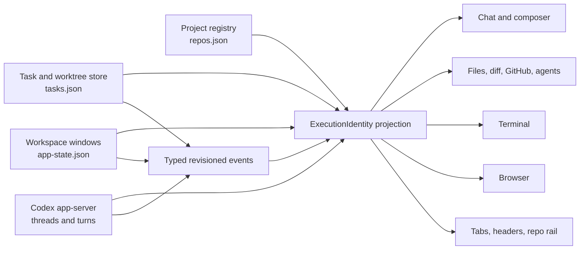
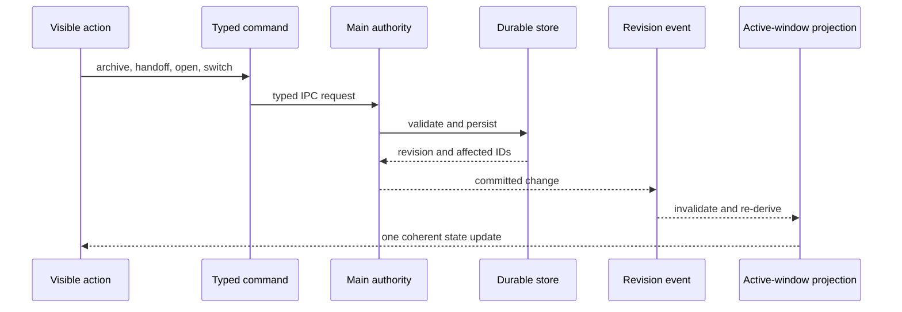
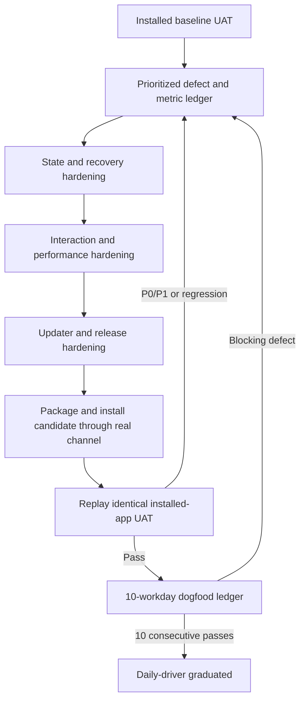

# Cranberri Daily-Driver Hardening - Plan

## Goal Capsule

- Make Cranberri dependable enough to replace the native Codex app for the user's normal local development day: local sessions, managed worktrees, chat, subagents, terminal, browser, files, diff, GitHub context, restart, and updates.
- Start from observed behavior in the installed `/Applications/Cranberri.app`, not assumptions from source or smoke tests. Use Computer Use to operate the app like a person before implementation and replay the same scenarios against the installed release candidate.
- Make a workspace window's persisted binding the single projection point for project, task, checkout, worktree, and Codex thread identity. Domain stores remain authoritative; renderer-global selections stop competing with the active window.
- Prefer eliminating stale, contradictory, or manually refreshed state over adding features. Preserve the existing chat-first product shape.
- Stop engineering work only when automated gates and the final installed-release UAT pass. Graduate the candidate to daily-driver status only after ten consecutive real workdays without lost state, a manual-refresh dependency, an update crash, or a composer/input regression.
- The implementation owner carries the plan through candidate installation and final UAT. The user and implementation owner jointly keep the ten-day dogfood ledger; any P0/P1 failure resets the graduation streak and returns the affected unit to active work.

## Product Contract

### Problem Frame

Cranberri has most of the capabilities needed for daily work, but too many surfaces can disagree about which project, task, checkout, worktree, thread, or window is active. Smoke coverage is broad but does not reproduce the lived interaction quality of the installed app. Runtime performance is not measured, and the updater can replace the daily-driver application without sufficient artifact validation or atomic rollback. The result is capable software that still asks the user to distrust, reload, or recover it.

### Actors

- **User:** drives Cranberri all day across real repositories, local sessions, worktrees, terminals, browser tabs, agents, and release updates.
- **Codex app-server:** owns thread and transcript lifecycle and executes turns in the exact context Cranberri supplies.
- **Cranberri main process:** owns registered projects, task/worktree lifecycle, persisted workspace state, process routing, telemetry, and updates.
- **UAT operator:** Computer Use operating the installed application through visible controls. It may inspect real repos read-only; it mutates only controlled fixture repositories unless the user explicitly approves otherwise.

### Requirements

- **R1 - Installed baseline:** Record a repeatable Computer Use baseline against the currently installed Cranberri release, including functional failures, rough interaction edges, accessibility/focus behavior, screenshots, and runtime timings.
- **R2 - Exact execution identity:** Every visible workspace window resolves one explicit execution identity: project, task, checkout/worktree, Codex thread, and working directory. The header, composer, terminal, browser, files, diff, GitHub view, agents, and app-server context must agree with it.
- **R3 - One selection model:** Activating a window derives active task and thread state. Global renderer selections may cache projections but may not independently choose another task or thread.
- **R4 - Immediate coherence:** Creating, opening, archiving, deleting, handing off, restoring, or recovering a session/worktree updates the repo rail, active tab, chat, right rail, terminal/browser context, and agents view without manual reload or polling-dependent delay.
- **R5 - Durable recovery:** Clean quit, forced quit, crash, interrupted first turn, interrupted worktree provisioning, interrupted handoff, missing checkout, and unavailable Codex thread each reconcile to a durable outcome: resumed, repaired, retryable, or explicitly needs attention. Cranberri must never silently substitute a different repo or checkout.
- **R6 - Worktree daily flow:** A user can create a worktree session from a selected base branch, run its app-level environment setup, work with chat/agents/terminal/browser in that checkout, hand the branch to the pinned local checkout for final testing, and archive or remove the session with dirty/unpushed work protected.
- **R7 - Interaction consistency:** Menus, popovers, selects, tabs, tooltips, keyboard focus, scrolling, empty/loading/error states, and toast feedback use shared primitives and behave consistently across chat, both rails, settings, terminal, browser, and dialogs. The composer must remain stable with long text, attachments, plugins, and skills.
- **R8 - Runtime responsiveness:** Measure and enforce launch, restore, switching, streaming, rail refresh, terminal, browser, large transcript, and large diff behavior in the packaged runtime. Common interactions must feel immediate and sustained use must not accumulate unbounded CPU, memory, telemetry, or listener work.
- **R9 - Safe updates:** Stable and beta candidates are version-consistent, verified before install, installed only when Cranberri is quiescent, replaced atomically, and automatically rolled back when verification or relaunch fails. The previous app and user data remain recoverable.
- **R10 - Release proof:** The packaged candidate passes automated checks, packaged Electron scenarios, and the same Computer Use UAT corpus after being installed through Cranberri's real update path.
- **R11 - Sustained readiness:** Ten consecutive real workdays complete without lost state, manual refresh dependency, update crash, or composer/input regression. Any P0/P1 defect is captured with evidence, fixed, replayed, and restarts the streak.
- **R12 - Draft durability:** Composer text, skill/plugin mentions, attachments, context parts, mode, and owning window survive tab switches, failed sends, provisioning, restart, and update relaunch until send acknowledgment or explicit discard. Recovery never duplicates a draft or first turn.

### Key Flows

- **F1 - Start and resume a day:** Launch the installed app cold, restore windows and their exact session/task bindings, inspect repo sessions, resume a local or worktree chat, and observe matching right-rail and execution context without corrective clicks.
- **F2 - Local session:** Create a local session on the repo's pinned branch, converse with Codex, use terminal/browser/right rail, restart the app, and resume the same thread and working directory.
- **F3 - Worktree session:** Choose a base branch, provision a managed checkout and environment, run a turn and subagent, inspect files/diff/GitHub, and move among local and multiple worktree sessions without context bleed.
- **F4 - Handoff and final test:** From a clean or safely bundled worktree, hand the branch to the pinned local checkout, run the final local test flow, then return to or archive the worktree session with an intelligible recovery path if any step fails.
- **F5 - Lifecycle mutation:** Archive or delete a session and see its tab close immediately; restore an archived session; remove a managed worktree only after dirty, process, unique-commit, and unpushed-branch protections pass.
- **F6 - Recovery:** Interrupt provisioning, setup, first turn, handoff, and app-state persistence at controlled checkpoints; relaunch and receive one deterministic recovery outcome with no orphan tab, hidden worktree, or silent fallback.
- **F7 - Update:** Check for a candidate, review concise release state, quiesce active work, install through the real channel, relaunch into the same workspace, verify bundle/version/state, and automatically recover the previous app after an injected replacement or launch failure.
- **F8 - Long session:** Exercise a long transcript, long composer draft, streaming tool activity, repeated tab/repo switches, terminal output, browser overlays, and large diffs while focus, scrolling, responsiveness, and memory remain stable.

### Acceptance Examples

- **AE1:** Given two worktree sessions and one local session for the same project, when the user switches among their tabs, then the header, chat thread, Codex working directory, right-rail files/diff/GitHub data, terminal cwd, and agents list all identify the selected tab's checkout before the next user action.
- **AE2:** Given a worktree tab is active, when the user opens a new terminal or browser, then the new window binds to that worktree; it does not inherit a renderer-global task selected by another tab.
- **AE3:** Given a session is archived or deleted from the repo rail, when the operation succeeds, then every tab bound to it closes in the same state transition and focus moves predictably to a surviving tab or the repo's new-session surface.
- **AE4:** Given a managed checkout disappears on disk, when Cranberri restarts, then the affected tab says the checkout needs attention and offers retry/repair or discard; files and GitHub never fall back to the main repo.
- **AE5:** Given a follow-up draft containing a skill or plugin chip and enough text to scroll, when the user edits around the chip, moves the caret, scrolls, and sends, then the caret remains accurate, no text spills outside the composer, and the message sent matches the visible composition.
- **AE6:** Given an active turn, subagent, PTY, environment job, or handoff, when the user requests an update install, then Cranberri blocks replacement, names the work that must settle, and provides stop/defer actions; it never tears down active work silently.
- **AE7:** Given an update helper fails after staging the candidate, when relaunch verification fails, then the previous app is restored atomically, user data is untouched, and the next launch explains the rollback through one toast and a diagnostic record.
- **AE8:** Given a forced quit immediately after a workspace mutation, when Cranberri relaunches, then the last acknowledged binding is restored and no 200 ms debounce window loses the active tab or thread association.
- **AE9:** Given Computer Use replays the baseline corpus against the final installed candidate, then every scenario has pass/fail evidence, every baseline P0/P1 has a linked resolution, and no scenario relies on hidden test hooks to claim success.
- **AE10:** Given checkout A has an in-flight file, Git, worker, or transcript result, when checkout B becomes active before A's result arrives, then the stale result is discarded by binding revision and never appears in B.
- **AE11:** Given a draft contains text, a skill/plugin mention, and an attachment, when Cranberri restarts or updates, then the draft returns exactly once in its original window; an interrupted first-turn send is either acknowledged once or offered for retry, never delivered twice.

### Success Criteria

- Zero execution-identity mismatches across the final UAT corpus and restart matrix.
- Zero actions in the final corpus that require a manual app/repo/session refresh to observe successful state.
- Zero lost drafts, threads, tabs, task bindings, worktrees, or acknowledged workspace changes across controlled restart and interruption scenarios.
- Initial packaged-runtime budgets, calibrated after the baseline but not weakened to excuse visible lag: cold launch to usable at or below 3 seconds; restored or newly selected workspace interactive at or below 500 ms p95; local tab/session switch visual response in the next frame and fully coherent at or below 250 ms p95; right-rail context refresh at or below 500 ms p95; composer key-to-paint at or below 50 ms p95; no main-thread task above 100 ms during common interactions; idle CPU at or below 2% after settling; and less than 15% retained-memory growth after the defined repeated-switch endurance loop.
- Candidate update verifies channel, version, bundle identifier, artifact digest, and install location before replacement; injected replacement and relaunch failures restore the previous app.
- Ten consecutive real workdays meet R11 with a completed dogfood ledger.
- A qualifying dogfood day includes at least two active hours, one local-session flow, one managed-worktree flow, composer use with structured context, one terminal or browser flow, right-rail inspection, and one restart/resume check. Any candidate code, packaging, persisted-schema, or updater change restarts the ten-day streak; documentation-only ledger corrections do not.

### Scope Boundaries

- No cloud sync, collaboration, auth, billing, generic IDE workbench, dashboard shell, or rich editor.
- No broad feature race with the native Codex app. Use it as an interaction-quality reference where helpful, not a pixel-copy requirement.
- No wholesale state-management rewrite or second styling engine. Consolidate only the identities, commands, notifications, and primitives that currently cause visible drift.
- No mutation of the user's real registered repositories during baseline/final UAT without separate approval. Generated Git fixtures cover archive, delete, worktree, handoff, commit, dirty-state, and failure scenarios.
- Signing and notarization are required for a distributable stable channel when Apple credentials are available. A private local beta may remain unsigned only when digest, bundle, version, source, and rollback checks pass and the UI identifies the channel honestly.
- The `roadmap/` package remains outside this plan and stays gitignored.

## Planning Contract

### Key Technical Decisions

- **KTD1 - Domain authority plus one projection:** Keep `repos.json`, `tasks.json`, Codex app-server, and persisted workspace state as deep modules with narrow ownership. Add one typed `ExecutionIdentity` projection derived from the active `WorkspaceWindowState`; do not replace them with a giant renderer store.
- **KTD2 - Persist the binding that cannot be reconstructed safely:** Version the app-state schema so chat windows persist `threadId` alongside `projectId`, `taskId`, and `checkoutId`. Remove writable legacy repo/path maps and `Project.localLeaseTaskId` after migration; task-store leases remain authoritative.
- **KTD3 - Revisioned main-to-renderer events:** Replace ad hoc `CustomEvent` invalidation for task/session/workspace mutations with typed preload events carrying an authority revision and affected IDs. React Query and renderer projections invalidate from those events; periodic refetch remains recovery, not the primary user-visible update path.
- **KTD4 - Commands before DOM choreography:** Route visible buttons, menus, shortcuts, and command-palette entries through the same typed action handlers. Keep DOM events only for local presentation concerns.
- **KTD5 - Cross-store reconciliation is explicit and fail-closed:** Startup and mutation recovery reconcile projects, tasks, app-state windows, Codex thread availability, environment jobs, and owned processes into typed `ready`, `repaired`, `retryable`, or `needsAttention` outcomes. An unresolved binding never falls back to another project or checkout.
- **KTD6 - Measure the packaged runtime:** Keep source heuristics as diagnostics, but daily-driver performance gates come from timing and resource measurements in packaged Electron scenarios and installed-app UAT. Store raw run evidence outside Git and commit concise audit summaries plus machine-readable scenario results.
- **KTD7 - One UAT corpus, two installed releases:** Baseline and final verification use the same versioned scenario IDs and acceptance criteria. Computer Use is the human-style operator; scripts only prepare fixtures, capture metadata, and assert durable state that is not reliably visible.
- **KTD8 - Update only from quiescence:** Build a preflight over active turns, workers, PTYs, environment jobs, handoffs, workspace persistence, and repository safety. Update install is deferred until acknowledged state is flushed and active operations settle or are explicitly stopped.
- **KTD9 - Atomic app swap with independent verification:** Stage beside the installed app, verify manifest/digest/bundle/version/signature policy, move the current app to a recoverable backup, atomically promote the candidate on the same volume, relaunch, and retain the backup until a startup health acknowledgment. Roll back from any partial state.
- **KTD10 - Graduation is evidence, not a release tag:** Engineering completion occurs after final installed UAT. Daily-driver graduation additionally requires the ten-workday ledger; a blocking defect reopens the owning unit and resets the streak.
- **KTD11 - Async results carry identity and revision:** Git, file, Codex, worker, terminal, browser, and rail requests capture the originating execution identity and binding revision. Reducers discard late results after a window rebind or newer revision instead of painting them into the current surface.
- **KTD12 - Drafts are window-owned durable state:** Persist structured composer drafts by window binding with schema validation and bounded attachment references. Sending uses an idempotency key and a journaled pending-first-turn state so crash recovery can distinguish acknowledged, retryable, and already-delivered input.

### High-Level Technical Design

### State and Recovery Invariants

- A workspace window has at most one execution identity; an identity may be unavailable, but it is never silently substituted.
- A task/worktree lifecycle mutation and all renderer invalidations share one committed revision.
- A chat window's thread binding survives reload or resolves to a visible recovery state.
- Files, diff, GitHub, agents, terminal, browser, and Codex cwd resolve from the same canonical main-process execution context.
- An archive/delete/remove operation cannot leave a focused orphan window.
- An acknowledged app-state mutation is flushed before quit or update.
- Recovery is idempotent: repeating startup reconciliation produces the same result and does not duplicate worktrees, tabs, threads, or notifications.
- Async results apply only when their originating execution identity and binding revision still match the destination window.
- Draft state is window-owned, schema-validated, and cleared only after send acknowledgment or explicit discard.

### System-Wide Impact

- **IPC and preload:** Persisted binding, draft, recovery, update, and change-event schemas change across shared, main, preload, renderer declarations, and tests. Each interface must version and validate payloads symmetrically.
- **Persistence:** App-state migration removes duplicate writable maps, adds thread/draft bindings and revisions, handles corrupt/truncated data, and preserves the last valid snapshot. Task-store migration removes the unused project lease authority without weakening worktree journals.
- **Async work:** Git/file queries, Codex events, worker updates, terminal/browser lifecycle, and right-rail requests become identity-aware. Cancellation is preferred; revision rejection is the final guard.
- **Agent context:** Root turns and workers receive the same canonical checkout/cwd shown in the UI. Agent events are scoped to the owning thread/window and cannot change another active rail.
- **Failure propagation:** Unresolved identity blocks mutating actions and presents a named recovery state such as reconciling, project missing, checkout missing, thread missing/archived, operation interrupted, state corrupt, install interrupted, rollback required, or candidate health failed.
- **Storage and privacy:** UAT evidence is sanitized; real repos stay read-only; telemetry and draft retention are bounded; attachments and private repo contents are not copied into committed audits.

### Sequencing

1. Establish baseline evidence and fixtures before changing behavior.
2. Consolidate identity, mutation events, and recovery before polishing surfaces that consume them.
3. Standardize interactions and instrument runtime performance on top of coherent state.
4. Complete the worktree flow and cross-surface endurance scenarios.
5. Harden release/update only after app quiescence and persistence signals are trustworthy.
6. Package, install, and replay the UAT corpus; then begin the dogfood graduation window.

### Risks and Dependencies

- The native Codex app and local app-server protocol can change during the project. Treat app-server schemas as authoritative and make unknown item/status handling fail softly without inventing state.
- Computer Use sees the real desktop and can trigger consequential actions. Require action-time confirmation for candidate install/replacement and any destructive UI action; keep repository mutations in fixtures.
- Performance thresholds vary by machine and fixture size. Record machine/app/fixture metadata, use p95 over repeatable loops, and permit tightening after baseline; do not relax thresholds below visible-quality floors without a recorded KTD amendment.
- Apple signing/notarization depends on credentials outside the repo. Keep the private beta path verifiable without secrets and make stable-channel signing status explicit.
- Ten workdays extend beyond a single implementation session. Keep the canonical ledger in the repo and link each failure to evidence and the responsible unit so the goal can resume without chat history.

## Implementation Units

### U1. Installed-release baseline and reproducible UAT corpus

- **Goal:** Establish the lived baseline and a scenario corpus that can be replayed after each risky milestone and against the final installed candidate.
- **Requirements:** R1, R7, R8, R10; F1-F8; AE5, AE9.
- **Files:** `docs/uat/daily-driver-scenarios.md`, `docs/uat/daily-driver-evidence.md`, `docs/audits/2026-07-12-daily-driver-baseline.md`, `scripts/uat/daily-driver-fixtures.mjs`, `scripts/uat/daily-driver-evidence.mjs`, `scripts/uat/daily-driver-fixtures.test.ts`, `package.json`.
- **Approach:** Split scenario preparation and evidence capture from GUI operation. Generate isolated repositories for local/worktree/handoff/dirty/error cases and a separate user-data directory where isolation is required. At execution time, discover and record the installed `/Applications/Cranberri.app` version; `0.1.11` is the planning-time observation, and any variance receives an explicit baseline note. Run Computer Use with the normal user profile for read-only day-in-the-life flows and the fixture profile for mutations. Record scenario ID, app/build, macOS/hardware metadata, preconditions, visible actions, screenshots/accessibility snapshots, timings, durable-state assertions, result, severity, and evidence path. Keep raw screenshots/logs in a timestamped temp artifact directory; commit the concise baseline audit and sanitized JSON summary.
- **Test Scenarios:** Cold and warm launch; repo expansion/session discovery; local and worktree creation; long composer with skill/plugin chips; model/select menus and scrolling; active turn/stop/steer; agents; terminal and browser overlays; files/diff/GitHub; archive/delete/restore; handoff; forced quit at safe checkpoints; update UI inspection; compact and normal window sizes.
- **Verification:** Fixture tests prove isolation and cleanup uses `/usr/bin/trash`; every documented scenario has deterministic preconditions and an observable pass condition; the baseline audit links all P0/P1/P2 findings and measured timings without claiming source-only behavior.
- **Dependencies:** None.

### U2. Canonical execution identity and revisioned state propagation

- **Goal:** Remove competing renderer authorities so every surface derives context from the active workspace window.
- **Requirements:** R2-R4, R12; F1-F5; AE1-AE3, AE10, AE11.
- **Files:** `src/shared/appState.ts`, `src/shared/projects.ts`, `src/shared/tasks.ts`, `src/shared/execution-context.ts`, `src/main/appState.ts`, `src/main/task-store.ts`, `src/main/execution-context.ts`, task/session IPC registration, `src/preload/index.ts`, `src/renderer/vite-env.d.ts`, `src/renderer/state/appState.tsx`, `src/renderer/state/tasks.tsx`, `src/renderer/state/repos.tsx`, `src/renderer/state/workspace.ts`, `src/renderer/state/execution-context.ts`, `src/renderer/state/codex.tsx`, and focused tests beside each module.
- **Approach:** Introduce a shared `ExecutionIdentity` and versioned workspace binding that includes `threadId`. Migrate app state once, remove writable legacy repo/path maps and the unused project lease field, and derive active task/thread from the active window. Add typed authority-change subscriptions through preload, carrying monotonically increasing revisions and affected IDs. Tag async requests/results with identity and revision. Keep React Query caches and lightweight projections, but make event-driven committed changes the primary invalidation path. Flush acknowledged app-state writes on quit, window close, and updater preflight; retain the last valid snapshot and expose a named recovery state for corrupt/truncated data.
- **Test Scenarios:** Migration from current and corrupt app-state versions; local and managed window restoration; switch among same-project checkouts; open terminal/browser from a non-default worktree; out-of-order/duplicate revision events; delayed file/Git/worker result after rebind; archive/delete active and inactive sessions; quit immediately after tab/thread mutation; stale event after newer snapshot.
- **Verification:** Unit and integration tests prove one active-window-derived identity, persisted thread binding, idempotent revision handling, no unrelated-task inheritance, and no lost acknowledged state on quit. Preload/main/shared typings stay symmetric and zod validates every persisted/IPC payload.
- **Dependencies:** U1.

### U3. Cross-store lifecycle reconciliation and recovery UX

- **Goal:** Make restart and interrupted operations deterministic across tasks, worktrees, windows, Codex threads, environments, and owned processes.
- **Requirements:** R4, R5; F5, F6; AE3, AE4, AE8.
- **Files:** `src/shared/tasks.ts`, `src/shared/appState.ts`, new shared recovery result types, `src/main/task-recovery.ts`, `src/main/task-store.ts`, `src/main/appState.ts`, `src/main/handoff.ts`, `src/main/worktree-lifecycle.ts`, `src/main/environments.ts`, Codex thread lookup/client modules, `src/main/index.ts`, `src/renderer/state/workspace.ts`, `src/renderer/components/Workspace.tsx`, `src/renderer/components/RepoRail.tsx`, `src/renderer/components/RightRail.tsx`, toast/recovery UI, and focused tests.
- **Approach:** Expand startup reconciliation into a cross-store coordinator that validates task ownership, checkout path/Git identity, workspace bindings, thread availability, environment jobs, local lease, and resumable journal phases. Return typed per-binding outcomes with repair/retry/discard commands. Exercise restart after every first-turn, provisioning, setup, handoff, and cleanup journal phase. Preserve the current fail-closed ownership and dirty/unpushed protections.
- **Test Scenarios:** Missing worktree; moved project; stale local lease; missing Codex thread; interrupted handoff before/after transfer; interrupted environment setup; orphaned window; terminal/process still alive; recovery rerun; user chooses retry, repair, or discard; failure while persisting recovery.
- **Verification:** A restart matrix proves idempotent outcomes, no silent repo fallback, no duplicate worktree/thread/window, and one concise recovery message per affected binding. Computer Use checkpoint replay confirms the visible recovery path matches durable state.
- **Dependencies:** U2.

### U4. Shared interaction grammar and composer resilience

- **Goal:** Give every surface the same polished control, focus, scrolling, feedback, and error behavior while preserving dense chat-first layout.
- **Requirements:** R7, R12; F1-F8; AE5, AE11.
- **Files:** `src/renderer/components/ui/*`, `src/renderer/lib/ui.ts`, `src/renderer/lib/typography.ts`, `src/renderer/styles/*`, `src/renderer/state/actions.ts`, `src/renderer/components/CommandPalette.tsx`, `src/renderer/components/ChatWindow.tsx`, composer/chat subcomponents, `RepoRail.tsx`, `RightRail.tsx`, `SettingsDialog.tsx` and settings pages, terminal/browser components, dialogs/popovers/menus/selects, `AppToaster`, and focused component tests.
- **Approach:** Inventory every interactive primitive and state from U1 evidence. Consolidate selects, menus, popovers, icon buttons, tabs, tooltips, scroll containers, loading/empty/error treatments, and toasts into small shared primitives using the existing semantic token and typography layers. Route commands through typed action handlers. Preserve the user's no-divider preference, icon-only controls with accessible names/tooltips, restrained radii, and dense desktop typography. Treat composer contenteditable selection, chips, long drafts, IME/paste, scroll, focus restore, and send/stop/steer as a dedicated reliability surface. Persist structured drafts by owning window, journal pending sends with idempotency, and define explicit discard behavior for closed/deleted sessions.
- **Test Scenarios:** Keyboard-only traversal and escape/return focus; nested menu/popover scroll without dismissal; chevron/icon padding; long labels and narrow windows; long composer, multiline paste, selection across chips, backspace/delete around chips, IME composition, attachments, voice, model selector, failed send, tab/repo switch, session close/delete, restart/update recovery, duplicate first-turn acknowledgment, disabled/loading/error states, and toast deduplication.
- **Verification:** Component tests cover state transitions and composer selection semantics; Playwright/Electron screenshots at normal and compact sizes show no overlap or text clipping; Computer Use completes all interaction scenarios with mouse and keyboard without focus traps, accidental dismissal, or inline diagnostic noise.
- **Dependencies:** U2, U3.

### U5. Packaged-runtime performance instrumentation and budgets

- **Goal:** Turn “smooth and buttery” into repeatable packaged-runtime measurements and enforce regressions before release.
- **Requirements:** R8; F1, F3, F8.
- **Files:** `src/shared/telemetry.ts`, `src/main/telemetry.ts`, renderer performance instrumentation modules, `src/renderer/App.tsx`, `Workspace.tsx`, `ChatWindow.tsx`, repo/right rail state, terminal/browser lifecycle, `scripts/measure-performance.mjs`, new `scripts/measure-runtime-performance.mjs`, focused tests, `package.json`, and CI/release workflow gates.
- **Approach:** Add low-overhead performance marks around launch-to-usable, state restore, active-window switch-to-coherent, first Codex event, right-rail refresh, composer input, transcript commit, terminal readiness, browser readiness, and large diff render. Add packaged Electron loops that emit versioned JSON and compare p50/p95/resource growth to budgets and a checked-in threshold file. Bound telemetry retention and remove duplicate/unbounded storage behavior. Profile and fix only measured bottlenecks, prioritizing rerender fan-out, listener duplication, serialization, transcript virtualization, and background polling.
- **Test Scenarios:** Cold/warm launch; 50 repeated switches across three projects and three checkouts; 1,000-message transcript with streaming; long composer input; large diff; sustained terminal output; browser quick search overlay; idle settle; telemetry rollover; instrumentation disabled/failure path.
- **Verification:** Packaged measurements meet the Product Contract budgets on the baseline machine; threshold comparison fails on regression; instrumentation adds no visible UI and remains bounded; before/after evidence identifies the changed bottlenecks rather than relying on static source scoring.
- **Dependencies:** U1-U4.

### U6. Complete worktree, handoff, and agent-context daily flow

- **Goal:** Make the user's actual branch/worktree workflow complete, fast, and context-safe from provisioning through final local testing and archive.
- **Requirements:** R2, R4-R6; F2-F5; AE1-AE4.
- **Files:** `src/main/tasks.ts`, `src/main/task-store.ts`, `src/main/worktree-lifecycle.ts`, `src/main/handoff.ts`, environment setup modules, `src/shared/tasks.ts`, `src/shared/settings.ts`, `src/renderer/components/RepoRail.tsx`, task/session menus and headers, pinned-branch controls, `src/renderer/components/RightRail.tsx`, agents view, terminal/browser creation, and focused tests/UAT fixtures.
- **Approach:** Verify branch-base freshness and fallback toast behavior, environment setup lifecycle, exact agent/app-server cwd, live rail invalidation, pinned local checkout handoff, and archive/remove coupling through the canonical identity/event model. Keep the UX selection-oriented rather than exposing raw Git data. Protect dirty work, active processes, unique commits, unpushed branches, and externally owned worktrees. Enforce configurable retention with the existing seven-day/default fifteen-worktree policy.
- **Test Scenarios:** Create from selected branch and latest commit; remote refresh fallback; setup success/failure/retry; concurrent local lease; two worktrees on related branches; subagent context; terminal/browser context; handoff clean/dirty/conflict/interrupted; local final test; archive with active tab; retention and cap; external worktree preservation.
- **Verification:** Unit/integration tests assert Git and filesystem outcomes plus UI revisions; app-server/agent context reports the exact checkout; fixture-backed Computer Use completes F3-F5 without manual reload or context mismatch.
- **Dependencies:** U2-U5.

### U7. Quiescent, verified, atomic updater and release pipeline

- **Goal:** Make updating the installed daily-driver app recoverable and prove the packaged artifact before it can replace the current install.
- **Requirements:** R5, R9, R10; F7; AE6, AE7.
- **Files:** `src/main/updater.ts`, new `src/main/updater.test.ts`, `scripts/updater/install-helper.mjs`, helper tests, `src/shared/settings.ts`, shared update types, preload typings, renderer update state/settings UI, `electron-builder.yml`, `.github/workflows/release.yml`, `scripts/run-electron-builder.mjs`, `docs/updater-dogfood.md`, and release validation scripts.
- **Approach:** Add typed quiescence status and flush acknowledgments; validate release tag/package/bundle versions, source channel and commit, digest, bundle identifier, architecture, minimum macOS compatibility, native-module loadability, schema upgrade/downgrade policy, free space, install path, and signature policy. Prevent concurrent app instances or update attempts from owning the same install journal. Replace delete-then-copy with same-volume staged rename and a journaled backup/promotion/health-ack state machine that recovers from every partial phase. Keep the backup until the candidate sends a startup-health acknowledgment after workspace restoration. Make release CI package and launch the artifact, run packaged smoke, publish digest metadata, and reject mismatched tags. Configure signing/notarization when credentials exist; keep local beta verification independent of secrets.
- **Test Scenarios:** Active turn/worker/PTY/environment/handoff blocks install; flush timeout; bad digest; wrong bundle/version/architecture/macOS compatibility; native-module load failure; insufficient disk/permissions; second app/update instance; cancellation before quit; helper never starts; failure before backup, after backup, during promotion, before/after health acknowledgment; candidate and rollback launch failures; successful stable and beta relaunch with state preserved.
- **Verification:** Focused updater/helper tests cover every journal phase and rollback; release workflow rejects metadata mismatch and runs packaged smoke; a controlled installed-app update and injected failure both preserve user data and leave either the verified candidate or restored previous app launchable.
- **Dependencies:** U2, U3, U5, U6.

### U8. Final installed-candidate replay and ten-workday graduation

- **Goal:** Prove the release in the environment where it will actually be used and sustain that proof across real workdays.
- **Requirements:** R10, R11; F1-F8; AE1-AE11.
- **Files:** `docs/audits/2026-07-12-daily-driver-final.md`, `docs/uat/daily-driver-dogfood.md`, UAT scenario/result manifests, and only scoped fixes discovered by replay.
- **Approach:** Build and publish the release candidate through the existing GitHub release workflow and install that exact artifact through Cranberri's stable update path with action-time approval. Use beta only for earlier checkpoint rehearsals; daily-driver graduation is tied to the immutable release artifact. Verify installed bundle/version/source, and replay every U1 Computer Use scenario without hidden hooks. Compare baseline/final results and performance. Start a ten-workday ledger with at least two active hours and the Success Criteria's required interaction coverage per day, recording startup/resume, session/worktree work, composer use, agents/terminal/browser/right rail, restart behavior, and any intervention. A P0/P1 or candidate code/package/schema/updater change returns to the owning unit, receives a regression scenario, and resets the streak; documentation-only ledger corrections do not. P2 polish is triaged explicitly and may not conceal a requirement failure.
- **Test Scenarios:** Complete U1 corpus; update rollback drill; first launch after install; resume previous real read-only sessions; daily local/worktree flow; long-session endurance; at least one clean restart per day and one controlled forced-quit recovery during the streak.
- **Verification:** Final audit contains scenario-by-scenario before/after evidence, all automated gates are green, no P0/P1 remains, and the ledger records ten consecutive qualifying workdays. The installed candidate, not a dev build, is the artifact declared the daily driver.
- **Dependencies:** U1-U7.

## Verification Contract

| Gate | Command or evidence | Done signal |
|---|---|---|
| Focused unit tests | `npm test -- <focused test paths>` during each unit | Happy, edge, failure, restart, and migration scenarios for the unit pass |
| Full tests | `npm test` | Entire Vitest suite passes |
| Production build | `npm run build` | Metadata, typography audit, strict TypeScript, ESLint, updater helper copy, and Electron/Vite build pass |
| Package | `npm run package` | Candidate DMG/ZIP/app artifacts build with matching version metadata |
| Packaged Electron scenarios | `npm run smoke:electron` plus the new daily-driver/runtime scenario commands | Fixture-backed packaged flows pass with no console/page errors or leaked child processes |
| Codex worker UAT | `npm run uat:codex:workers` | Real app-server worker lifecycle and exact checkout context pass in fixtures |
| Runtime budgets | New packaged runtime measurement command | Product Contract p95/resource thresholds pass and machine-readable comparison reports no regression |
| Release validation | Updated `.github/workflows/release.yml` | Tests/build/package, metadata/digest checks, packaged launch/smoke, and signing policy for the selected channel pass |
| Installed baseline | U1 Computer Use audit against the version discovered at `/Applications/Cranberri.app` (`0.1.11` at planning time) | Every scenario has evidence, version variance is recorded, and defects are prioritized before behavior changes |
| Installed final UAT | U8 Computer Use replay after real updater install | Same corpus passes against verified installed candidate, including restart and rollback |
| Sustained dogfood | Ten-workday ledger | Ten consecutive qualifying days satisfy R11 |
| Diff hygiene | `git diff --check` and review against this plan | No whitespace errors, abandoned attempts, unrelated refactors, secrets, raw UAT artifacts, or roadmap files enter the diff |

### Computer Use UAT Protocol

- Launch and identify the installed app through visible desktop state; record `CFBundleShortVersionString`, bundle identifier, and install path separately as evidence.
- Use visible controls and realistic mouse/keyboard sequences. Inspect focus, selection, scrolling, hover/tooltips, menus, popovers, resize behavior, and timing rather than jumping directly to end state.
- Run real registered repository scenarios read-only. Use generated, clearly named fixture repositories and isolated Cranberri state for mutation, failure injection, archive/delete, handoff, and worktree cleanup.
- Capture before/action/after screenshots or accessibility snapshots for each failure and key transition. Pair visible evidence with durable task/app-state/Git assertions when the UI alone cannot prove correctness.
- Require user confirmation at the moment of installed-app replacement, destructive UI cleanup, macOS permission prompts, secret entry, or any external push. Never bypass system prompts or destructive-command policy.
- Replay the same scenario IDs after each high-risk checkpoint (U3, U6, U7) and the full corpus in U8. A scenario cannot be waived by replacing it with smoke-test output.

## Definition of Done

- **U1:** A sanitized installed-release baseline, versioned scenario corpus, fixture tooling, raw-evidence convention, performance baseline, and prioritized defect ledger exist.
- **U2:** Active window identity is canonical, thread binding persists, duplicate authorities are migrated away, committed mutations propagate through typed revisions, and acknowledged state flushes before quit.
- **U3:** Cross-store recovery is idempotent, fail-closed, and actionable across all journal phases and missing-resource cases.
- **U4:** Shared interaction primitives and typed commands cover every surface; composer, menus, focus, scroll, feedback, compact layouts, and accessibility pass component and Computer Use checks.
- **U5:** Packaged runtime instrumentation and budgets are repeatable, CI-enforced, bounded, and green on the target machine.
- **U6:** Local/worktree creation, environment setup, exact agent context, handoff, final local testing, archive, removal, retention, and live rail updates complete without context drift or manual refresh.
- **U7:** Stable/beta artifacts are validated, installs are quiescent and atomic, partial failures roll back, CI runs packaged proof, and user data survives success and failure.
- **U8:** The verified installed candidate passes the full baseline corpus and rollback drill, then completes ten consecutive qualifying workdays.
- All requirements and acceptance examples are covered by automated or installed-app evidence. No blocking open question remains.
- No P0/P1 defect remains open; P2 items are explicitly triaged and do not contradict a requirement or performance gate.
- Experimental, dead-end, duplicate, and superseded code from the hardening work is removed. Raw screenshots/logs stay outside Git; committed audits contain no secrets or private repository content.

## Appendix

### Sources and Research Breadcrumbs

- Existing parity history: `docs/plans/2026-07-07-004-feat-codex-parity-platform-plan.md` and `docs/plans/2026-07-08-005-codex-parity-wrap-up.md`.
- Existing worktree and turn foundations: `docs/plans/2026-07-11-009-feat-first-class-worktrees-plan.md` and `docs/plans/2026-07-12-010-feat-native-codex-turn-parity-plan.md`.
- State authorities and recovery: `src/main/task-store.ts`, `src/main/task-recovery.ts`, `src/main/appState.ts`, `src/main/execution-context.ts`, `src/renderer/state/tasks.tsx`, `src/renderer/state/workspace.ts`, and `src/renderer/state/codex.tsx`.
- Daily work surfaces: `src/renderer/components/ChatWindow.tsx`, `RepoRail.tsx`, `RightRail.tsx`, `Workspace.tsx`, `SettingsDialog.tsx`, terminal/browser components, and `src/renderer/state/actions.ts`.
- Existing runtime proof: `scripts/smoke-electron.mjs`, `scripts/uat-codex-workers.mjs`, `scripts/measure-performance.mjs`, and `scripts/measure-chat-ux.mjs`.
- Release/update path: `src/main/updater.ts`, `scripts/updater/install-helper.mjs`, `.github/workflows/release.yml`, `electron-builder.yml`, and `docs/updater-dogfood.md`.
- Computer Use operating rules: `/Users/dushyantgarg/.codex/plugins/cache/openai-bundled/computer-use/1.0.1000387/skills/computer-use/SKILL.md`.
