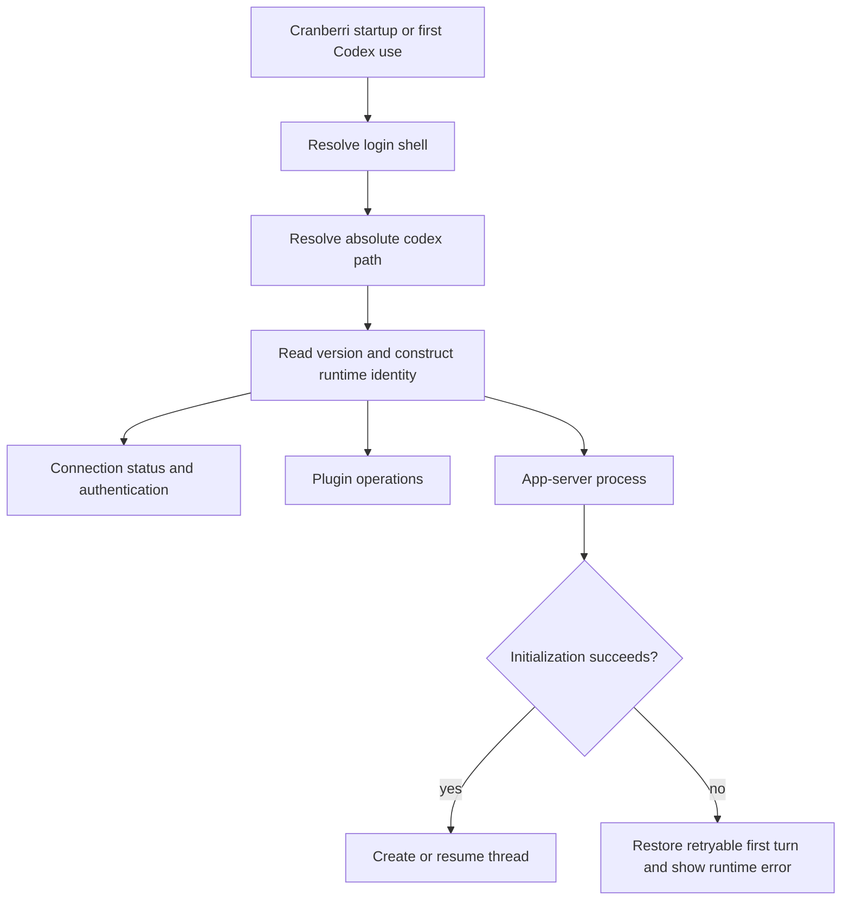

# User Codex Runtime - Plan

## Goal Capsule

- **Objective:** Make Cranberri use the same Codex executable the user's login shell resolves, across every Codex operation.
- **Product authority:** The user's installed Codex owns its version, authentication, plugins, and app-server capabilities; Cranberri is a client and does not choose, install, or upgrade the CLI.
- **Execution profile:** Test-first fix covering executable resolution, shared runtime use, failure recovery, and packaged-app behaviour.
- **Stop conditions:** Stop if implementation requires Cranberri to select among installations, manage Codex versions, or silently substitute a fallback binary.
- **Tail ownership:** The implementing agent owns unit tests, packaged smoke coverage, build verification, and UAT of the first local turn.

---

## Product Contract

### Summary

Cranberri currently changes `PATH` before starting Codex, which can select a different CLI than the user runs in their shell. The packaged beta selected stale Homebrew Codex `0.133.0-alpha.1` instead of the user's `~/.local/bin/codex` `0.144.1`, causing app-server startup to exit and the first chat to remain pending.

### Problem Frame

Cranberri treats Codex discovery as a generic GUI-tool lookup. That violates the product boundary: Cranberri should use the user's Codex environment, not create its own precedence rules or manage the CLI lifecycle. The failure is especially damaging because connection status and app-server startup can resolve different executables, producing a false “Connected” state before chat fails.

### Requirements

**Runtime identity**

- R1. Cranberri resolves Codex through the system account's configured login shell and stores the absolute executable path for the app session.
- R2. Authentication, connection status, plugins, and app-server startup use the same resolved executable and environment.
- R3. Cranberri does not rank installations, select the newest version, install Codex, or upgrade Codex.

**Visibility and compatibility**

- R4. General Settings and Diagnostics display the resolved Codex path and version.
- R5. When the resolved Codex is missing or lacks a required app-server capability, Cranberri reports the path, version when available, and actionable failure detail.

**First-turn recovery**

- R6. App-server startup failure restores the composer content and leaves the first turn visibly retryable.
- R7. A failed pre-thread task does not become a silent, permanently pending session and can be retried without creating duplicate tasks.

### Acceptance Examples

- AE1. Given `~/.local/bin/codex` is what the login shell resolves and stale Codex also exists under `/opt/homebrew/bin`, when Cranberri starts a local chat, then every Codex operation uses the `~/.local/bin` executable.
- AE2. Given the resolved Codex exits during app-server initialization, when the user submits a first prompt, then the prompt is restored, an actionable error is shown, and retry does not duplicate the task.
- AE3. Given the login shell cannot resolve Codex, when the user opens General Settings or submits a prompt, then Cranberri explains that the user's shell has no Codex executable and does not install one.

### Scope Boundaries

**In scope**

- One canonical Codex runtime identity per Cranberri app session.
- Removal of CLI install/update ownership from the connection flow.
- Retry-safe first-turn behaviour when runtime initialization fails.
- Unit, integration, packaged smoke, and manual UAT coverage.

**Deferred to Follow-Up Work**

- A user-facing executable override, runtime switching, or multi-Codex profile support.
- Broader changes to generic GUI-tool lookup for GitHub, Node, terminals, or environment tools.

**Outside this product's identity**

- Selecting the “best” Codex installation by version.
- Installing or upgrading the Codex CLI on the user's behalf.

---

## Planning Contract

### Key Technical Decisions

- KTD1. **Login-shell resolution is canonical.** Resolve the system account's shell through the operating-system user record, then resolve `codex` through that shell because Finder-launched GUI processes do not reliably inherit the terminal's `PATH`.
- KTD2. **Use an absolute executable everywhere.** Resolve once, cache the runtime identity for the app session, and pass its absolute path to every Codex subprocess so later environment augmentation cannot change selection.
- KTD3. **Keep generic GUI tool discovery separate.** Do not change `withGuiToolPath()` globally; its Homebrew-first behaviour serves unrelated GUI-launched tools and should not define Codex identity.
- KTD4. **Capability errors belong to the selected runtime.** Report the resolved path, version, and app-server stderr rather than falling back to another installation.
- KTD5. **Cranberri never owns CLI lifecycle.** Connection may initiate authentication for the resolved Codex, but missing or outdated Codex is user-actionable rather than an npm installation trigger.
- KTD6. **First-turn journals remain retry-safe.** Preserve the user's prompt while ensuring runtime startup failures return the task to an explicit retryable state and do not accumulate duplicates.

### High-Level Technical Design

### Sequencing

1. Establish and test the canonical runtime resolver.
2. Route every Codex subprocess through that runtime and remove CLI lifecycle ownership.
3. Harden first-turn failure recovery and prove the packaged-app path.

### Assumptions

- The system account's configured login shell is the authority for what “their Codex” means; a missing or unusable shell is an actionable resolution failure.
- Shell-resolution failures must be surfaced; falling back to a different binary would violate R1.
- Plugin installation remains in scope because it modifies the selected Codex environment, while CLI installation and upgrades do not.

---

## Implementation Units

### U1. Canonical Codex runtime resolver

- **Goal:** Resolve and cache the user's shell-selected Codex executable, version, and environment without changing executable precedence.
- **Requirements:** R1, R2, R3, R5; AE1, AE3.
- **Dependencies:** None.
- **Files:** `src/main/codex/env.ts`, new `src/main/codex/env.test.ts`.
- **Approach:** Introduce a Codex-specific runtime resolver that consults the system account's configured login shell, validates that the result is an absolute executable, captures the shell-derived environment needed by Codex, and returns structured resolution failures within a bounded timeout. Keep `src/main/guiToolPath.ts` unchanged for non-Codex tools. Cache a successful runtime identity for the app session; changing Codex identity takes effect on the next Cranberri launch.
- **Execution note:** Start with failing tests that reproduce the stale Homebrew binary winning over the shell-selected binary.
- **Patterns to follow:** Existing executable probes and bounded subprocess handling in `src/main/codex/env.ts`; environment preservation tests in `src/main/guiToolPath.test.ts`.
- **Test scenarios:**
  - Covers AE1. A login shell resolves `/Users/example/.local/bin/codex` while `/opt/homebrew/bin/codex` also exists; the runtime identity selects the shell result.
  - The inherited GUI `PATH` lacks user-local directories but the login shell supplies them; resolution still returns the shell-selected executable.
  - The shell emits unrelated startup text; the resolver extracts only its framed resolution output or fails safely rather than accepting arbitrary text.
  - Covers AE3. The shell cannot resolve Codex; resolution returns a typed, actionable error and does not inspect fallback candidates.
  - The resolved path is non-absolute, missing, or non-executable; validation rejects it with the path included in the error.
  - Two concurrent consumers request the runtime; both receive the same successful cached identity without launching competing probes.
  - Shell startup hangs or exits unsuccessfully; resolution times out or fails with a bounded actionable error.
- **Verification:** Tests prove shell authority, path validation, safe parsing, and session-level identity reuse.

### U2. Single runtime across Codex surfaces

- **Goal:** Make status, authentication, plugins, and app-server use one absolute Codex executable and remove Cranberri-owned CLI installation/update behaviour.
- **Requirements:** R2, R3, R4, R5; AE1, AE3.
- **Dependencies:** U1.
- **Files:** `src/main/codex/client.ts`, `src/main/codex/client.test.ts`, `src/main/codex/ipc.ts`, `src/shared/codex.ts`, `src/renderer/components/settings/GeneralSettings.tsx`, new `src/renderer/components/settings/GeneralSettings.test.tsx`.
- **Approach:** Inject the resolved runtime identity into `CodexClient` and spawn its absolute executable. Replace the duplicate IPC-local binary finder with the shared resolver. Route status, authentication, plugin commands, and app-server through the same identity. Buffer bounded app-server stderr during initialization so compatibility failures retain the selected path and useful process detail. Remove automatic npm installation and update actions; Settings should identify the resolved path/version and tell the user how to correct missing or incompatible Codex outside Cranberri.
- **Patterns to follow:** Existing `CodexConnectionStatus` contract in `src/shared/codex.ts`, bounded command execution in `src/main/codex/ipc.ts`, and connection-state rendering in `src/renderer/components/settings/GeneralSettings.tsx`.
- **Test scenarios:**
  - Covers AE1. Client startup receives the shell-selected absolute path and never resolves bare `codex` through a rewritten `PATH`.
  - Status, login, plugin listing, and app-server startup are all invoked with the same executable identity.
  - Covers AE3. Missing Codex renders a “not found in your login shell” state without an Install action or npm command.
  - An incompatible selected Codex reports its path, version, and app-server error without trying another installation.
  - Re-authentication restarts the client with the same session runtime identity; changing the shell-selected Codex requires restarting Cranberri.
  - General Settings displays the selected path/version for connected, unauthenticated, missing, and incompatible states.
- **Verification:** No production Codex subprocess uses a bare command name or a separately resolved binary; UI copy makes Cranberri's client-only ownership explicit.

### U3. Retry-safe startup failure and packaged regression proof

- **Goal:** Ensure app-server startup failures cannot strand the first prompt or leave an invisible pending task, then prove the behaviour in packaged conditions.
- **Requirements:** R5, R6, R7; AE2.
- **Dependencies:** U1, U2.
- **Files:** `src/renderer/state/tasks.tsx`, `src/renderer/state/tasks.test.ts`, `src/renderer/state/use-chat-composer.ts`, `src/renderer/state/use-chat-composer.test.ts`, `src/main/tasks.ts`, `src/main/tasks.test.ts`, `scripts/smoke-electron.mjs`, `docs/uat/daily-driver-scenarios.md`, `docs/uat/daily-driver-evidence.md`.
- **Approach:** Treat failure before thread creation as a retryable task transition. Reuse the journaled idempotency key on retry, surface the runtime error through the existing composer dispatch-error channel, and prevent an unbound pending task from appearing as a successful session. Extend packaged smoke coverage with competing fake Codex installations whose versions and app-server behaviour differ, proving the login-shell-selected binary wins.
- **Execution note:** Add the failure/retry integration scenario before changing task state transitions.
- **Patterns to follow:** First-turn idempotency and pending-turn recovery in `src/main/tasks.ts`, composer lifecycle restoration in `src/renderer/state/use-chat-composer.ts`, and packaged user-flow scaffolding in `scripts/smoke-electron.mjs`.
- **Test scenarios:**
  - Covers AE2. App-server exits during `tasks:resume`; composer content returns, the exact runtime error is visible, and the saved draft remains retryable.
  - Retrying the same restored prompt reuses its idempotency key and task rather than creating duplicates.
  - A failure before `threadId` assignment releases any local lease and leaves no task presented as active.
  - A later successful retry binds the original task, sends the first turn once, and clears both pending journals.
  - Packaged smoke runs with a shell-selected compatible fake Codex and a stale Homebrew fake; only the shell-selected process records invocation.
  - Packaged smoke runs with an incompatible shell-selected Codex; Cranberri reports that failure and does not invoke the compatible fallback.
- **Verification:** Automated coverage reproduces issue #9 under packaged-like process resolution, proves retry idempotency, and records evidence for the daily-driver UAT contract.

---

## Verification Contract

| Gate | Scope | Done signal |
|---|---|---|
| Targeted unit tests | Codex environment, client startup, connection UI, tasks, composer lifecycle | All U1-U3 scenarios pass, including competing-installation and retry cases. |
| Full test suite | Repository regression coverage | `npm test` passes without unrelated failures. |
| Production build | Types, lint, packaging inputs, Electron renderer/main build | `npm run build` passes with zero warnings or errors. |
| Electron smoke | Packaged-like first-turn flow | `npm run smoke:electron` proves the login-shell-selected Codex is the only binary used. |
| Manual UAT | Installed beta or local packaged app | Add Cranberri repo, confirm displayed path/version, send first prompt successfully, then repeat with an intentionally incompatible shell-selected fixture and observe a retryable error. |

---

## Definition of Done

- U1-U3 verification outcomes are satisfied.
- Every Codex operation uses one shell-resolved absolute executable for the app session.
- Cranberri no longer installs or upgrades the Codex CLI.
- Missing or incompatible Codex produces an actionable path/version-specific error.
- First-turn startup failure restores the prompt and retries without duplicate tasks or turns.
- Packaged smoke coverage prevents Homebrew or GUI `PATH` augmentation from overriding the user's Codex.
- `npm test`, `npm run build`, and the Electron smoke gate pass.
- Daily-driver UAT evidence records the successful and failure-path results.
- Dead-end code and superseded executable-selection helpers are removed from the final diff.

---

## Appendix

### Sources & Research

- GitHub issue #9 documents the packaged `v0.1.13` reproduction, selected binaries, app-server exit code, and persisted pending state.
- `src/main/codex/env.ts` currently prepends Node's directory before the inherited `PATH`.
- `src/main/codex/client.ts` currently spawns bare `codex`, allowing the modified environment to choose the executable.
- `src/main/codex/ipc.ts` currently resolves Codex separately for connection/plugin operations and installs or updates the CLI during connection.
- `src/renderer/state/use-chat-composer.ts` already restores visible and durable drafts after dispatch failure; the plan extends this contract through task creation and resume failure.
