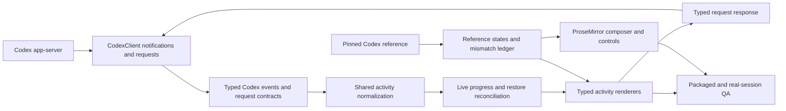

# Native Codex Chat and Composer Parity - Plan

## Goal Capsule

| Field | Decision |
|---|---|
| Objective | Make Cranberri's chat transcript and composer match a pinned native Codex reference in structure, interaction, spacing, typography, and state presentation while preserving Cranberri's repo-specific context controls. |
| Authority hierarchy | User-confirmed scope, `AGENTS.md`, a captured native Codex reference build, the generated local app-server protocol, and the existing turn-parity behavior in `docs/plans/2026-07-12-010-feat-native-codex-turn-parity-plan.md`. |
| Execution profile | Implement in small end-to-end slices with fixture-first protocol tests, then renderer work, packaged smoke, and a real app-server live-to-restore proof. |
| Stop conditions | Stop before visual styling if the native Codex reference build and fixed-state captures cannot be identified; stop approval work if the installed app-server schema cannot be regenerated; stop release work if the full build or packaged smoke is red. |
| Tail ownership | The final unit owns reference comparison, real app-server restore validation, regression cleanup, and removal of abandoned experimental code. |

## Product Contract

### Summary

Cranberri already matches the native Codex turn rhythm: prompts own chronological work trails, active turns accept steering, completed trails collapse, final answers remain separate, and scrolling respects reader intent. This follow-up closes the remaining chat-window and composer gaps by preserving and rendering the full app-server activity and approval contracts, completing native editing behavior, and replacing visual judgment from memory with a pinned reference and repeatable comparison.

### Problem Frame

The current normalized activity model compresses commands, patches, tools, searches, images, and collaboration into a title plus one short detail string. Live command output and MCP progress are routed to logs or metadata rather than the owning transcript item. Guardian review notifications have dedicated handling, while general server requests still rely on method handlers and do not yet have a complete typed renderer lifecycle. The refactored ProseMirror composer now has a thin `ChatComposer`, a behavior-owning `useChatComposer`, and durable window-owned drafts with pending-send idempotency; parity work must preserve that recovery contract while adding prompt history, mention clipboard behavior, boundary-aware keyboard actions, and reference-backed visual proof.

### Actors

- **A1. Repository operator** - uses Cranberri to direct Codex, inspect its work, answer requests, and resume prior sessions without losing context.
- **A2. Codex app-server** - supplies typed thread items, incremental progress, approvals, user-input requests, tool elicitation, and restored thread history.

### Requirements

#### Reference Contract

- **R1.** Parity is pinned to a named native Codex desktop build, local app-server version, theme, interface-size setting, and fixed desktop and compact viewports.
- **R2.** Reference captures cover empty, drafted, menu-open, active, approval-waiting, request-resolved, failed, validation-error, completed-collapsed, completed-expanded, long-output, attachment, restored-session, hover, keyboard-focus, and disabled-control states in light and dark themes.
- **R3.** A durable mismatch ledger records measured geometry, typography, color/token mapping, interaction differences, and intentional Cranberri-only deviations before styling begins.
- **R4.** The claim "1:1" means the comparable chat and composer regions match the pinned reference's structure, state behavior, and measured presentation; Cranberri-only repo controls remain available and are integrated into the reference layout rather than removed.

#### Rich Turn Activity

- **R5.** Every activity item keeps stable thread, turn, and item identity across start, progress, completion, duplicate, out-of-order, and restored events.
- **R6.** Commands expose parsed actions, command text, cwd, streaming and aggregated output, process identity when present, exit code, duration, and completed, failed, or declined state through a bounded expandable row.
- **R7.** File changes expose path, change kind, live patch updates, per-file diff, aggregate turn diff when available, apply state, and failure details through expandable patch presentation.
- **R8.** MCP and dynamic-tool rows expose server or namespace identity, tool name, app context when present, arguments, progress, structured result or content, duration, and error or success state without flattening structured data during normalization.
- **R9.** Web search, image view and generation, review mode, compaction, sleep, hook, collaboration, and subagent activity receive kind-specific presentation when the protocol provides useful data; unknown future items remain visible through a quiet fallback.
- **R10.** Reasoning, commentary, plan updates, steering, tool work, approvals, and the final answer retain the chronological turn ownership established by the previous parity work.
- **R11.** Large output, results, and diffs remain usable without transcript or renderer instability: previews are bounded, expansion is explicit, and default collapse is derived per activity kind and state from the pinned reference manifest rather than assumed globally; autoscroll still follows reader intent.
- **R12.** Sensitive activity content never enters telemetry, screenshot fixtures, or mismatch artifacts; verification uses synthetic fixtures and user-reviewed reference content.

#### Approvals and Requests

- **R13.** Cranberri handles every server-initiated approval decision exposed by the pinned app-server schema, including one-time and session-scoped acceptance, execution-policy or network-policy amendments, decline, cancel, permission grants, and their protocol-specific response shapes. A checked-in conformance ledger maps every generated request method and decision variant to transport, schema, state, renderer, and test ownership.
- **R14.** Command, file-change, permission, tool user-input, and MCP elicitation requests retain request identity and render at the owning item or turn with action-specific details and controls. Guardian review remains a separate notification plus `thread/approveGuardianDeniedAction` transport and is not coerced into the JSON-RPC server-request responder model.
- **R15.** Multiple concurrent requests, requests arriving before their target item, untargeted requests, stale requests after reconnect, response failure, timeout, denial, cancellation, and externally resolved requests have explicit visible states and recovery behavior.
- **R16.** Denying an approval sends the protocol's denial response; it does not interrupt the entire turn unless the protocol requires cancellation or the user separately presses Stop.
- **R17.** Human-gated actions remain human-only. Codex cannot approve its own privileged action or bypass the configured approval policy.

#### Composer

- **R18.** Existing send, stop, steer, multiline, IME, attachment, image, voice, skill, plugin, Goal, Plan, model, effort, speed, approval-policy, context-meter, durable draft restore, pending-send idempotency, binding-revision, and handoff/restart behavior remains functional.
- **R19.** Submitted-prompt history is derived from the active thread transcript, deduplicates adjacent identical submitted prompts, preserves the unsent draft before the first history move, and navigates only at document boundaries when no suggestion menu owns the key. It does not create a second global prompt-history store.
- **R20.** Undo, redo, word and line deletion, selection replacement, multiline paste, drag and drop, mention insertion and atomic deletion, and clipboard round trips preserve the document, caret, structured mention identity, and plain-text fallback.
- **R21.** Slash, skill, and plugin suggestions match the reference's keyboard, pointer, empty, loading, selected, dismissal, and focus-return behavior with correct listbox and option semantics.
- **R22.** Composer height, internal scrolling, toolbar wrapping, attachment layout, disabled/error states, and Send/Stop placement match the reference at fixed desktop and compact sizes without covering the transcript. At compact width, the editor and Send/Stop remain primary; Add Context and active Goal/Plan state remain visible; approval, model, context meter, and voice stay available in a wrapping secondary toolbar without being silently removed. The pinned manifest may refine order and spacing, but any capability removal is out of scope.

#### Equivalence and Compatibility

- **R23.** Live event processing and `thread/read` hydration produce semantically equivalent item identity, order, final content, status, approval placement, worker linkage, and collapse state; live-only intermediate deltas need not be recreated after restore.
- **R24.** Older sessions without rich payloads continue through the existing fallback model without crashing, inventing output, or losing messages.
- **R25.** The outer workspace, rails, task header, worktree controls, terminal, browser, and generic shell styling do not change in this pass.

### Key Flows

- **F1. Live rich turn:** The operator sends a prompt, observes typed activity update in place, expands command, patch, or tool detail, optionally steers the active turn, and receives a separate final answer.
- **F2. Human request:** The app-server asks for approval, permissions, structured user input, or MCP elicitation; Cranberri renders the request at its owning activity, sends the selected typed response, shows the resolved outcome, and lets the same turn continue.
- **F3. Restore:** The operator reopens the session and sees the same semantic turn order, rich completed content, request outcomes, and collapsed state as after the live turn completed.
- **F4. Native composer:** The operator edits text and mentions, navigates suggestions and prompt history, attaches context, sends or steers with the native keyboard rules, and retains focus and caret intent after the action.
- **F5. Reference QA:** The implementer recreates each pinned state at fixed viewports, compares the isolated transcript and composer regions, records mismatches, and closes or documents each intentional deviation.

### Acceptance Examples

- **AE1.** Given a command emits several output chunks and exits nonzero, when the row completes, then one command item contains the ordered output, exit code, failure treatment, duration, and an explicit disclosure without duplicate log rows.
- **AE2.** Given a file-change item receives live patch updates, when the user expands it, then each changed path and patch is readable; after session restore the completed patch content and ordering remain equivalent.
- **AE3.** Given an MCP tool reports progress and returns structured content, when the call runs and completes, then progress updates the existing row and the result replaces it without losing arguments, app identity, duration, or error state.
- **AE4.** Given two requests are pending for different items, when the operator accepts one for the session and declines the other, then each response uses its own request ID and decision type, both cards resolve independently, and the turn is not interrupted by the denial alone.
- **AE5.** Given a request arrives before its target item, when the item later starts, then the request moves to the owning row without duplication or lost focus.
- **AE6.** Given the composer caret is at the start or end of a document with no suggestion menu open, when the operator presses the reference history key, then the prior submitted prompt loads; the same key inside the document preserves normal cursor movement.
- **AE7.** Given copied content contains skill and plugin mentions, when it is pasted into Cranberri and sent, then known mentions preserve structured identity and unknown destinations retain readable plain text.
- **AE8.** Given the user scrolls away from the latest long command output, when more output arrives, then the transcript does not pull them back and Jump to latest remains available.
- **AE9.** Given a completed live session is reopened, when its normalized transcript is compared with the live final state, then semantic identities, order, content, statuses, approvals, worker linkage, and collapse state match.
- **AE10.** Given the pinned desktop and compact reference states, when Cranberri captures the same isolated regions, then comparable geometry and screenshot regions meet the plan's tolerances and every remaining mismatch is recorded as an intentional Cranberri deviation.
- **AE11.** Given an unsent structured draft and a submitted-prompt history traversal, when the operator returns to the newest position, restarts Cranberri, or crosses first-turn task creation, then the exact unsent draft, mentions, attachments, modes, and pending-send identity are restored once without a duplicate message or changed owner.

### Success Criteria

- The activity matrix covers every item and request family emitted by the pinned app-server schema, with a documented fallback for later schema additions.
- The reference-state manifest is replayable, and the protocol conformance ledger has no unmapped request method, decision variant, or item family for the pinned desktop/CLI pair.
- No known app-server command output, patch, tool result, tool progress, approval decision, or request-user-input path is discarded between main process and transcript.
- Fixed-viewport geometry differs by no more than 2 CSS pixels for comparable bounds and spacing, and comparable screenshot regions remain within a 1% changed-pixel threshold after masking text-antialiasing and Cranberri-only controls.
- All automated gates, packaged smoke, a real live-to-restore round trip, and the reviewed mismatch ledger pass before the parity claim is made.

### Scope Boundaries

**In scope:** the transcript viewport, turn activity, final-response presentation where needed for alignment, inline requests, jump-to-latest control, composer card/editor/toolbars/menus/chips, their shared state and protocol transport, and reference/verification artifacts.

**Deferred:** direct worker-management controls inside chat unless they appear in the pinned Codex chat reference; virtualizing very long transcripts unless measurement shows the richer rows miss the existing responsiveness bar.

**Outside this product slice:** outer workspace layout, repos and task navigation, right rail, terminal, browser, settings redesign, new theme engines, and agent self-approval.

### Dependencies and Sources

- `docs/plans/2026-07-12-010-feat-native-codex-turn-parity-plan.md` is the shipped behavioral baseline for chronology, steering, collapse, and scroll intent.
- `docs/plans/2026-07-12-011-refactor-daily-driver-hardening-plan.md` and the shipped `src/shared/composer-drafts.ts`, `src/main/composer-drafts.ts`, `src/renderer/state/composer-drafts.ts`, and `src/renderer/state/use-chat-composer.ts` define the current window-owned draft, binding revision, pending-send idempotency, and restart/handoff invariants.
- `docs/plans/2026-07-12-012-fix-user-codex-runtime-plan.md` makes failed first-turn restoration and retry-without-duplication a composer regression constraint.
- `codex app-server generate-ts` from local `codex-cli 0.144.0` exposes command output, patch updates, MCP progress/results/errors, structured tool output, collaboration state, and the complete request decision shapes. Regenerate at implementation start and record the pinned version with the reference.
- `scripts/smoke-electron.mjs` is the existing packaged integration surface for chat, steering, mention editing, composer height, desktop/compact screenshots, attachments, voice, approvals, and restored sessions.
- `.context/compound-engineering/ce-optimize/cranberri-chat-smoothness/strategy-digest.md` records the prior lifecycle invariants: immediate completion rendering, stable-scalar telemetry, and centralized run-end emission.
- No `docs/solutions/` or `CONCEPTS.md` corpus exists in this checkout; the previous plan, generated protocol, current implementation, and smoke harness are the local sources of truth.

## Planning Contract

### Product Contract Preservation

Product Contract refreshed against latest `main`: R11, R13-R14, R18-R19, R22, and AE11 clarify reference-derived collapse, protocol conformance, Guardian separation, durable composer invariants, exact history scope, compact control priority, and restart continuity. The July 12 turn-parity behavior remains unchanged.

### Key Technical Decisions

- **KTD1. Pin evidence before implementation.** Reference styling and behavior come from captured states tied to an exact Codex build, CLI schema version, theme, interface size, and viewport. "Current Codex" is not a stable acceptance target.
- **KTD2. Preserve structured protocol data.** Replace the shallow generic activity payload with discriminated item details. Normalization retains typed content; presentation owns truncation, disclosure, and formatting.
- **KTD3. Keep one semantic model for live and restored turns.** `normalizeCodexActivityItem` remains the common constructor, while item-scoped reducers merge progress and completion. Equivalence is semantic because restored history cannot reproduce every live delta timestamp.
- **KTD4. Use protocol identity as the durable key.** Thread, turn, item, request or review, and worker-thread IDs correlate state. Synthetic IDs remain a legacy fallback only; optimistic IDs reconcile through explicit aliases before dependent activity is attached.
- **KTD5. Treat server requests as bidirectional JSON-RPC.** Main process owns pending request IDs and typed responders. Renderer actions return protocol-specific decisions through typed preload/IPC rather than approximating denial with turn interruption.
- **KTD5a. Keep Guardian transport distinct.** Guardian review start/completion notifications and `thread/approveGuardianDeniedAction` keep their existing protocol-specific path. The UI may share request-card primitives, but transport and response schemas do not pretend Guardian is a general server request.
- **KTD6. Dispatch rich rows by kind.** `TurnActivityItem.tsx` selects focused components for commands, file changes, tools, search/images, collaboration, narrative items, and fallback rows. Each component stays small and receives normalized data rather than app-server objects.
- **KTD7. Bound presentation, not meaning.** Rich content remains available through explicit expansion, while collapsed previews and rendered DOM are bounded. Telemetry stores metadata only; reference fixtures use synthetic content.
- **KTD8. Extend the current composer ownership boundaries.** `ChatComposer` stays presentation-only, `useChatComposer` owns orchestration, and `ComposerEditor` plus pure model helpers own document behavior. History, clipboard, suggestions, mentions, and boundary-aware prompt recall must not move behavior back into `ChatWindow` or duplicate attachment/message-building state.
- **KTD8a. Preserve durable drafts as the source of truth.** Prompt history is a reversible view over submitted prompts from the active transcript. Before traversal, `useChatComposer` snapshots the current unsent composition and restores it at the newest position; existing window-owned draft persistence, pending-send journal, idempotency key, binding revision, and migration semantics remain authoritative.
- **KTD9. Separate parity proof from regression proof.** Native reference comparison proves alignment with the pinned target. Playwright screenshot baselines prove Cranberri does not regress after alignment. Both are required.
- **KTD10. Preserve established turn-flow behavior.** Steering, inline chronology, final-answer separation, completed collapse, active expansion, reader-aware scrolling, and measured composer inset remain regression constraints throughout the work.
- **KTD11. Persist only request outcomes needed for restore.** Add a dedicated, bounded, Zod-validated request-outcome ledger keyed by thread, request/review, and target identity. Persist status, chosen decision kind, timestamps, and safe display metadata only; never persist free-form answers, secrets, raw tool arguments, or permission payloads. Merge the ledger with `thread/read` during hydration and prune it when the owning thread is removed.
- **KTD12. Make comparison executable.** A checked-in reference-state manifest defines state IDs, setup, viewport, theme, masks, comparable regions, and expected interactions. Playwright Test owns screenshot comparison and trace evidence; `scripts/smoke-electron.mjs` remains the broader packaged regression gate.
- **KTD13. Treat parity as a pinned release baseline.** This plan closes parity against one recorded desktop/CLI pair. Future Codex releases require an explicit manifest and conformance-ledger rebaseline; they are not an implicit perpetual 1:1 promise.
- **KTD14. Resolve conflicts in favor of operator outcomes.** Correct transport, human-gating, draft continuity, focus, readable output, and recovery outrank cosmetic mimicry. Comparable visual regions still meet the numeric tolerances; deviations require a predeclared mask for dynamic/non-comparable content or a user-approved ledger entry, never an after-the-fact waiver.

### High-Level Technical Design

The app-server client forwards full item lifecycle and item-scoped progress instead of translating useful data into uncorrelated logs. Shared discriminated unions and Zod schemas define stable activity and request contracts across Electron boundaries. Pure normalizers construct the same completed representation from live events and restored SDK turns; renderer reducers handle incremental deltas and optimistic-to-real identity reconciliation. The transcript dispatches to focused detail components, while request controls respond through typed IPC and durable safe outcomes merge during restore. Composer work extends `useChatComposer`, `ChatComposer`, and the current ProseMirror boundaries without weakening the existing draft journal.

### Assumptions

- The reference will use the official Codex desktop application build available to the user at implementation start and will record its exact version before styling.
- The protocol baseline is local `codex-cli 0.144.0` unless regeneration at implementation start finds a newer version. U1 records both desktop and CLI versions and classifies their compatibility as exact, supported-with-aliases, or blocked; a version change updates the snapshot and fixture matrix before code changes.
- Complete approvals means every request and decision variant in the pinned generated schema, not only those exercised by the default Cranberri approval modes.
- Screenshot comparison will isolate comparable transcript/composer regions. Masks are declared in the reference manifest before implementation for text antialiasing, dynamic elapsed time, and Cranberri-only repo controls; the mismatch ledger remains authoritative for user-approved intentional differences.
- Existing dependencies are sufficient. Playwright snapshot support, ProseMirror, the current diff-rendering packages, and existing UI primitives should be reused before proposing another dependency.

### Sequencing and Constraints

1. Complete U1 before visual component work; it fixes the target and fixture matrix.
2. Complete U2 before U3-U5; typed lossless data is the prerequisite for reconciliation, approvals, and renderers.
3. U3 and U4 may proceed independently after U2, but U5 depends on both so request placement and activity rendering converge once.
4. U6 may begin after U1 and can run alongside protocol work, but its final styling waits for the shared visual language from U5.
5. U7 is the integration owner and starts only after U3-U6 pass focused tests.
6. Keep behavior changes separate from unrelated refactors. Do not modify outer shell surfaces to make screenshot comparison easier.
7. U2-U3 form a protocol/state checkpoint, U4 a request-lifecycle checkpoint, and U5-U6 a UI checkpoint. Each checkpoint remains buildable and reviewable, but no partial checkpoint may claim native parity before U7 closes the ledger.

## System-Wide Impact

- **IPC and protocol:** Approval and elicitation work expands the typed main/preload/renderer contract. Every new IPC and persisted payload requires a shared strict Zod schema, symmetric parsing at trust boundaries, renderer declarations, and explicit Promise types.
- **State lifecycle:** Rich deltas increase update volume and make stable identity more important. Reducers must be idempotent and frame-batched where output frequency can cause renderer churn.
- **Persistence:** No new transcript store is introduced. Restored richness comes from app-server thread items plus a narrow durable request-outcome ledger; ephemeral expansion state remains renderer-local and defaults from the pinned reference manifest. Composer history derives from the active transcript and does not alter the existing draft store schema unless implementation evidence proves transcript derivation insufficient.
- **Security and privacy:** Command output and tool results can contain secrets. They may render in the local transcript but must not be copied into telemetry or committed QA artifacts.
- **Performance:** Large output, patches, structured results, and image previews can enlarge the DOM and disturb scroll anchoring. Bounded collapsed previews and targeted rendering are required before considering transcript virtualization.
- **Accessibility:** Disclosure controls, request choices, suggestion lists, composer state, progress, and errors need keyboard reachability, accessible names, focus return, and appropriate live-region behavior without announcing every streaming chunk.

### Interaction and Accessibility Contracts

| Surface | Keyboard/focus contract | Announcement contract |
|---|---|---|
| Activity disclosure | Enter/Space toggles; focus stays on the disclosure; restored default comes from the manifest. | Announce expanded/collapsed state, not each streamed chunk. |
| Pending request | Tab reaches each valid action; selection moves focus to the resolved summary; failure returns focus to the actionable card. | Announce arrival once, then resolved/failed/cancelled once. |
| Multi-question input or elicitation | Field order follows protocol order; validation focuses the first invalid field; Escape does not silently decline. | Associate errors with fields and announce the summary once. |
| Suggestion menu | Arrow keys move options, Enter commits, Escape dismisses and returns focus to the editor; it takes precedence over prompt history. | Expose listbox/option count and active option without duplicating editor text. |
| Prompt history | Up only at document start and Down only at document end when suggestions are closed; returning newest restores the unsent snapshot and caret intent. | Do not use a live region for each history move. |
| Streaming/final response | Reader focus and manual scroll position remain stable; Jump to latest is keyboard reachable. | Announce meaningful phase/status transitions and final completion, not token/output deltas. |

## Risks and Mitigations

| Risk | Mitigation |
|---|---|
| Codex UI or protocol moves during implementation | Pin exact build/schema evidence in U1; treat later changes as a deliberate rebaseline, not silent scope drift. |
| Normalization discards data needed by a renderer | Use discriminated normalized payloads and fixture matrices before component work; prohibit reconstruction from telemetry strings. |
| Output deltas cause excessive renders or memory growth | Merge by item ID, batch frequent updates, bound retained live preview where protocol completion provides aggregate output, and test large synthetic output. |
| Rich output leaks into durable artifacts | Use synthetic smoke fixtures, metadata-only telemetry, and a review step before committing any reference capture. |
| Approval denial interrupts unrelated work | Implement typed response channels for each request family and test that decline differs from Stop. |
| Request arrives before its activity item or after reconnect | Keep request-to-item correlation independent of render order; reconcile by protocol IDs and expose stale/retry states. |
| Reference comparison becomes subjective | Record measurements and fixed-state captures, use numerical geometry and screenshot tolerances, and require a closed mismatch ledger. |
| Compact widths regress scroll or composer overlap | Preserve measured composer inset and reader-intent logic; include 900x600 long-output, menu, approval, and multiline-composer assertions. |
| Full smoke remains flaky outside chat | Add a focused parity smoke mode for diagnosis, but require the complete packaged smoke to pass before shipping. |

## Implementation Units

### U1. Pin the native reference and parity matrix

- **Goal:** Create the reproducible evidence that defines the visual and behavioral target before implementation guesses at 1:1.
- **Requirements:** R1-R4, R12, AE10, KTD1, KTD9, KTD12-KTD14.
- **Dependencies:** None.
- **Files:** `docs/references/codex-chat-parity/README.md`, `docs/references/codex-chat-parity/reference-states.json`, `docs/references/codex-chat-parity/*.png`, `docs/audits/2026-07-13-native-codex-chat-parity.md`, `scripts/uat/codex-chat-parity-contract.mjs`, `scripts/uat/codex-chat-parity-contract.test.ts`, `scripts/smoke-electron.mjs`.
- **Approach:** Record the Codex desktop and CLI versions, their compatibility classification, OS display scale, theme, interface size, and fixed 1400x900 and 900x600 viewports. Capture isolated comparable states using synthetic, non-sensitive content. Make each state replayable through a manifest containing setup, viewport, theme, region, masks, interactions, and expected outcome. Build a mismatch and protocol-conformance ledger covering transcript rhythm, disclosure defaults, item detail, request decision shapes, response prose, composer geometry, toolbar priority/wrapping, menus, chips, focus, hover, disabled, error, and responsive states. Declare masks before visual implementation and keep private reference assets inside this private repo.
- **Test scenarios:** Capture all R2 states in both themes; replay every manifest state; verify desktop/CLI compatibility and dimensions/scale metadata; reject undeclared masks, missing state assets, or unknown ledger dispositions; verify no secret or real repo output appears in committed captures; prove Cranberri-only controls are identified rather than counted as accidental divergence.
- **Verification:** `npx vitest run scripts/uat/codex-chat-parity-contract.test.ts`; review the reference README and both ledgers; inspect every capture at native resolution.

### U2. Preserve the full app-server activity and request contracts

- **Goal:** Establish lossless, stable shared types for rich activity and bidirectional requests before renderer behavior changes.
- **Requirements:** R5-R10, R13-R17, R23-R24, AE1-AE5, KTD2, KTD4, KTD5-KTD5a.
- **Dependencies:** U1 for the pinned reference build and recorded CLI/schema version.
- **Files:** `src/shared/codex.ts`, `src/shared/codex-turn-activity.ts`, `src/shared/codex-turn-activity.test.ts`, `src/shared/codex-requests.ts`, `src/shared/codex-requests.test.ts`, `src/main/codex/client.ts`, `src/main/codex/client.test.ts`, `src/main/codex/eventPolicy.ts`, `src/main/codex/eventPolicy.test.ts`, `src/main/codex/ipc.ts`, `src/preload/index.ts`, `src/renderer/vite-env.d.ts`.
- **Approach:** Regenerate the pinned app-server TypeScript schema and map current plus supported legacy aliases into discriminated activity detail and pending-request unions backed by strict shared Zod schemas. Retain structured command, patch, tool, search, image, review, collaboration, worker, and failure fields. Add item-scoped output, patch, progress, and turn-diff events. Model server requests with request ID, thread/turn/item correlation, allowed decisions, status, typed response, and safe description fields. Maintain a method-by-method conformance ledger. Keep Guardian notifications/call transport separate, and keep raw unknown payloads out of the renderer contract unless bounded and validated.
- **Test scenarios:** Normalize every pinned `ThreadItem` family and supported alias; preserve command action arrays, output, exit code, changes/diffs, MCP results/errors/app context, dynamic content, collaboration states, images, and search action; forward item-scoped progress with complete identity; schema-decode every approval/request family and decision variant at IPC boundaries; prove Guardian never enters the generic responder path; return unsupported request errors without hanging the app-server; retain quiet unknown-item fallback.
- **Verification:** `npx vitest run src/shared/codex-turn-activity.test.ts src/shared/codex-requests.test.ts src/main/codex/client.test.ts src/main/codex/eventPolicy.test.ts`; compare shared compatibility fields and the conformance ledger with freshly generated schema output.

### U3. Reconcile rich live activity with restored history

- **Goal:** Make incremental activity stable, performant, idempotent, and semantically equivalent to restored completed turns.
- **Requirements:** R5-R12, R23-R24, AE1-AE3, AE8-AE9, KTD3, KTD4, KTD7, KTD10.
- **Dependencies:** U2.
- **Files:** `src/renderer/state/codex-turn-activity.ts`, `src/renderer/state/codex-turn-activity.test.ts`, `src/renderer/state/codex-streaming.ts`, `src/renderer/state/codex-streaming.test.ts`, `src/renderer/state/codex.tsx`, `src/renderer/state/codex-rich-activity.ts`, `src/renderer/state/codex-rich-activity.test.ts`, `scripts/measure-chat-ux.mjs`.
- **Approach:** Add pure helpers that merge output, patches, progress, results, completion, and turn diffs into the owning item by protocol identity. Preserve optimistic alias reconciliation for prompt and steering items, then attach dependent activity only after the real turn ID is known. Batch high-frequency output while retaining order. Reconcile completed live detail with authoritative completion payloads and define semantic equivalence against `thread/read` hydration. Keep expansion state outside the protocol model.
- **Test scenarios:** Started-before-turn, progress-before-start, target-after-request, duplicate start/completion, output after completion, completion without start, interrupted turn, failed item, unknown item, optimistic ID replacement, two simultaneous turns in different threads, large output, restore with missing live-only timing, legacy session, and live-versus-restored deep equivalence.
- **Verification:** `npx vitest run src/renderer/state/codex-turn-activity.test.ts src/renderer/state/codex-streaming.test.ts src/renderer/state/codex-rich-activity.test.ts`; run the chat smoothness measurement after updating its static contract for the new modules.

### U4. Implement complete inline requests and typed responses

- **Goal:** Replace Guardian-only approve/deny behavior with the pinned app-server's complete human request lifecycle.
- **Requirements:** R13-R17, R23, AE4-AE5, KTD5-KTD5a, KTD11.
- **Dependencies:** U2; coordinate request placement with U3.
- **Files:** `src/shared/codex-requests.ts`, `src/shared/codex-requests.test.ts`, `src/main/codex/client.ts`, `src/main/codex/ipc.ts`, `src/main/codex-requests.ts`, `src/main/codex-requests.test.ts`, `src/main/index.ts`, `src/preload/index.ts`, `src/renderer/vite-env.d.ts`, `src/renderer/state/codex-requests.ts`, `src/renderer/state/codex-requests.test.ts`, `src/renderer/components/chat/InlineApproval.tsx`, `src/renderer/components/chat/InlineApproval.test.tsx`, `src/renderer/components/chat/InlineUserRequest.tsx`, `src/renderer/components/chat/InlineUserRequest.test.tsx`.
- **Approach:** Register typed main-process handlers for command, file, permissions, tool user-input, and MCP elicitation server-request families while retaining Guardian's separate notification/call path. Store pending resolver identity until the renderer responds or the app-server resolves it externally. Use a structured interaction matrix per request method: displayed context, controls, validation, exact response shape, cancel/timeout/external-resolution behavior, focus target, announcement, and persisted safe outcome. Render protocol-provided choices and action-specific detail, including session/policy scope. Preserve pending cards during recoverable response errors, resolve cards independently, and send decline rather than interrupt. Persist only the bounded safe outcome required for restore and prune with thread deletion. Keep OS permissions, credentials, and privileged decisions human-gated.
- **Test scenarios:** Accept once, accept for session, policy amendment, network amendment, permission profile and scope, decline, cancel, timeout, external resolution, responder failure and retry, concurrent requests, duplicate request, request before target, targetless elicitation, multi-question user input, auto-resolution deadline, URL/form elicitation, restart with restored resolved outcome, corrupt/oversized outcome store recovery, pruning, Guardian approval/denial, and Stop while a request is pending.
- **Verification:** `npx vitest run src/shared/codex-requests.test.ts src/main/codex/client.test.ts src/main/codex-requests.test.ts src/renderer/state/codex-requests.test.ts src/renderer/components/chat/InlineApproval.test.tsx src/renderer/components/chat/InlineUserRequest.test.tsx`; exercise each request family through deterministic client and renderer-state fixtures. U7 owns fake-client server-request integration.

### U5. Build native-style rich activity presentation

- **Goal:** Render every useful activity family with the pinned reference's density, hierarchy, disclosures, and error treatment while keeping the transcript calm and readable.
- **Requirements:** R2-R12, R22-R25, AE1-AE3, AE8, AE10, KTD6, KTD7, KTD9, KTD10.
- **Dependencies:** U1-U4.
- **Files:** `src/renderer/components/chat/TurnActivity.tsx`, `src/renderer/components/chat/TurnActivity.test.tsx`, `src/renderer/components/chat/TurnActivityItem.tsx`, `src/renderer/components/chat/CommandActivity.tsx`, `src/renderer/components/chat/CommandActivity.test.tsx`, `src/renderer/components/chat/FileChangeActivity.tsx`, `src/renderer/components/chat/FileChangeActivity.test.tsx`, `src/renderer/components/chat/ToolActivity.tsx`, `src/renderer/components/chat/ToolActivity.test.tsx`, `src/renderer/components/chat/SearchImageActivity.tsx`, `src/renderer/components/chat/SearchImageActivity.test.tsx`, `src/renderer/components/chat/CollaborationActivity.tsx`, `src/renderer/components/chat/CollaborationActivity.test.tsx`, `src/renderer/components/chat/TranscriptList.tsx`, `src/renderer/components/chat/TranscriptList.test.tsx`, `src/renderer/components/chat/MarkdownContent.tsx`, `src/renderer/index.css`.
- **Approach:** Keep `TurnActivityItem` as a small dispatcher and extract kind-specific renderers. Use semantic tokens and existing primitives for disclosures, code, patches, structured data, media, status, and focus. Bound collapsed previews and mount expensive detail only when expanded. Derive each kind/state's live and restored default expansion from the reference manifest, while preserving final-answer separation, chronology, reader-aware scroll, jump-to-latest, and legacy fallback. Apply reference measurements only to chat-scoped styles; do not retheme the shell.
- **Test scenarios:** Each item kind in running, completed, failed, declined, request-bearing, empty, long, and unknown states; manifest-derived live/restored disclosure defaults; output ANSI/control text safety; multi-action commands; multi-file and moved patches; structured and malformed tool results; nonblank and failed images; nested collaboration states; inline request placement; keyboard disclosure and focus retention; single transition announcements without streaming spam; light/dark; 1400x900 and 900x600; reader scrolled away during streaming.
- **Verification:** Run the component test files above; render deterministic component-level rich-turn fixtures; inspect reference overlays and measurement output for both themes and fixed viewports. U7 owns fake-client rich-turn integration.

### U6. Complete native composer behavior and presentation

- **Goal:** Finish native editing and suggestion behavior without losing Cranberri's structured mentions, attachments, voice, modes, settings, and context controls.
- **Requirements:** R1-R4, R18-R22, R25, AE6-AE7, AE10-AE11, KTD8-KTD10, KTD12, KTD14.
- **Dependencies:** U1; final visual alignment follows U5's shared chat language.
- **Files:** `src/renderer/components/chat/ChatComposer.tsx`, `src/renderer/components/chat/ChatComposer.test.tsx`, `src/renderer/components/chat/ComposerEditor.tsx`, `src/renderer/components/chat/ComposerEditor.test.tsx`, `src/renderer/components/chat/composer-editor-model.ts`, `src/renderer/components/chat/composer-editor-model.test.ts`, `src/renderer/components/chat/composer-history.ts`, `src/renderer/components/chat/composer-history.test.ts`, `src/renderer/components/chat/ComposerSuggestionMenu.tsx`, `src/renderer/components/chat/ComposerSuggestionMenu.test.tsx`, `src/renderer/components/chat/composer-layout.ts`, `src/renderer/components/chat/composer-layout.test.ts`, `src/renderer/components/chat/AttachmentChips.tsx`, `src/renderer/state/use-chat-composer.ts`, `src/renderer/state/use-chat-composer.test.ts`, `src/renderer/state/composer-drafts.ts`, `src/renderer/state/composer-drafts.test.ts`, `src/shared/composer-drafts.ts`, `src/main/composer-drafts.ts`, `src/main/composer-drafts.test.ts`, `src/renderer/components/ChatWindow.tsx`, `src/renderer/components/ChatWindow.test.tsx`, `src/renderer/index.css`.
- **Approach:** Add active-thread prompt-history derivation and unsent-snapshot traversal in `useChatComposer`; keep document-boundary detection, mention clipboard serialization/plain-text fallback, multiline/selection helpers, and suggestion key precedence in ProseMirror commands/plugins or pure helpers. Preserve IME guards and native base keymap behavior. Keep `ChatWindow` limited to dispatch and lifecycle integration and `ChatComposer` limited to presentation. Align card, editor, chips, toolbar, menus, controls, Send/Stop, focus/error/disabled states, and compact wrapping to captured measurements. Preserve all existing draft fields, binding revision, owner migration, pending-send journal, idempotency key, first-turn acknowledgment, and failure restoration; prompt recall must never overwrite durable state until the user actually edits or sends.
- **Test scenarios:** Empty and nonempty idle turn, empty and nonempty active turn, root steering and worker direction, Enter/Shift-Enter/Mod-Enter, IME, undo/redo, word and line deletion, selection replacement, multiline paste, text/image/file drag-drop, mention insert/delete/copy/cut/paste, unknown mention fallback, prompt history at start/end/mid-document, suggestion-over-history precedence, adjacent duplicate submissions, unsent snapshot return, restored transcript history, structured draft restart, interrupted first-turn retry, binding-revision migration, tab/task/handoff continuity, dictation insertion, attachment removal, error retry, focus return, maximum composer height, compact toolbar wrapping with every capability available, and accessible listbox/editor/action states.
- **Verification:** `npx vitest run src/renderer/components/chat/ChatComposer.test.tsx src/renderer/components/chat/ComposerEditor.test.tsx src/renderer/components/chat/composer-editor-model.test.ts src/renderer/components/chat/composer-history.test.ts src/renderer/components/chat/ComposerSuggestionMenu.test.tsx src/renderer/components/chat/composer-layout.test.ts src/renderer/state/use-chat-composer.test.ts src/renderer/state/composer-drafts.test.ts src/main/composer-drafts.test.ts src/renderer/components/ChatWindow.test.tsx`; inspect focused reference-state component renders at both fixed viewports and themes. U7 owns packaged composer UAT.

### U7. Prove packaged and real-session parity end to end

- **Goal:** Close the mismatch ledger and prove the richer chat survives real app-server streaming, completion, restart, and restore without regressing the rest of Cranberri.
- **Requirements:** R1-R25, F1-F5, AE1-AE11, KTD9-KTD10.
- **Dependencies:** U3-U6.
- **Files:** `src/main/codex/fakeClient.ts`, `src/main/codex/client.test.ts`, `scripts/smoke-electron.mjs`, `scripts/measure-chat-ux.mjs`, `scripts/uat/codex-chat-parity.spec.ts`, `playwright.chat-parity.config.ts`, `docs/audits/2026-07-13-native-codex-chat-parity.md`, and narrowly scoped chat/protocol corrections or regression fixes directly caused by this work. Failures in excluded outer-shell surfaces are reported as blockers rather than opportunistically fixed in this plan.
- **Approach:** Extend the fake client with deterministic rich activity, every request family, large output, failures, images, collaboration, and restored history. Use Playwright Test to replay the U1 manifest, compare declared regions and masks, retain failure traces, and support a focused packaged parity loop while keeping the complete smoke as the shipping gate. Run one real app-server thread that produces command output, file change, tool or search activity, steering, and a request; capture the completed state, restart, restore, and compare semantic state, durable request outcomes, draft continuity, and screenshots. Close each mismatch or obtain user approval for a Cranberri-only deviation. Review the final diff for duplicate models, stale fallbacks, sensitive fixtures, and dead experimental code.
- **Test scenarios:** Full live rich turn; active steering; each request response; denial without interrupt; failure and retry; long-output scroll intent; completed collapse/expand; close/reopen restore; application restart restore; desktop/compact and light/dark reference states; accessibility keyboard pass; renderer console health; no blank image/diff/detail; no overlap; no sensitive artifact; legacy session; outer chat/task/rail regression smoke.
- **Verification:** `npm test`; `npm run build`; `npm run package:dir`; focused `npx playwright test --config playwright.chat-parity.config.ts`; complete `npm run smoke:electron`; real app-server live-to-restore UAT; reference measurement and screenshot comparison; `node scripts/measure-chat-ux.mjs`; `git diff --check`; process cleanup check.

## Verification Contract

| Gate | Proof |
|---|---|
| Dependency readiness | `npm ci` or an existing complete `node_modules` makes `vitest`, TypeScript, Electron, and Playwright available before results are treated as evidence. |
| Generated protocol comparison | The pinned `codex app-server generate-ts` output matches the compatibility fields and request decisions covered by shared tests. |
| Reference manifest and conformance ledger | Every visual state is replayable; every pinned request method, decision variant, item family, declared mask, and intentional deviation has an owner and passing disposition. |
| Shared normalization tests | Every activity and request family, status, alias, unknown fallback, and structured field passes fixture tests. |
| Main client tests | Item-scoped output/progress/patch events and bidirectional request responses preserve protocol identity and failure behavior. |
| Renderer state and persistence tests | Incremental, duplicate, out-of-order, optimistic, concurrent, failed, and restored paths remain idempotent and semantically equivalent; safe request outcomes restore while answers/secrets do not persist. |
| Component and composer tests | Rich disclosures, request controls, editing, history, clipboard, suggestions, keyboard, focus, accessibility, responsive layout, and scroll behavior pass. |
| `npm test` | Full Vitest suite passes. |
| `npm run build` | Metadata, typography audit, typecheck, zero-warning ESLint, updater helper, and production Electron/Vite build pass. |
| `npm run package:dir` | macOS directory package builds with native modules rebuilt successfully. |
| Focused packaged parity UAT | Playwright Test replays all manifest states and interactions without console errors, overlap, blank content, lost focus, wrong response semantics, undeclared masks, or unexplained screenshot differences. |
| Complete packaged smoke | Existing chat, worktree, worker, rail, terminal, browser, settings, updater, and cleanup flows remain green. |
| Real app-server round trip | One live rich turn completes, the app restarts, the session restores, and semantic activity/request state matches the live completed state. |
| Visual comparison | Comparable bounds and spacing are within 2 CSS pixels; masked comparable screenshot regions stay within 1% changed pixels; every remaining mismatch is an approved Cranberri-only deviation. |
| Privacy review | Telemetry and committed reference/smoke artifacts contain no real command output, secrets, local credentials, or private repo content beyond user-reviewed synthetic fixtures. |
| Final hygiene | `git diff --check` passes, no required process remains running, and abandoned implementation attempts or duplicate fallback paths are removed. |

## Definition of Done

- U1-U7 meet their requirements, test scenarios, and verification signals in dependency order.
- The pinned reference metadata, captures, and mismatch ledger are complete, reviewed, and private to this private repository.
- Every useful item, progress notification, and human request in the pinned app-server schema reaches an appropriate normalized and visible state or a documented safe fallback.
- Command output, patches, tool progress/results/errors, searches, images, collaboration, failures, and requests are inspectable without overwhelming the default transcript.
- Approval decisions use typed protocol responses; decline is not implemented as unconditional turn interruption; intentionally human-gated actions remain human-only.
- Guardian review remains protocol-distinct, and the conformance ledger contains no unowned pinned server-request method or decision variant.
- Live and restored turns are semantically equivalent in identity, ordering, content, status, request placement/outcome, worker linkage, and collapse behavior.
- Composer history, editing, clipboard, mentions, suggestions, multiline input, steering, attachments, voice, modes, model settings, context meter, focus, accessibility, durable draft, pending-send, restart, and handoff behavior pass their matrix.
- Desktop and compact, light and dark reference comparisons meet the numeric tolerances, and the ledger contains no unexplained mismatch.
- Full tests, production build, package, focused parity UAT, complete smoke, real app-server restore round trip, privacy review, and diff checks pass.
- The outer Cranberri shell remains unchanged except for narrowly required typed contracts, and no abandoned experiments, duplicate models, sensitive fixtures, or dead compatibility code remain.
