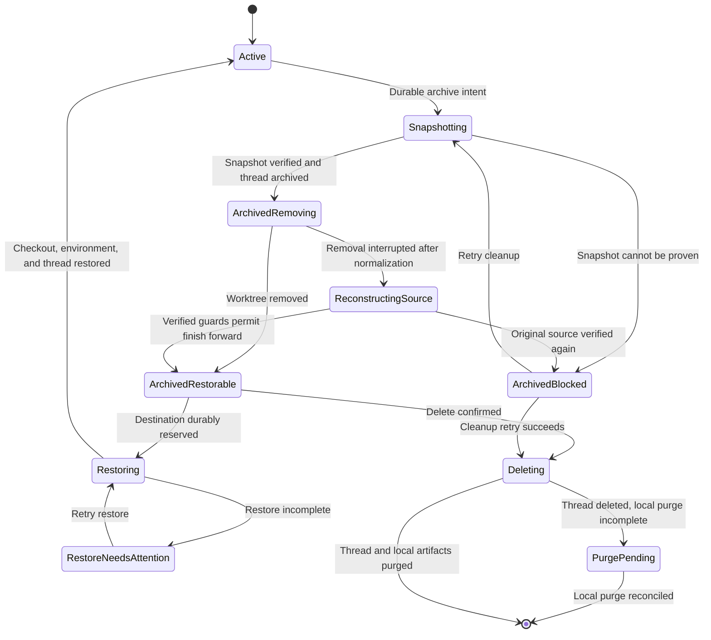
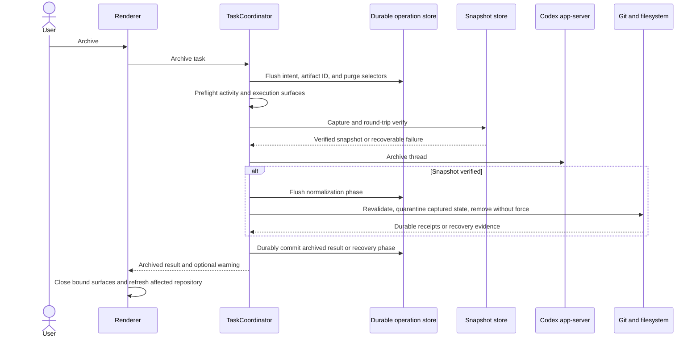
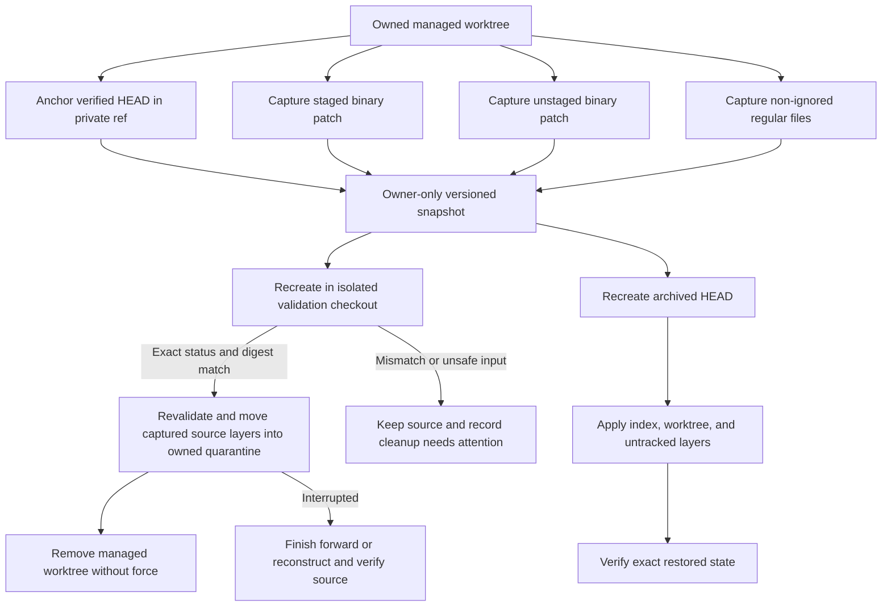
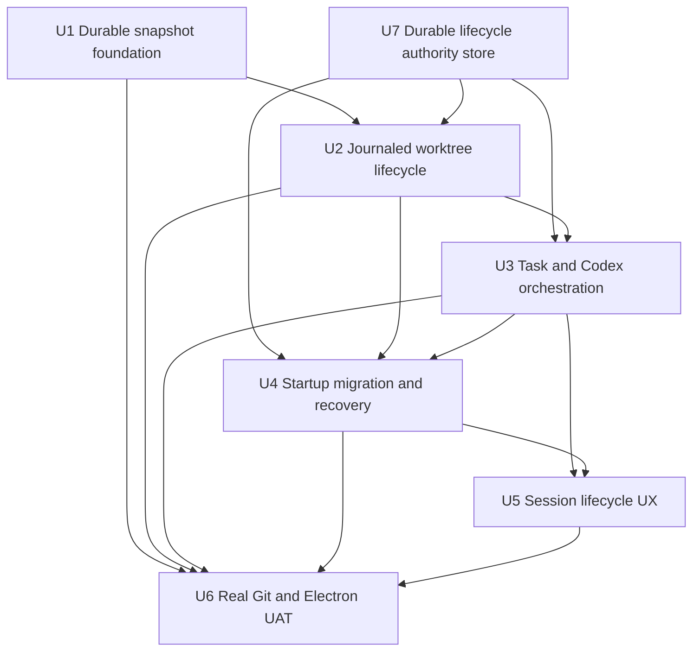

# Managed Worktree Archive Cleanup - Plan

## Goal Capsule

- **Objective:** Make archiving a Cranberri-managed worktree session preserve all agreed recoverable work and immediately reclaim its checkout, while keeping the archived conversation restorable.
- **Product authority:** The Codex task owns conversation history, the main-process task store owns lifecycle state, and only the managed-worktree lifecycle may perform archive, restore, or deletion mutations of an owned checkout; active task actors must be quiesced before those operations.
- **Execution profile:** Characterization-first, data-safety-focused implementation with real Git fixtures, fault injection, packaged Electron UAT, and filesystem verification at every destructive boundary.
- **Stop conditions:** Stop rather than remove a checkout when ownership, snapshot integrity, current Git state, process state, or operation recovery is uncertain.
- **Tail ownership:** The implementing agent owns migration of existing archives, cleanup and restore UI, deletion parity, startup reconciliation, settings copy, regression tests, and installed-candidate UAT.

---

## Product Contract

### Summary

Cranberri currently keeps an archived managed worktree on disk until a retention sweep or cap-pressure cleanup removes it.
That differs from current Codex behavior, which removes a Codex-managed worktree when its task is archived, saves a work snapshot first, keeps the task in history, and offers restoration when the task is reopened.
This plan makes archive the immediate cleanup boundary while preserving staged, unstaged, committed, and non-ignored untracked work.

### Problem Frame

The current archive path marks the task and worktree archived, then asks a retention sweep to remove only clean, publicly referenced worktrees.
Dirty changes, unpushed branches, and unique detached commits are protected by refusing cleanup, but Cranberri cannot yet snapshot those states and reclaim the checkout.
Archive and delete also span Codex app-server calls, Git operations, task-store writes, renderer history, pinned records, and open workspace windows without one durable operation journal.
Failures can therefore leave an archived thread beside an active task, a removed worktree beside a retained task, or a deleted thread with unpurged local artifacts.

### Actors

- A1. The user archives, restores, or permanently deletes a session from the repo rail, task header, or command palette.
- A2. The renderer reflects authority changes, removes presentation state, refreshes project history and pins, and presents concise progress or recovery feedback.
- A3. `TaskCoordinator` is the sole lifecycle-saga authority: it serializes operations, persists the durable journal, calls narrow Codex, activity, environment, snapshot, and worktree ports, and commits cross-system outcomes.
- A4. The managed-worktree executor verifies ownership, captures and restores work, manages private refs, and returns durable Git/filesystem receipts without independently advancing task lifecycle state.
- A5. Codex app-server archives, unarchives, and permanently deletes the conversation.
- A6. Git, the process registry, environment runner, and filesystem provide the mutable state that must remain stable across snapshot and cleanup.

### Requirements

**Archive and snapshot**

- R1. Archiving a task-bound Cranberri-managed worktree session closes its task-bound workspace surfaces, archives its Codex conversation, and attempts immediate worktree removal in one journaled lifecycle operation.
- R2. Before source cleanup, Cranberri anchors the current HEAD at a private task ref and captures staged binary changes, unstaged binary changes, and every non-ignored untracked regular file with its relative path and executable mode.
- R3. Snapshot capture omits ignored files and directories without captured regular files. Symlinks, sockets, devices, paths that escape the checkout, dirty submodules, unmerged indexes, and unsupported sparse-checkout states block cleanup unless the snapshot engine can prove an exact round trip.
- R4. Snapshot artifacts use owner-only permissions, file and parent-directory flushes, an atomic same-filesystem publish step, schema versioning, bounded total size, per-file and patch digests, and task/worktree ownership metadata.
- R5. Cranberri verifies that a published snapshot can reconstruct the saved index and working-tree state from the anchored HEAD before changing or removing the source checkout.
- R6. Cranberri locks the managed worktree during capture and verification, records before-and-after HEAD, index, status, and file guards, then revalidates ownership and running processes; only then may it normalize captured changes into operation-owned quarantine and unregister without force. Every moved path is journaled, and a failed removal must either finish forward from verified guards or reconstruct the source exactly before reporting cleanup blocked.
- R7. Unique detached commits and unpushed branch commits are eligible for explicit archive cleanup after the private ref and snapshot are verified; uncertainty still blocks removal.
- R8. If snapshotting fails, the conversation and task remain archived and the source stays untouched. If cleanup fails after normalization begins, the journal identifies the snapshot as temporary authority and recovery must either complete removal or reconstruct and verify the original checkout before exposing Cleanup needs attention with Retry and Diagnostics.

**Restore**

- R9. Restoring an archived managed session verifies the snapshot manifest, digests, private ref, ownership record, and destination containment before creating a checkout.
- R10. Restore recreates from the archived HEAD, reapplies staged, unstaged, and untracked state exactly, verifies the reconstructed state, reruns the recorded trusted environment revision, and unarchives the same Codex conversation only after the checkout is usable.
- R11. Restore durably reserves its destination, expected Git common directory, private ref, and unique ownership token before creating anything. It reuses the original managed path when safely available; an occupied or mismatched path is never overwritten and instead receives one recorded authorized path under the managed root that retries must adopt rather than duplicate.
- R12. Restore reattaches the recorded branch only when the branch still points at the archived HEAD and is not checked out elsewhere; otherwise it restores detached at the private ref and reports the fallback in a toast.
- R13. A recreated checkout remains non-runnable in `restoring` until state verification, trusted environment setup, Codex thread unarchive, and the final durable task/worktree commit succeed. Recovery either resumes that exact reserved checkout from verified evidence or safely discards and recreates it; a failed restore retains the snapshot and private ref and does not present the task as active.
- R14. After task, checkout, environment, and conversation restoration commit successfully, Cranberri retires the consumed dirty snapshot; a later archive captures a fresh snapshot.

**Permanent deletion and exclusions**

- R15. Permanent deletion is available only for archived sessions and always confirms that the conversation and local restore material cannot be recovered afterward.
- R16. Deleting an archived managed session first completes or retries its worktree cleanup, then deletes the Codex thread and purges every Cranberri-owned restore copy, including private task ref, snapshot, normalization quarantine, ownership manifest, task record, pins, and lifecycle journal.
- R17. If the worktree cannot be removed safely, permanent deletion stops and leaves the archived session recoverable; if thread deletion succeeds but local purge is interrupted, a durable tombstone completes purge during startup and remains visible in Diagnostics until resolved.
- R18. Local sessions never mutate the Local checkout during archive or delete.
- R19. External and user-created permanent worktrees are never adopted, snapshotted, removed, or purged by this lifecycle.

**Concurrency, migration, and feedback**

- R20. Archive, restore, delete, legacy migration, and cap cleanup serialize per task and per managed worktree under `TaskCoordinator`; a duplicate request is idempotent and a conflicting concurrent request is rejected with the active operation named.
- R21. Archive and delete block while a Codex turn, subagent, environment setup, handoff, registered process, or terminal process can mutate the checkout.
- R22. Lifecycle intent, artifact identity, purge selectors, restore destination, external-RPC outcome (`requested`, `unknown`, or `observed`), and every destructive subphase are power-loss-durable before their side effects. Startup reconciliation handles snapshot allocation/publication/linking, thread state, each normalization move, Git unregister, restore creation, and purge completion idempotently.
- R23. Existing archived managed worktrees migrate through the same snapshot-and-remove pipeline only when they contain no ignored content. Migration with ignored content, unsupported state, or uncertain ownership remains archived and visible without changing the directory until the user removes the blocker or a future inclusion policy can preserve it.
- R24. The worktree root and physical-worktree cap remain configurable, while delayed archive retention is retired because archived task worktrees are removed immediately and restore snapshots live until successful restore or permanent deletion.
- R25. Task-store authority-change events invalidate repo history, task context, Files, Diff, Agents, and task-bound workspace state without requiring a repo switch or manual reload.
- R26. Primary UI copy stays compact: Archive, Restore session, Delete archived session, Cleanup needs attention, Retry cleanup, and View diagnostics; raw paths, refs, hashes, and Git output remain in Diagnostics.
- R27. Every archive, restore, and delete request, including legacy unbound Codex sessions, adopts or resolves a task record first and routes through `TaskCoordinator`; renderer-facing code cannot call thread lifecycle RPCs directly.
- R28. The lifecycle store uses a monotonic schema migration with a validated backup, refuses unknown newer versions without modifying them, and preserves journals, tombstones, artifact ownership, and rollback evidence across upgrade or downgrade attempts.
- R29. Startup validates stores and reconciles lifecycle operations before restoring task-bound windows or exposing lifecycle IPC, then publishes one authoritative recovery revision and report to the renderer.

### Key Flows

- F1. Archive a managed worktree session
  - **Trigger:** The user chooses Archive on an idle managed worktree session.
  - **Steps:** Journal intent, preflight mutable actors, capture and verify the snapshot, archive the conversation, remove the verified checkout, persist the archived result, close task-bound surfaces, and refresh history.
  - **Outcome:** The conversation remains in archived history and the physical managed worktree is gone or visibly marked cleanup-needs-attention with the original data intact.
  - **Covered by:** R1-R8, R20-R29.
- F2. Restore an archived session
  - **Trigger:** The user chooses Restore session on an archived task whose worktree was removed.
  - **Steps:** Verify restore authority, recreate the checkout, apply and verify the snapshot, rerun environment setup, unarchive the conversation, commit active bindings, and retire the consumed snapshot.
  - **Outcome:** The same conversation resumes against a usable managed checkout with its saved Git state.
  - **Covered by:** R9-R14, R20-R22, R25-R29.
- F3. Permanently delete an archived session
  - **Trigger:** The user confirms Delete archived session.
  - **Steps:** Ensure managed cleanup is complete, journal deletion, delete the Codex thread, purge restore artifacts and refs, remove local records and pins, and refresh history.
  - **Outcome:** The conversation and all Cranberri-owned restore material are irrecoverable, while unrelated checkouts remain untouched.
  - **Covered by:** R15-R22, R25-R29.
- F4. Recover an interrupted lifecycle
  - **Trigger:** Cranberri launches with an unfinished archive, restore, or purge journal entry.
  - **Steps:** Compare the journal with task state, Codex thread state, snapshot integrity, Git registration, ownership manifests, and filesystem presence; then complete forward or stop in needs-attention.
  - **Outcome:** No missing checkout is silently replaced with Local and no recoverable artifact is discarded to make state look clean.
  - **Covered by:** R8, R13, R17, R20-R23, R28-R29.

### Acceptance Examples

- AE1. Given a clean detached managed worktree, Archive creates the private ref, removes the Git worktree and path, archives the same thread, closes its task-bound windows, and leaves the Local checkout byte-for-byte unchanged.
- AE2. Given staged binary changes, unstaged changes to the same file, executable-bit changes, and non-ignored untracked files, Archive then Restore reproduces file bytes, modes, staged status, unstaged status, and untracked paths exactly.
- AE3. Given ignored `.env` and build output during an explicit archive, Archive does not place them in the snapshot; Restore reruns the recorded environment revision and never claims ignored files were preserved.
- AE4. Given an untracked symlink, conflicted index, snapshot larger than the established safe limit, unreadable file, or digest mismatch, Archive preserves the original worktree, archives the conversation, and shows Cleanup needs attention.
- AE5. Given an unpushed branch or unique detached commit, Archive preserves its HEAD through the private ref and restores the work even when no public ref contains that commit.
- AE6. Given a branch that moved or became checked out elsewhere after archive, Restore creates a detached checkout at the archived HEAD, restores the work, and shows one fallback toast without moving the branch.
- AE7. Given an active Codex turn, subagent, setup job, handoff, registered process, or process-backed terminal, Archive and Delete leave thread, task, snapshot, and worktree unchanged and identify the blocker; after the user closes it, retry succeeds and remaining nonblocking surfaces close from main-process authority.
- AE8. Given a crash after snapshot allocation or publication, tracked reset, any individual untracked move, Git unregister, restore path reservation, Git registration, thread archive/unarchive/delete request, or local purge, relaunch reaches a deterministic archived, active, cleanup-needs-attention, or purge-tombstone state without data loss or duplicate restore checkout.
- AE9. Given a Local session and an external Git worktree sharing the same repository common directory, archive, restore, cap handling, migration, and delete never mutate either checkout.
- AE10. Given an active session, Delete is absent from the row and command palette; after Archive, Delete archived session requires confirmation and purges the thread, task, snapshot, private ref, manifest, pin, and stale windows.
- AE11. Given an archived session under an expanded inactive repository, archive completion, restore, and cleanup retry update that repository row and right rail without switching repositories or reloading.
- AE12. Given a pre-upgrade archived managed worktree, first launch snapshots and removes it through the new pipeline only when no ignored content exists; otherwise it records Cleanup needs attention and repeated launches or downgrade attempts leave every byte in its directory intact.

### Scope Boundaries

- The snapshot covers Git HEAD, index state, tracked working-tree changes, and non-ignored untracked regular files only.
- Ignored files in a newly requested archive remain the responsibility of environment setup and future `.worktreeinclude` support; pre-upgrade archived worktrees containing ignored files are not auto-removed.
- Explicit archive is authoritative even when a session is pinned; pinning does not preserve a physical checkout after the user archives the task.
- Cranberri does not create commits, push branches, rewrite branch refs, or publish restore snapshots outside the user's machine.
- Cranberri does not force-remove worktrees, run broad `git clean`, run broad `git worktree prune`, or accept renderer-provided paths as deletion authority.

### Deferred to Follow-Up Work

- Add Codex-compatible `.worktreeinclude` support for selected ignored environment files.
- Add a user-facing storage report for aggregate snapshot and managed-worktree disk usage.
- Expose archive, restore, and cleanup status as agent-callable Cranberri tools after a stable agent control surface exists; permanent deletion remains human-confirmed.

---

## Planning Contract

### Current-State Findings

- `src/main/tasks.ts` marks a managed worktree archived but does not remove it; `src/main/worktree-lifecycle.ts` waits for retention or cap pressure and refuses dirty, unpushed, or unique-commit cleanup.
- `src/main/git-worktrees.ts` already captures staged binary patches, unstaged binary patches, and bounded non-ignored untracked regular files, then reapplies them while preserving the index split.
- `src/main/worktree-lifecycle.ts` already serializes mutations, verifies ownership manifests and Git common-directory identity, creates private task refs, uses normal Git worktree removal, and sends verified residual paths to Trash.
- `src/main/codex/ipc.ts` archives the Codex thread before the task coordinator runs, while `TaskCoordinator.delete` removes a worktree before deleting its thread; neither cross-system ordering is journaled as one operation.
- `src/main/task-recovery.ts` repairs provisioning and handoff interruptions but does not model archive snapshot, restore apply, thread deletion, or purge phases.
- `src/renderer/components/RepoRail.tsx` and `src/renderer/components/CommandPalette.tsx` expose Delete on active and archived sessions, while current Codex requires archive before permanent delete.
- `src/renderer/state/codex.tsx` and `src/renderer/state/workspace-model.ts` already close removed chat windows and publish session invalidations, but task-bound terminal and browser surfaces can remain pointed at a checkout that archive removes.
- `scripts/smoke-electron.mjs` exercises archive, unarchive, delete, handoff, cross-repo history, focus return, and visual states, but does not assert snapshot contents or on-disk worktree removal.

### External Grounding

- OpenAI's current [Worktrees documentation](https://learn.chatgpt.com/docs/environments/git-worktrees) says Codex-managed worktrees are disposable, permanent worktrees are not automatically deleted, archive removes the associated managed worktree, a snapshot is saved before deletion, and reopening offers restoration.
- OpenAI's current [archive and delete documentation](https://help.openai.com/en/articles/20001333-how-to-archive-and-delete-chats-in-codex) requires a conversation to be archived before permanent deletion and treats delete as irreversible.
- Git remains the source of truth for worktree registration, HEAD reachability, branch ownership, binary patch semantics, ignored-file selection, and ref updates; every destructive boundary must be expressed as structured Git arguments and revalidated against current state.

### Assumptions

- The existing 64 MiB local-change transfer limit remains the archive snapshot ceiling unless implementation evidence shows a lower bound is required for reliable packaged-app operation.
- Restore snapshots are retained until successful restore or permanent deletion rather than expiring by elapsed days.
- A completed restore consumes the dirty snapshot because the recreated worktree becomes authoritative; the next archive captures a fresh state.
- The task's recorded managed root remains authoritative for restore even if the global root setting later changes.
- Existing archived worktrees are eligible for automatic migration only after the same snapshot verification required by an explicit archive and proof that the directory contains no ignored content.
- Product Contract unchanged by deepening; the added durability, migration, and ownership requirements make the accepted archive/restore/delete behavior implementable without weakening its safety guarantees.

### Durable Data Model

| Entity | Authority | Durable fields and purpose |
|---|---|---|
| Task | Main-process task store | Existing project, thread, checkout, location, lifecycle, archive time, and handoff identity plus the current lifecycle-operation identity and monotonic store schema |
| Managed worktree | Main-process task store | Existing ownership, path, Git common directory, HEAD, branch, environment revision, private ref, lifecycle, cleanup reason, and snapshot descriptor |
| Restore snapshot | Owner-only app data | Versioned manifest, task/worktree ownership, archived HEAD, branch metadata, staged and unstaged patch digests, untracked file entries, size, mode, and environment revision |
| Lifecycle operation | Power-loss-durable main-process operation store | Operation kind, task/worktree IDs, phase and subphase receipts, preallocated artifact identity, external-RPC requested/unknown/observed outcome, restore destination reservation, purge selectors, start/update times, retry posture, and last error |
| Normalization quarantine | Owner-only app data | Journal-owned moved source entries used only to finish removal or reconstruct the original checkout; never sent to OS Trash and purged after the operation reaches a durable safe state |
| Delete tombstone | Main-process task store | Persisted purge selectors plus observed or reconcilable Codex deletion outcome and the local artifacts still requiring idempotent purge |
| Execution-surface binding | Main-process registry | Task, checkout, resource kind, and mutation capability used to block process-backed archive and dispose nonblocking resources after commit |
| Workspace binding | Renderer app state | Presentation-only task/thread/checkout identity removed or refreshed after the main-process authority revision |

### High-Level Technical Design

The following diagrams fix lifecycle boundaries and state ownership; exact helper names remain implementation-time choices.

### Key Technical Decisions

- KTD1. Extend the existing `LocalChanges` capture/apply machinery into a durable snapshot codec rather than introducing stash mutation, temporary commits, or a second Git representation.
- KTD2. Store restore artifacts under an owner-only app-data snapshot root, not inside the worktree being deleted and not at a renderer-selected path.
- KTD3. Preallocate snapshot identity in the durable operation intent, publish snapshots atomically from a temporary sibling after flushing files and the parent directory, record cryptographic digests and bounded sizes, then verify a complete round trip in an isolated detached validation worktree before linking the artifact or normalizing the source. Startup reconciliation owns temporary, orphaned, and published-but-unlinked artifacts.
- KTD4. Keep private task refs as the commit-reachability anchor; snapshot patches and files represent only index and working-tree layers above that exact HEAD.
- KTD5. Lock the managed worktree during capture, compare before-and-after HEAD, index, status, and file guards, and treat conflicts, dirty submodules, unsupported sparse state, unsafe file kinds, escaping paths, oversized snapshots, digest mismatches, ownership mismatches, and running processes as cleanup blockers rather than cases for force.
- KTD6. Make lifecycle journal commits power-loss durable with flushed file and parent directory, a recoverable previous generation, deterministic newest-valid-generation selection, and a monotonic schema that refuses unknown newer versions. Persist typed phases before each irreversible boundary and make each phase idempotent on restart.
- KTD7. Make `TaskCoordinator` the sole cross-system saga owner. Inject narrow `CodexThreadGateway`, `ActivityGate`, `EnvironmentGateway`, `SnapshotStore`, and `WorktreeLifecycle` ports from a composition root that does not import IPC; executors return durable receipts and IPC remains typed validation only.
- KTD8. Archive the Codex thread even when snapshot capture cannot be proven, but retain the untouched worktree and report cleanup-needs-attention; a thread-archive failure leaves the task active and forbids source cleanup.
- KTD9. Allow dirty, unpushed, and unique-commit archive cleanup only after snapshot verification. Journal tracked reset and every content-verified untracked move into owner-tracked quarantine, then use normal `git worktree remove` without force. Once normalization starts, recovery must finish forward from verified guards or reconstruct and verify the source before reporting blocked; OS Trash is not part of the archive transaction.
- KTD10. Make restore commit last: reserve one attributable destination before creation, keep the checkout non-runnable and the thread archived while restoring, query app-server state after unknown outcomes, and consume the snapshot only after checkout, environment, thread, and task/worktree commits are all durably observed.
- KTD11. Make permanent deletion forward-recoverable: persist complete purge selectors and deletion intent before the Codex RPC, represent response loss as unknown rather than failed, treat a later authoritative `thread not found` as observed deletion, and retain a tombstone until every Cranberri-owned restore copy is purged.
- KTD12. Retire time-based worktree retention from behavior and settings UI; preserve legacy settings parsing during migration, keep root and cap controls, and count physical Cranberri-managed checkouts rather than restore snapshots.
- KTD13. Track execution resources by task and checkout in the main process. Process-backed terminals and other mutators are typed blockers the user must close; after lifecycle commit, dispose remaining nonblocking resources before renderer presentation state converges from one authority revision.
- KTD14. Keep irreversible delete human-confirmed; archive, restore, cleanup status, and diagnostics may later become agent-readable or agent-callable, but this plan does not invent a parallel Cranberri tool API.
- KTD15. Adopt legacy unbound Codex sessions into task authority before lifecycle mutation and remove direct renderer-facing archive/unarchive/delete RPC paths, preventing an unjournaled route around the saga.
- KTD16. Boot in strict authority order: validate and migrate stores; reconcile lifecycle operations and legacy migration; reread authoritative task/worktree state; reconcile persisted windows; publish one recovery report and revision; then expose lifecycle IPC and create the renderer.

### Sequencing

### Risks and Mitigations

- **Snapshot exists but cannot restore:** Verify reconstruction in an isolated checkout before touching the source, retain digests and private refs, and fault-inject every write and apply boundary.
- **Process mutates files during archive:** Block known active actors, capture under the lifecycle serializer, and revalidate HEAD and status immediately before normalization and removal.
- **Partial app-server and Git transaction:** Journal external boundaries, define forward recovery, and never infer completion from renderer state.
- **Power loss around journal writes:** Flush both generations and directories, fault-inject each persistence boundary, and refuse lifecycle work when no valid authoritative generation can be selected.
- **Untracked secret exposure:** Exclude ignored files, reject symlinks and special files, bound size, use owner-only storage, and never emit contents or absolute paths to telemetry.
- **Branch drift after archive:** Restore the branch only when its ref and checkout ownership still match; otherwise preserve work in detached state and tell the user.
- **Legacy archive migration surprises:** Block automatic cleanup when any ignored content exists, preserve the directory byte-for-byte across repeated launches and downgrade attempts, and never force cleanup merely to satisfy the new model.
- **Normalization interrupted after source mutation:** Journal every move, retain owner-tracked quarantine, and require finish-forward or exact source reconstruction before declaring the operation blocked.
- **Codex RPC commits but response is lost:** Persist requested/unknown/observed outcomes and reconcile by reading authoritative thread state before retrying or purging.
- **Delete leaves local residue:** Keep a tombstone after external deletion and reconcile local purge idempotently through Diagnostics and startup maintenance.
- **Renderer shows stale checkout data:** Subscribe every task-derived query and workspace binding to authority revisions, invalidate by affected task/worktree IDs, and verify inactive-repository updates in UAT.

### Operational and Documentation Notes

- Update Worktrees settings copy so root and maximum physical worktrees remain, while delayed-retention language disappears.
- Update any daily-driver or worktree UAT scenario that assumes an archived checkout remains present for seven days.
- Keep snapshot manifests and operation journals out of logs, telemetry payloads, support bundles, and chat context except for redacted status summaries.

---

## Implementation Units

### U1. Durable snapshot foundation

- **Goal:** Persist, verify, restore, and purge the exact recoverable Git state agreed for an owned managed worktree.
- **Requirements:** R2-R7, R9-R14, R18-R19.
- **Dependencies:** None.
- **Files:** `src/shared/worktree-snapshots.ts`, `src/shared/worktrees.ts`, `src/main/git-worktrees.ts`, `src/main/worktree-snapshot-store.ts`, `src/main/git-worktrees.test.ts`, `src/main/worktree-snapshot-store.test.ts`.
- **Approach:** Extract reusable serialization around the existing staged/unstaged/untracked representation; add an owner-only, atomic, versioned snapshot store; anchor HEAD at the private ref; validate containment, file kinds, size, modes, and digests; and round-trip the artifact through an isolated validation checkout before declaring it restorable.
- **Patterns to follow:** Atomic validated persistence in `src/main/task-store.ts`, safe path authorization in `src/main/repoSecurity.ts`, structured Git execution in `src/main/git-worktrees.ts`, and reversible bundles in `src/main/handoff.ts`.
- **Execution note:** Implement the snapshot codec test-first with real temporary repositories before changing archive behavior.
- **Test scenarios:** Clean HEAD with empty layers; staged and unstaged edits to the same binary file; executable-bit changes; Unicode and nested untracked paths; ignored files excluded; dirty submodule; unmerged index; sparse checkout; unsafe relative path; symlink and special-file rejection; unreadable file; exact size boundary and oversized rejection; interrupted temporary write before and after flush; digest mismatch; private-ref mismatch; validation-checkout apply failure; successful purge without touching another task's artifact.
- **Verification:** A real Git fixture can capture, serialize, reload, reconstruct, and compare HEAD, index diff, worktree diff, file bytes, paths, and modes without mutating the source.

### U7. Durable lifecycle authority store

- **Goal:** Provide the power-loss-durable, versioned operation authority required before any archive, restore, migration, or delete side effect can run.
- **Requirements:** R17, R20-R22, R27-R29.
- **Dependencies:** None.
- **Files:** `src/shared/tasks.ts`, `src/shared/recovery.ts`, `src/main/task-store.ts`, `src/main/task-store.test.ts`, `src/main/worktree-runtime.ts`.
- **Approach:** Introduce a monotonic task-store schema migration with validated backup and explicit newer-version refusal; persist lifecycle operations with preallocated artifact IDs, restore reservations, purge selectors, and external-RPC outcomes; write and flush a new generation plus parent directory before selection; retain a recoverable previous generation; and expose one narrow repository interface to `TaskCoordinator` from a composition root that does not import IPC.
- **Patterns to follow:** Zod validation and serialized mutations in `src/main/task-store.ts`, ownership-first persistence in `src/main/worktree-lifecycle.ts`, and typed recovery reporting in `src/shared/recovery.ts`.
- **Execution note:** Land this unit before wiring any destructive lifecycle behavior; current rename-only persistence is not a valid write-ahead journal.
- **Test scenarios:** Valid v1-to-new-version migration with backup; interrupted backup, write, file flush, rename, and directory flush; newest generation corrupt but previous valid; both generations invalid; unknown newer version opens read-only diagnostics and remains byte-identical; rollback attempt cannot erase unknown lifecycle fields; duplicate operation intent reuses IDs; complete purge selectors survive restart; restore destination reservation survives restart.
- **Verification:** Fault-injection restarts always select one deterministic valid generation or stop lifecycle work without modifying either generation, and no test can observe a side effect whose intent record was not durably committed first.

### U2. Journaled archive, restore, removal, and purge lifecycle

- **Goal:** Turn snapshot, worktree removal, restore, and artifact purge into one serialized, idempotent, crash-recoverable managed-worktree state machine.
- **Requirements:** R1-R14, R16-R24, R28-R29.
- **Dependencies:** U1, U7.
- **Files:** `src/shared/tasks.ts`, `src/shared/worktrees.ts`, `src/shared/recovery.ts`, `src/main/task-store.ts`, `src/main/worktree-lifecycle.ts`, `src/main/processRegistry.ts`, `src/main/worktree-lifecycle.test.ts`, `src/main/task-store.test.ts`.
- **Approach:** Implement authorized Git/filesystem execution behind `WorktreeLifecycle` receipts without mutating cross-system task phases; split clean removal from journaled tracked reset and per-path quarantine moves; allow private-ref-protected unique commits and unpushed branches during explicit archive; reconstruct the exact source after an interrupted normalization unless verified guards permit finish-forward; reserve and adopt one restore destination; preserve fail-closed ownership and process checks; and purge only artifacts named by the task/worktree operation.
- **Patterns to follow:** Serialized mutations and ownership manifests in `src/main/worktree-lifecycle.ts`, journal-before-side-effect handling in worktree creation, and needs-attention preservation in `src/main/handoff.ts`.
- **Execution note:** Add characterization tests for every current cleanup protection before relaxing dirty, unpushed, and unique-commit blockers under a verified snapshot.
- **Test scenarios:** Covers AE1-AE6 and AE8. Clean immediate archive; dirty exact-state archive; ignored files discarded after explicit archive; unique detached commit; unpushed branch; worktree lock/unlock; process appears after snapshot; external mutation between capture and removal; captured untracked file changes before quarantine; crash after tracked reset and after each individual move; failed removal reconstructs exact source; ownership mismatch; duplicate archive; archive racing restore; crash after restore path reservation, directory creation, Git registration, manifest publication, and task binding; original path occupied; branch unchanged/free, moved, or checked out elsewhere; environment callback failure; restore verification failure; idempotent purge; cross-task artifact refusal; no OS Trash copies.
- **Verification:** The lifecycle matrix passes against real Git repositories and every uncertain condition preserves either the original worktree or a verified restore artifact.

### U3. Atomic task and Codex session orchestration

- **Goal:** Align task state, Codex conversation state, managed checkout state, and permanent deletion across partial failures.
- **Requirements:** R1, R8, R10, R13, R15-R22, R25, R27-R29.
- **Dependencies:** U2, U7.
- **Files:** `src/main/tasks.ts`, `src/main/codex/ipc.ts`, `src/main/codex/client.ts`, `src/main/codex/fakeClient.ts`, `src/main/worktree-runtime.ts`, `src/preload/index.ts`, `src/renderer/vite-env.d.ts`, `src/main/tasks.test.ts`, `src/main/codex/client.test.ts`, `src/main/codex/ipc.test.ts`.
- **Approach:** Make `TaskCoordinator` the sole saga owner and inject narrow lifecycle gateways from `worktree-runtime.ts`; preflight Codex, worker, environment, handoff, and execution-resource state; adopt legacy sessions before mutation; return archived outcomes with optional cleanup warnings; keep the thread archived until restore commits; persist requested/unknown/observed RPC outcomes and complete purge selectors before calls; and remove direct renderer-facing thread lifecycle methods.
- **Patterns to follow:** Typed request schemas in `src/shared/tasks.ts`, thin IPC handlers in `src/main/codex/ipc.ts`, first-turn idempotency handling in `src/main/tasks.ts`, and fake-client lifecycle support in `src/main/codex/fakeClient.ts`.
- **Execution note:** Start with failing integration tests for app-server success/failure crossed with snapshot, removal, store-write, and purge success/failure.
- **Test scenarios:** Thread archive failure before source cleanup; snapshot failure followed by archived cleanup-blocked result; worktree removal failure after thread archive; durable-store failure prevents Git side effects; restore setup failure; thread unarchive failure; commit-then-disconnect and crash-before-response for archive, unarchive, and delete; later `thread not found` confirms requested deletion; active turn, worker, and process-backed terminal blockers; active-session delete rejection; archived delete success; thread delete success plus purge failure; legacy unbound active and archived adoption; direct lifecycle IPC unavailable; duplicate and conflicting requests.
- **Verification:** No tested failure ordering produces an active thread bound to a missing checkout, an unarchived task with an archived thread and no recovery record, or a deleted task with an owned worktree left undiscoverable.

### U4. Startup migration and lifecycle reconciliation

- **Goal:** Repair interrupted operations and migrate existing archived worktrees without trusting stale renderer or filesystem assumptions.
- **Requirements:** R17, R20-R25, R28-R29.
- **Dependencies:** U2, U3, U7.
- **Files:** `src/main/task-recovery.ts`, `src/main/startup-recovery.ts`, `src/main/worktree-runtime.ts`, `src/main/settings.ts`, `src/shared/settings.ts`, `src/main/task-recovery.test.ts`, `src/main/startup-recovery.test.ts`, `src/main/worktree-runtime.test.ts`, `src/main/settings.test.ts`.
- **Approach:** Boot in strict authority order: validate and migrate stores, reconcile lifecycle sagas and legacy archives, reread task/worktree state, reconcile persisted windows, publish one recovery report and revision, then expose lifecycle IPC and create the renderer. Reconcile requested/unknown/observed Codex outcomes, snapshot allocation/publication/linking, normalization receipts, restore reservations, Git registration, ownership manifests, and path presence; migrate legacy archives only when no ignored content exists; remove elapsed-day sweeping; and retain legacy retention values only for compatible parsing.
- **Patterns to follow:** Existing provisioning/handoff repair in `src/main/task-recovery.ts`, startup maintenance error reporting in `src/main/worktree-runtime.ts`, and bounded settings migration in `src/main/settings.ts`.
- **Test scenarios:** Covers AE8 and AE12. Restart after every archive, normalization, restore, RPC, and purge subphase; missing snapshot with source present; source missing with verified or invalid snapshot; Git unregistered with residue; thread archived before task commit; thread deleted before purge; old archived worktree clean/dirty/unsafe; old archive with ignored `.env` or database remains byte-identical across repeated launches and rollback; corrupt legacy settings; root changed after archive; persisted windows are not restored before saga reconciliation; repeated startup reconciliation emits one authority revision.
- **Verification:** Reconciliation is idempotent across two consecutive launches, never substitutes Local for a missing worktree, and produces a clear recovery report for every non-completable state.

### U5. Archive-first session lifecycle UX

- **Goal:** Make archive, restore, cleanup retry, and permanent delete concise, truthful, and immediately coherent across every session surface.
- **Requirements:** R1, R8, R13, R15-R17, R21, R24-R27, R29.
- **Dependencies:** U3, U4.
- **Files:** `src/renderer/state/tasks.tsx`, `src/renderer/state/codex.tsx`, `src/renderer/state/workspace-model.ts`, `src/renderer/state/session-invalidation.ts`, `src/renderer/components/RepoRail.tsx`, `src/renderer/components/CommandPalette.tsx`, `src/renderer/components/ChatWindow.tsx`, `src/renderer/components/chat/TaskHeader.tsx`, `src/renderer/components/settings/WorktreesSettings.tsx`, `src/renderer/state/workspace.test.ts`, `src/renderer/components/RepoRail.test.tsx`, `src/renderer/components/CommandPalette.test.tsx`, `src/renderer/components/settings/WorktreesSettings.test.tsx`.
- **Approach:** Remove Delete from active-session menus and commands; expose it only for archived sessions; show cleanup warning and retry without a Git dump; identify process-backed blockers and ask the user to close them before retry; preserve archived read-only conversation access; dispose main-owned nonblocking resources after commit before removing renderer presentation state; refresh active and inactive repository projections from one authority revision; and simplify Worktrees settings to root and cap.
- **Patterns to follow:** Existing Sonner toast handling, `closeSessionChatWindows` identity matching, task authority subscriptions, semantic typography, Radix focus return, and compact task-header actions.
- **Test scenarios:** Covers AE7, AE10, and AE11. Active versus archived menus; keyboard and pointer actions; delete confirmation and focus return; process-backed terminal returns a typed blocker and succeeds after closure; archive success disposes only bound resources and presentation; cleanup-blocked toast and retry; restore progress and fallback toast; inactive-repository row update; pin cleanup after delete; authority event during open Files/Diff/Agents tabs; narrow-width and light/dark copy review; no paths, refs, or hashes in primary surfaces.
- **Verification:** Every archive/delete entry point follows the same eligibility and close behavior, and no manual repo switch, refresh button, or app relaunch is needed to see the authoritative lifecycle state.

### U6. Real Git, packaged Electron, and installed-app UAT

- **Goal:** Prove the entire lifecycle as a user would experience it and inspect durable state after every destructive boundary.
- **Requirements:** All requirements and acceptance examples.
- **Dependencies:** U1-U5, U7.
- **Files:** `scripts/smoke-electron.mjs`, `scripts/uat/daily-driver-fixtures.mjs`, `scripts/uat/daily-driver-fixtures.test.ts`, `docs/uat/daily-driver-scenarios.md`, `src/main/codex/fakeClient.ts`, and focused implementation fixes found by UAT.
- **Approach:** Extend the isolated worktree smoke fixture with staged, unstaged, binary, executable, untracked, ignored, unpushed, detached-unique, process-blocked, external-worktree, inactive-repository, restore, delete, and crash-recovery cases; inspect Git worktree registration, private refs, snapshot permissions, task-store journals, paths, windows, and screenshots; then package and operate the release candidate through the visible Cranberri UI.
- **Execution note:** Treat filesystem/Git assertions as the release gate; screenshots alone cannot prove cleanup safety.
- **Test scenarios:** Covers AE1-AE12. Archive and restore through the repo rail; archived conversation reopen; cleanup retry; active-delete absence; permanent-delete confirmation; app restart at every injected journal/RPC phase; interrupted normalization reconstruction; legacy ignored-content preservation; inactive repo refresh; right-rail convergence; Local and external-worktree survival; no archive-created OS Trash duplicates; temporary fixture and process cleanup after pass and failure.
- **Verification:** Automated real-Git fixtures pass, packaged Electron smoke passes with no orphan processes or fixture residue, and Computer Use UAT confirms the installed release behaves coherently through archive, restore, and delete.

---

## Verification Contract

| Gate | Units | Done signal |
|---|---|---|
| Snapshot codec and store Vitest suites | U1 | Exact staged, unstaged, binary, mode, and untracked state round-trips; unsafe and corrupt artifacts fail closed |
| Durable-store fault injection | U7 | Schema migration, generations, flush boundaries, rollback attempts, and unknown newer versions preserve one deterministic authority or stop safely |
| Real Git lifecycle and coordinator suites | U2-U4 | Archive, restore, delete, migration, concurrency, unknown RPC outcomes, and injected partial failures reach only valid durable states |
| Renderer lifecycle tests | U5 | Menus, confirmation, focus, toasts, window closure, pins, inactive repositories, and authority refresh match the product contract |
| `npm test` | U1-U7 | Full unit and integration suite passes without skipped lifecycle cases |
| `npm run build` | U1-U7 | Metadata, typography audit, typecheck, lint, helper copy, and production Electron build pass |
| Packaged Electron worktree smoke | U6 | Visible UI flow and on-disk Git/snapshot/task state agree after archive, restore, delete, and restart |
| Installed release candidate UAT | U6 | A user can archive, reopen, restore, and delete clean and dirty managed sessions without stale rails, dead windows, lost work, or manual reload |
| Filesystem and Git residue audit | U6 | Local/external worktrees remain intact; deleted task refs, snapshots, quarantines, manifests, journals, temporary validation worktrees, processes, and archive-created Trash duplicates are absent |
| `git diff --check` and final diff review | U1-U7 | No whitespace errors, unrelated churn, stale retention copy, unsafe deletion shortcut, or untyped IPC boundary remains |

---

## Definition of Done

- Archive immediately removes every safely snapshotted Cranberri-managed task worktree and keeps the same conversation restorable from archived history.
- Staged, unstaged, binary, executable-mode, untracked, unpushed, and unique detached work survive an archive and restore round trip exactly within the documented safety bound.
- Ignored files are excluded honestly and restored environment setup reruns the exact recorded trusted revision.
- Snapshot, cleanup, restore, app-server, power-loss, and purge failures preserve authoritative data and surface one concise retry or diagnostics path.
- Permanent delete is archive-first, human-confirmed, irreversible, and purges all Cranberri-owned restore artifacts without touching Local, external, or permanent worktrees.
- Existing delayed archived worktrees migrate through the same fail-closed pipeline only when no ignored content exists; blocked legacy directories and older/newer store generations remain intact, and the obsolete retention-days UI and behavior are removed without breaking legacy settings files.
- Archive, restore, delete, migration, and startup reconciliation are serialized, idempotent, and covered at every crash boundary.
- Repo rail, command palette, task header, chat, right rail, pins, and task-bound windows converge from authority events without manual reload.
- Full tests, production build, packaged Electron smoke, installed-candidate Computer Use UAT, screenshot review, Git inspection, and residue cleanup all pass.
